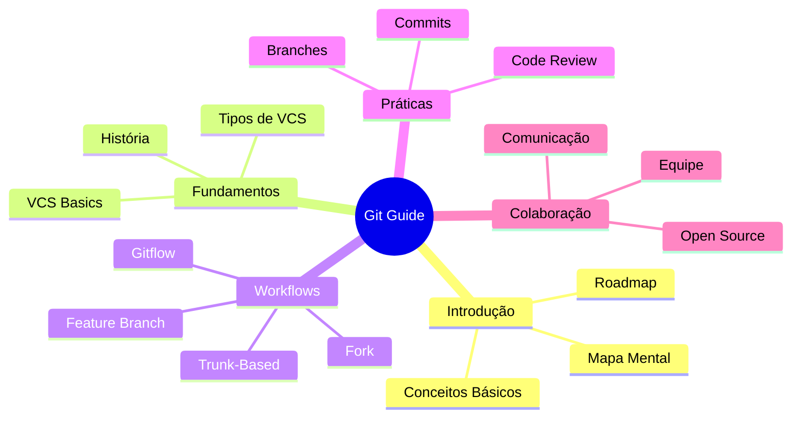
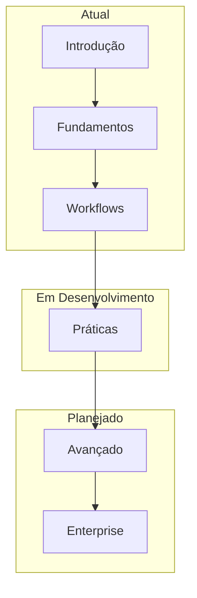
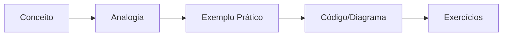
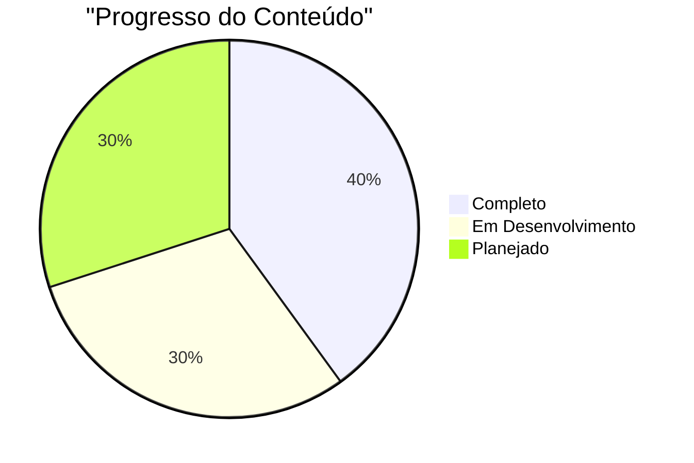
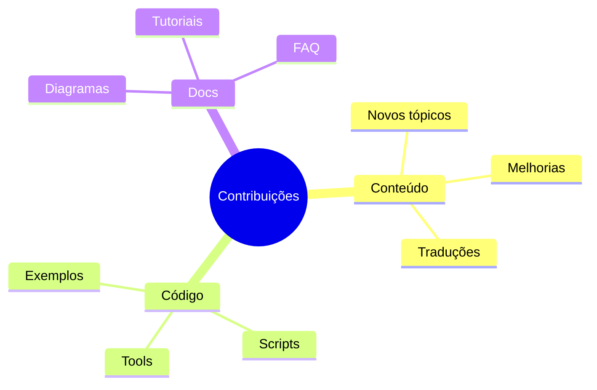

# Arquitetura do Projeto

## Overview do Conteúdo
Este é um guia completo sobre Git e controle de versão, estruturado de forma didática e divertida, usando analogias com American Pie para tornar o aprendizado mais envolvente.

## Estrutura Atual

## Roadmap de Desenvolvimento

### Fase 1: Fundamentos ✅
- [x] Introdução
- [x] Conceitos básicos
- [x] Mapa mental inicial
- [x] Workflows principais

### Fase 2: Expansão 🚧
- [ ] Workflows detalhados
  - [x] Trunk-Based Development
  - [ ] Feature Branch Workflow
  - [ ] Gitflow Workflow
  - [ ] Forking Workflow
- [ ] Práticas avançadas
- [ ] Guias de migração

### Fase 3: Avançado 📅
- [ ] Segurança
- [ ] Performance
- [ ] Automação
- [ ] Casos de uso

### Fase 4: Enterprise 🔮
- [ ] Escalabilidade
- [ ] Governança
- [ ] Compliance
- [ ] Métricas

## Estrutura de Tópicos

## Analogias e Didática

### Abordagem
- Usa referências de American Pie
- Exemplos práticos e visuais
- Diagramas explicativos
- Código real e aplicável

### Estrutura de Cada Tópico

## Tecnologias Utilizadas

### Documentação
- Writerside
- Markdown
- Mermaid Diagrams

### Exemplos
- Git
- GitHub/GitLab
- CI/CD Tools

## Métricas de Progresso

## Próximos Passos

### Imediato (Sprint Atual)
1. Completar workflows detalhados
2. Expandir exemplos práticos
3. Adicionar mais diagramas interativos

### Curto Prazo
1. Módulo de segurança
2. Guias de migração
3. Casos de uso enterprise

### Longo Prazo
1. Integrações com CI/CD
2. Módulos avançados
3. Templates e ferramentas

## Contribuição

### Como Contribuir
1. Fork do repositório
2. Criar branch feature
3. Commit das mudanças
4. Push para o branch
5. Criar Pull Request

### Áreas de Contribuição

## Status do Projeto

### Atual
- Base sólida estabelecida
- Workflows principais documentados
- Sistema de analogias funcionando

### Desafios
- Manter consistência nas analogias
- Balancear profundidade técnica
- Manter exemplos atualizados

### Oportunidades
- Expandir para outros conceitos
- Criar ferramentas complementares
- Desenvolver conteúdo interativo