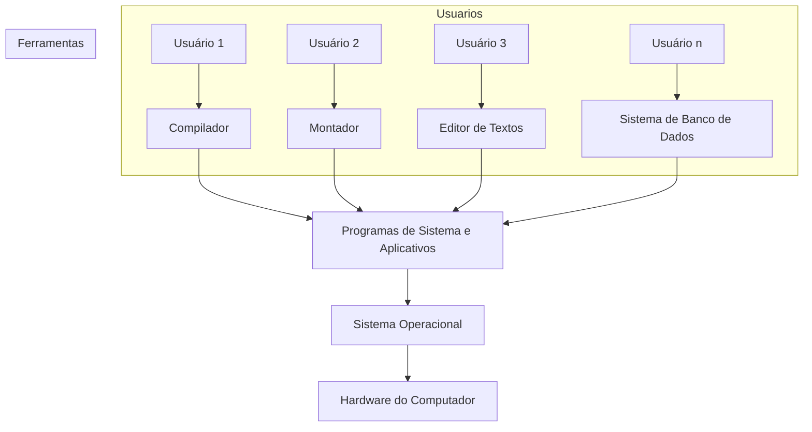

# 1.1 O que os Sistemas Operacionais fazem

Um **sistema computadorizado** ou só computador, pode ser *dividido em quatro partes*:
- Hardware
- Sistema Operacional
- Software
- Usuários


- **Também podemos considerar que um sistema computadorizado é composto por:**

```
										
[0101] |                             | [  ] -> Finge que é um PC
[010]  |--: Dados        Hardware :--| |==| 
[01]   |       |             |       | ----
			   -- Software----
					 |
					 |
				|--------|
				|  WIN95 |
				|--------|     
```

----


- **Exemplo de Funcionamento de um Sistema Operacional**

```
+---------+   +---------+   +---------+   +---------+
| usuário |   | usuário |   | usuário |   | usuário |
|    1    |   |    2    |   |    3    |   |    n    |
+---------+   +---------+   +---------+   +---------+
     |             |             |             |
     |             |             |             |
   +------------+ +----------+ *----------+  *----------+
   | compilador | | montador | | editor de | | sistema |
   |            | |          | | textos   | | de banco|
   |            | |          | |          | | de dados|
   +------------+ +----------+ +----------+ +--------+
                        |
                        |
                    +----------+
                    | programas|
                    | de sistema|
                    | e aplicat-|
                    | ivos     |
                    +----------+
                        |
                        |
                    +----------+
                    | sistema   |
                    | operacional|
                    +----------+
                        |
                        |
                    +----------+
                    | hardware do|
                    | computador |
                    +----------+
```

