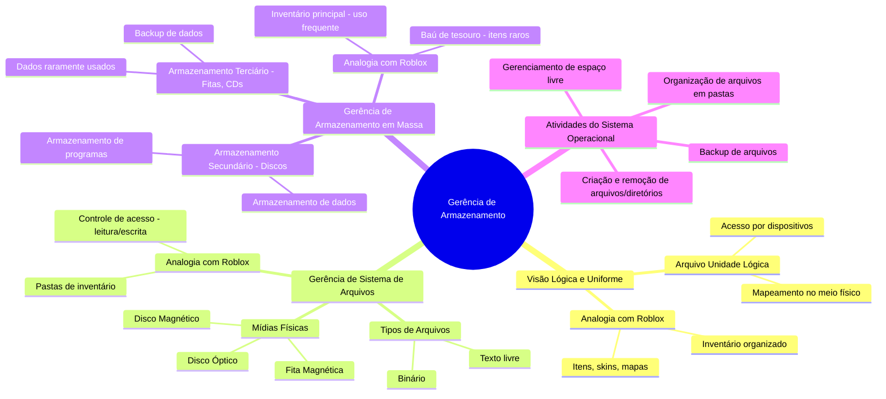
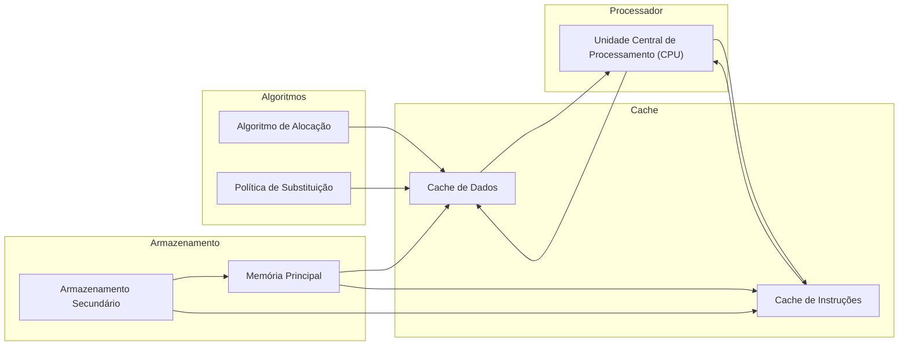
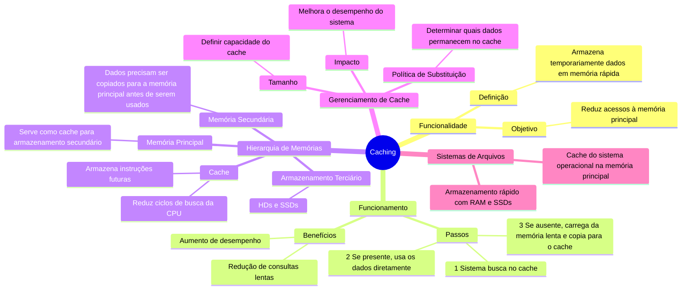
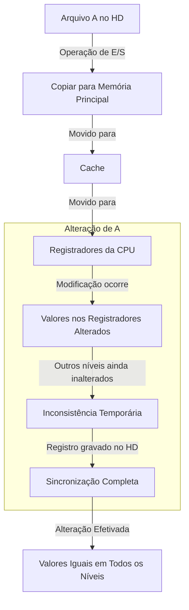

# 1.10 Gerência de armazenamento

O sistema operacional fornece uma visão lógica e uniforme do armazenamento de informações, abstraindo as propriedades físicas dos dispositivos de armazenamento. Ele define uma unidade de armazenamento lógica chamada **arquivo**, que é mapeada no meio físico e acessada por dispositivos de armazenamento.

**Analogia com Roblox:** Imagine o Roblox como um sistema operacional. Ele gerencia todos os itens, skins, mapas e scripts que você usa nos jogos. Esses itens são como "arquivos" que o Roblox organiza e torna acessíveis para você, independentemente de onde eles estejam armazenados fisicamente (servidores, nuvem, etc.).

---

### 1.10.1 Gerência de Sistema de Arquivos
A gerência de arquivos é uma parte visível do sistema operacional, responsável por organizar e controlar o acesso a arquivos e diretórios. Os arquivos podem ser de vários tipos (texto, binários, etc.) e são armazenados em diferentes mídias (discos magnéticos, ópticos, fitas). O sistema operacional gerencia a criação, remoção, organização e acesso a esses arquivos.

**Analogia com Roblox:** No Roblox, você tem uma "pasta" de inventário onde todos os seus itens (arquivos) são organizados. Alguns itens são raros (como arquivos importantes), outros são comuns (como arquivos de texto). O Roblox também controla quem pode acessar seus itens (leitura, escrita, remoção), assim como um sistema operacional faz com arquivos.

### 1.10.2 Gerência de Armazenamento em Massa
Como a memória principal é limitada e volátil, o armazenamento secundário (como discos) é essencial para guardar programas e dados. O sistema operacional gerencia o espaço livre, a alocação de armazenamento e o escalonamento do disco para garantir eficiência. Além disso, há o armazenamento terciário (como fitas e CDs), usado para backups e dados raramente acessados.

**Analogia com Roblox:** Pense no armazenamento secundário como o seu "inventário principal" no Roblox, onde você guarda os itens que usa com frequência. Já o armazenamento terciário seria como um "baú de tesouro" onde você guarda itens raros ou que não usa muito (como skins antigas ou itens de eventos passados). O Roblox gerencia esses espaços para que você possa acessá-los quando precisar.

### 1.10.3 Caching

O **caching** é um conceito essencial para entender como os sistemas computadorizados otimizam o acesso a informações. Ele funciona como uma camada intermediária de armazenamento rápido, reduzindo o tempo de acesso a dados frequentemente utilizados.

#### Como funciona:
1. **Armazenamento de Informações**:
   - As informações são armazenadas em dispositivos como a memória principal.
   - Quando acessadas, são copiadas temporariamente para uma memória mais rápida, chamada **cache**.

2. **Busca de Dados**:
   - Ao buscar uma informação, o sistema primeiro verifica se ela está no cache.
     - Se estiver (**cache hit**), os dados são usados diretamente do cache.
     - Se não estiver (**cache miss**), o sistema busca a informação na memória principal (ou secundária) e a copia para o cache, acelerando futuros acessos.

3. **Registradores e Algoritmos**:
   - Registradores (como os de índice) são gerenciados por algoritmos que decidem quais dados manter no cache e quais enviar para a memória principal.
   - Esses algoritmos são implementados por programadores, compiladores ou diretamente no hardware.

4. **Cache de Instruções**:
   - Muitos sistemas possuem um **cache de instruções**, que armazena as próximas instruções a serem executadas pela CPU.
   - Isso evita que a CPU perca ciclos buscando instruções na memória principal.

5. **Hierarquia de Memórias**:
   - O cache está no topo da hierarquia de memórias, sendo a mais rápida, porém com capacidade limitada.
   - Abaixo dele estão a memória principal e o armazenamento secundário (discos, SSDs).

6. **Gerenciamento de Cache**:
   - Como o cache tem tamanho reduzido, seu gerenciamento é crucial. Isso inclui:
     - Definir o **tamanho do cache**.
     - Estabelecer a **política de substituição** (ex.: LRU - Least Recently Used) para decidir quais dados remover quando o cache estiver cheio.

---

Esses fatores podem **melhorar o desempenho da memória cache**.

A **memória principal** pode ser vista como um **cache rápido para o armazenamento secundário**, pois os dados precisam ser copiados da memória secundária para a principal antes de serem utilizados.

De forma recíproca, para serem **movidos para a memória secundária**, os dados **precisam estar primeiro na memória principal**, garantindo proteção e integridade.

O sistema de arquivos vê os dados permanentemente gravados no armazenamento secundário de forma hierárquica, existindo *diversos níveis na hierarquia*:
- No nível mais alto -> o **sistema operacional** pode **manter um cache do sistema de arquivos na memória principal**.

Também é **possível que memórias RAM, como discos de estado sólido** (ou então discos eletrônicos de RAM), sejam usadas para **armazenamento de alta velocidade**, acessados pela **interface do sistema de arquivos**. Isso significa que a comunicação deve ser feita diretamente com o sistema de arquivos.

Atualmente, a maior parte do **armazenamento terciário** consiste em **HDs ou SSDs**.

#### Níveis e o Cache

Os **movimentos** de informações entre os **níveis da hierarquia de memórias** podem ser de dois tipos: **explícitos** e **implícitos**. Isso depende da arquitetura do **hardware** e do **software** que controla o sistema operacional.

Podemos exemplificar essa questão:
- A **transferência de dados entre a cache e a CPU e seus registradores** -> ocorre diretamente no **hardware**, sem intervenção do sistema operacional.
- A **transferência de dados do disco para a memória RAM** -> normalmente é controlada pelo **sistema operacional**.

Como, nessa estrutura hierárquica, os mesmos dados podem aparecer em diferentes níveis de armazenamento, vejamos um exemplo:

- Suponha que um texto no arquivo `A` precise ser alterado para um outro valor no arquivo `B`, que reside no HD.
- Antes da alteração, **o sistema precisa emitir uma operação de E/S para copiar o bloco de disco contendo `A` para a memória principal**.
- Em seguida, o arquivo `A` será **copiado para o cache e para os registradores internos da CPU**.
- Assim, a **cópia de `A` estará presente em vários níveis**, conforme mostrado abaixo:

- Quando a alteração for feita nos registradores internos da CPU, os valores de `A` **serão diferentes nos outros níveis de armazenamento, que permanecerão inalterados**.
- Somente quando o **registrador gravar a mudança no disco rígido** (memória secundária), os valores nos diferentes níveis estarão **sincronizados**, tornando a alteração efetiva.

