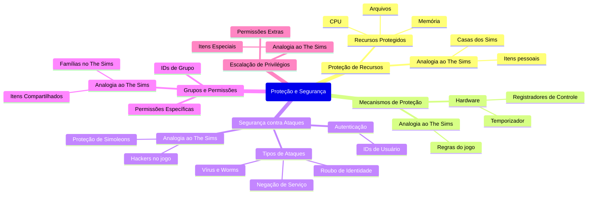

# 1.11 Proteção e segurança

1. **Proteção de Recursos**:
   - Em um sistema com múltiplos usuários e processos, o acesso aos recursos (arquivos, memória, CPU) precisa ser controlado. O sistema operacional garante que apenas processos autorizados possam acessar esses recursos.
   - **Analogia ao The Sims**: Imagine que cada Sim (usuário) tem sua própria casa (espaço de memória) e itens (recursos). O jogo impede que um Sim entre na casa de outro ou use seus itens sem permissão.

2. **Mecanismos de Proteção**:
   - O hardware e o sistema operacional trabalham juntos para proteger recursos. Por exemplo, o temporizador impede que um processo monopolize a CPU, e os registradores de controle de dispositivo protegem periféricos.
   - **Analogia ao The Sims**: No jogo, há regras que impedem que um Sim fique indefinidamente em uma atividade (como cozinhar ou dormir), garantindo que outros Sims também tenham acesso aos recursos.

3. **Segurança contra Ataques**:
   - A segurança protege o sistema contra ataques externos e internos, como vírus, roubo de identidade e negação de serviço. A autenticação (IDs de usuário) é usada para garantir que apenas usuários autorizados acessem o sistema.
   - **Analogia ao The Sims**: Imagine que um "hacker" tenta invadir o jogo e roubar os Simoleons (moeda do jogo) de um Sim. O sistema de segurança do jogo (como senhas ou autenticação em dois fatores) impede isso.

4. **Grupos e Permissões**:
   - Os sistemas operacionais usam IDs de usuário e grupo para controlar permissões. Um usuário pode pertencer a um ou mais grupos, e cada grupo tem permissões específicas.
   - **Analogia ao The Sims**: No jogo, você pode criar famílias (grupos) e definir quais Sims têm permissão para usar certos itens ou áreas da casa.

5. **Escalação de Privilégios**:
   - Às vezes, um usuário precisa de permissões extras para realizar tarefas específicas. O sistema operacional permite essa escalação de forma controlada.
   - **Analogia ao The Sims**: Se um Sim precisa usar um item especial (como um objeto de magia), ele pode ganhar permissões temporárias para acessá-lo.

