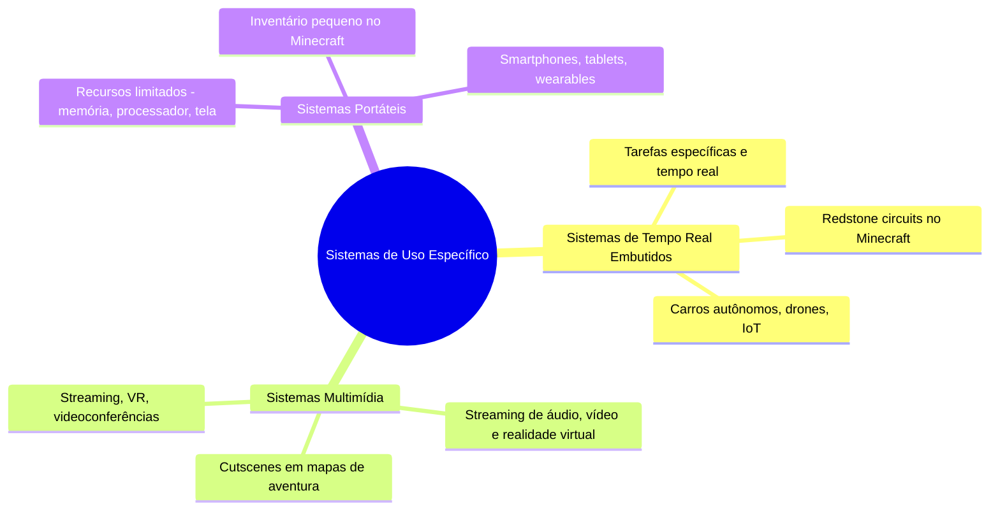

# 1.12 Sistemas de uso específico

## 1.11 Sistemas de Uso Específico
Os sistemas computadorizados de uso específico são projetados para tarefas especializadas e limitadas, diferindo dos sistemas de uso geral que estamos acostumados a utilizar. Eles são amplamente empregados em dispositivos embutidos, como eletrodomésticos inteligentes, carros autônomos, drones e dispositivos IoT (Internet das Coisas).

---

## 1.11.1 Sistemas de Tempo Real Embutidos
- **O que são?**  
  Sistemas embutidos são computadores dedicados a tarefas específicas, como controlar motores de carros, robôs industriais, drones ou até mesmo dispositivos domésticos inteligentes, como assistentes virtuais (Alexa, Google Home) e termostatos (Nest). Eles operam em **tempo real**, o que significa que precisam responder a eventos dentro de um tempo definido, ou o sistema falha.

- **Analogia ao Minecraft**:  
  Imagine um **redstone circuit** no Minecraft. Ele é projetado para realizar uma tarefa específica, como abrir uma porta automaticamente quando um jogador se aproxima. Se o circuito não responder imediatamente, a funcionalidade falha. Assim como um sistema de tempo real, o circuito de redstone tem "restrições de tempo" para funcionar corretamente.

- **Exemplos Modernos**:  
  - Carros autônomos (como um **redstone contraption** que controla um veículo automático no Minecraft).  
  - Drones (como um **dispenser** que lança foguetes no tempo exato).  
  - Dispositivos IoT (como um **sensor de movimento** no Minecraft que acende luzes automaticamente).

---

## 1.11.2 Sistemas Multimídia
- **O que são?**  
  Sistemas multimídia lidam com dados como áudio, vídeo e realidade aumentada (AR), que precisam ser entregues em "streaming" com restrições de tempo (ex.: 60 frames por segundo para jogos ou vídeos 4K). Eles são usados em aplicações como videoconferências (Zoom, Teams), streaming (Netflix, YouTube) e realidade virtual (VR).

- **Analogia ao Minecraft**:  
  Pense em um **mapa de aventura** no Minecraft com cutscenes (cenas pré-gravadas). Para que a experiência seja imersiva, as cenas precisam ser exibidas sem atrasos, assim como um vídeo precisa ser reproduzido sem travamentos. Se o sistema não conseguir entregar os frames no tempo certo, a experiência é prejudicada.

- **Exemplos Modernos**:  
  - Streaming de jogos (como o **Minecraft RTX**, que exige alta performance gráfica).  
  - Realidade virtual (como um **mundo VR** no Minecraft).  
  - Videoconferências (como um **evento ao vivo** no servidor de Minecraft com transmissão em tempo real).

---

## 1.11.3 Sistemas Portáteis
- **O que são?**  
  Sistemas portáteis, como smartphones, tablets e wearables (smartwatches), têm recursos limitados devido ao seu tamanho reduzido. Eles possuem pouca memória, processadores eficientes (mas não tão potentes quanto desktops) e telas pequenas, mas são altamente convenientes e portáteis.

- **Analogia ao Minecraft**:  
  Imagine um **inventário de Minecraft**. Ele tem espaço limitado, então você precisa gerenciar os itens com cuidado, priorizando o que é mais importante. Assim como um smartphone, o inventário é pequeno, mas essencial para a jogabilidade.

- **Desafios Modernos**:  
  - Memória limitada (como um **baú pequeno** no Minecraft, mas com otimizações para armazenar mais itens).  
  - Processadores eficientes (como jogar Minecraft no **celular** com gráficos reduzidos para evitar lag).  
  - Telas pequenas (como a interface compacta do **Minecraft Pocket Edition**).

- **Tecnologias Atuais**:  
  - Smartphones com 5G (como um **servidor de Minecraft** com conexão ultrarrápida).  
  - Wearables (como um **smartwatch** que monitora sua saúde enquanto você joga).  
  - Tablets (como jogar Minecraft em um **iPad** com tela maior e portabilidade).

