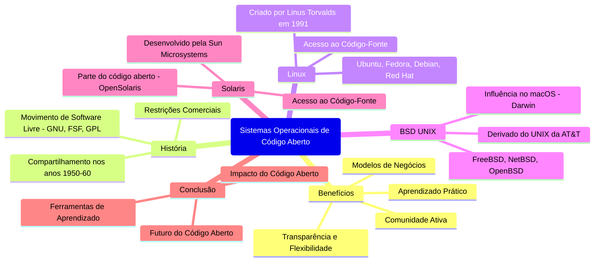

# 1.14 Sistemas Operacionais de Código Aberto

## 1.13.1 Benefícios dos Sistemas de Código Aberto
- **Transparência e Flexibilidade**:  
  O acesso ao código-fonte permite que programadores e estudantes entendam como o sistema funciona, modifiquem o código e criem versões personalizadas.
  
- **Aprendizado Prático**:  
  Estudantes podem modificar o código, compilar e testar suas alterações, o que é uma excelente ferramenta educacional.

- **Comunidade Ativa**:  
  Uma grande comunidade de desenvolvedores contribui para o código, ajudando a identificar e corrigir bugs rapidamente. Isso torna o software mais seguro e confiável.

- **Modelos de Negócios**:  
  Empresas como Red Hat e SUSE mostram que é possível gerar receita com software de código aberto, oferecendo suporte técnico, serviços personalizados e hardware compatível.

---

## 1.13.2 História dos Sistemas de Código Aberto
- **Origens**:  
  Nos anos 1950 e 1960, o software era frequentemente compartilhado livremente entre entusiastas e grupos de usuários. A cultura de compartilhamento de código era comum.

- **Restrições Comerciais**:  
  Com o crescimento da indústria de software, empresas começaram a proteger seus códigos-fonte, distribuindo apenas binários compilados para evitar cópias não autorizadas.

- **Movimento de Software Livre**:  
  Em 1983, Richard Stallman iniciou o projeto **GNU** para criar um sistema operacional livre e compatível com UNIX. Ele fundou a **Free Software Foundation (FSF)** e criou a **Licença Pública Geral (GPL)**, que exige que o código-fonte seja compartilhado junto com qualquer distribuição do software.

---

## 1.13.3 Linux
- **Origem**:  
  Criado em 1991 por Linus Torvalds, o Linux é um kernel de código aberto que, combinado com ferramentas GNU, forma o sistema operacional **GNU/Linux**.

- **Distribuições**:  
  Existem centenas de distribuições Linux, como **Ubuntu**, **Fedora**, **Debian** e **Red Hat**, cada uma com foco em diferentes usuários (desktop, servidores, gamers, etc.).

- **Acesso ao Código-Fonte**:  
  O código-fonte do Linux pode ser baixado e modificado por qualquer pessoa. Ferramentas como o **VMware Player** permitem testar distribuições Linux em máquinas virtuais.

---

## 1.13.4 BSD UNIX
- **História**:  
  Derivado do UNIX da AT&T, o **BSD UNIX** foi desenvolvido na Universidade da Califórnia em Berkeley. Em 1994, uma versão totalmente funcional e de código aberto, a **4.4BSD-lite**, foi lançada.

- **Distribuições**:  
  Incluem **FreeBSD**, **NetBSD**, **OpenBSD** e **DragonFly BSD**, cada uma com foco em diferentes aspectos, como segurança, portabilidade e desempenho.

- **Influência no macOS**:  
  O kernel do macOS, chamado **Darwin**, é baseado no BSD e também é de código aberto.

---

## 1.13.5 Solaris
- **Origem**:  
  Desenvolvido pela Sun Microsystems, o **Solaris** é um sistema operacional baseado no UNIX. Em 2005, a Sun abriu parte do código-fonte do Solaris, criando o projeto **OpenSolaris**.

- **Características**:  
  Embora nem todo o Solaris seja de código aberto (devido a componentes proprietários), grande parte do sistema pode ser explorada e modificada.

- **Acesso ao Código-Fonte**:  
  O código-fonte está disponível no site **opensolaris.org**, onde também é possível explorar o código online.

---

## 1.13.6 Conclusão
- **Impacto do Código Aberto**:  
  O movimento de software livre e código aberto tem impulsionado a inovação, permitindo que milhares de desenvolvedores colaborem em projetos como Linux, BSD e Solaris.

- **Ferramentas de Aprendizado**:  
  O acesso ao código-fonte de sistemas operacionais maduros, como Linux e BSD, é uma ferramenta valiosa para estudantes e profissionais que desejam entender e contribuir para o desenvolvimento de software.

- **Futuro**:  
  A tendência é que mais empresas e indivíduos adotem projetos de código aberto, impulsionados pela transparência, segurança e colaboração que esse modelo oferece.

---

