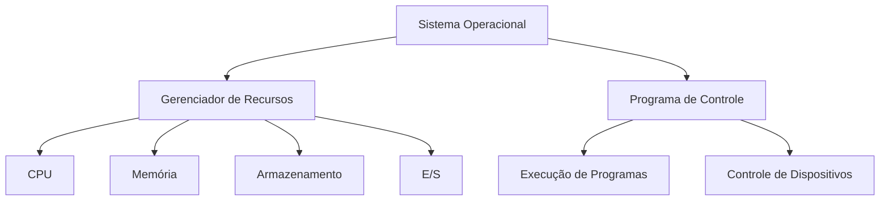
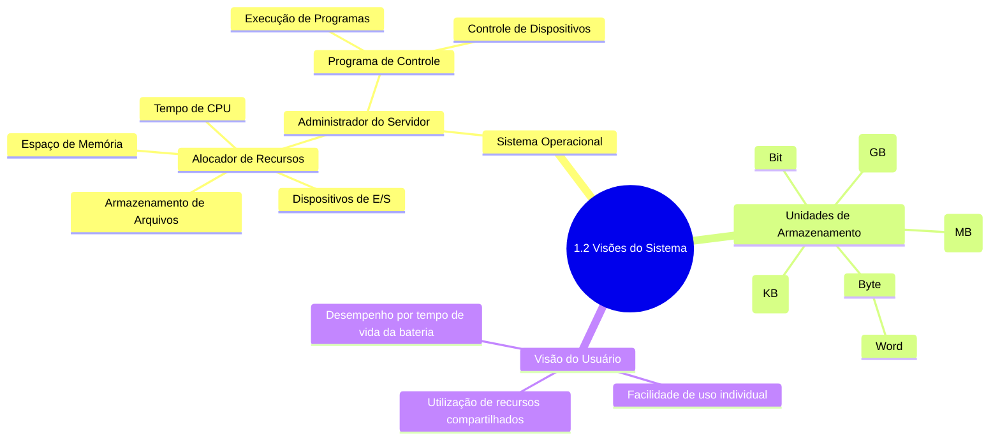

# 1.1.3 Visões do Sistema

## Visão do Sistema: O Administrador do Servidor

Do ponto de vista do computador, o sistema operacional é como o administrador de um servidor Minecraft. Assim como um admin controla todos os aspectos do jogo, o sistema operacional gerencia intimamente o hardware do computador.

### O Sistema Operacional como Alocador de Recursos

Imagine o sistema operacional como o sistema de plugins de um servidor Minecraft, responsável por gerenciar:

1. **Tempo de CPU**: Como o dia e a noite no Minecraft, distribuindo tempo para cada processo.
2. **Espaço de Memória**: Similar ao inventário dos jogadores, alocando espaço para programas.
3. **Armazenamento de Arquivos**: Como baús no Minecraft, organizando e armazenando dados.
4. **Dispositivos de E/S**: Portais para outros mundos, gerenciando a comunicação com dispositivos externos.

O sistema operacional deve alocar esses recursos de forma eficiente e justa, assim como um bom admin de Minecraft garante que todos os jogadores tenham acesso justo aos recursos do servidor.

### Unidades de Armazenamento: Os Blocos do Mundo Digital

- **Bit**: O bloco mais básico, como um grão de areia no Minecraft.
- **Byte**: 8 bits, como um bloco completo no Minecraft.
- **Word**: A unidade nativa do computador, como um chunk no Minecraft.
- **Kilobyte (KB)**: 1.024 bytes, como uma pequena construção.
- **Megabyte (MB)**: 1.024² bytes, como uma vila inteira.
- **Gigabyte (GB)**: 1.024³ bytes, como um reino completo no Minecraft.

### O Sistema Operacional como Programa de Controle

Assim como as regras e configurações de um servidor Minecraft, o sistema operacional controla a execução de programas e o uso de dispositivos para prevenir erros e uso indevido.

Este diagrama mostra como o Sistema Operacional, assim como o core de um servidor Minecraft, gerencia recursos e controla a execução de programas e dispositivos, mantendo todo o sistema funcionando harmoniosamente.

## Visão do Usuário

A visão do computador pelo usuário varia de acordo com a interface utilizada. Na maioria dos casos, os jogadores de Minecraft se sentam à frente de um computador, com um monitor, teclado, mouse e processador. Esse sistema foi projetado para que o jogador monopolize os recursos do computador. 

O objetivo é proporcionar uma experiência mais rápida e imersiva no jogo. Nesse caso, o sistema operacional foi projetado principalmente para a facilidade de uso, com alguma atenção ao desempenho e pouca consideração à utilização de recursos – como a competição por espaço de memória e processamento. 

É natural que o desempenho seja importante para o jogador; mas esses sistemas são otimizados para a experiência individual do jogador.

Em alguns casos, o jogador pode se conectar a um servidor remoto, permitindo que vários jogadores acessem o mesmo computador. Nesse caso, o sistema operacional foi projetado para um equilíbrio entre a facilidade de uso individual e a utilização de recursos compartilhados.

Alguns computadores podem ter pouca ou nenhuma visão do usuário. Por exemplo, os computadores embutidos nos consoles de jogos podem ter teclados numéricos e botões de luz indicadora, para mostrar o status do jogo, mas, em sua maioria, eles e seus sistemas operacionais são projetados para serem executados sem a intervenção do jogador.

