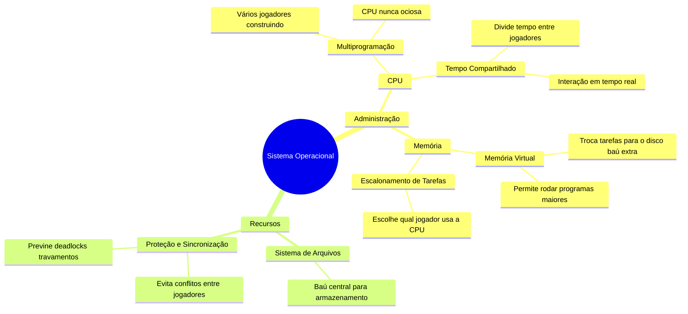

# 1.6 Estrutura do sistema operacional

Um **sistema operacional** é como o "administrador" de um servidor de Minecraft. Ele gerencia recursos (CPU, memória, dispositivos) e permite que vários programas (ou jogadores) funcionem ao mesmo tempo.

- **Multiprogramação**: É como ter vários jogadores construindo no mesmo mundo. Se um jogador precisa esperar (por exemplo, para minerar), o sistema passa para outro, mantendo a CPU sempre ocupada. Isso evita que o servidor fique ocioso.

- **Tempo compartilhado (time sharing)**: É como dividir o tempo do servidor entre vários jogadores. Cada um recebe um pouco de atenção do servidor, mas tão rápido que parece que todos estão jogando ao mesmo tempo. Isso permite interação em tempo real, como digitar comandos e ver resultados imediatos.

- **Escalonamento de tarefas**: O sistema escolhe qual jogador (tarefa) deve usar o servidor (CPU) a seguir, garantindo que todos tenham uma chance justa.

- **Memória virtual**: Se o servidor não tem espaço para todos os jogadores (tarefas) na memória, ele "troca" alguns para o disco (como um baú extra) e os traz de volta quando necessário. Isso permite rodar programas maiores do que a memória física.

- **Sistema de arquivos**: É como o baú central do servidor, onde todos os itens (arquivos) são armazenados e organizados.

- **Proteção e sincronização**: O sistema garante que os jogadores (tarefas) não interfiram uns com os outros, evitando conflitos e travamentos (deadlocks).

