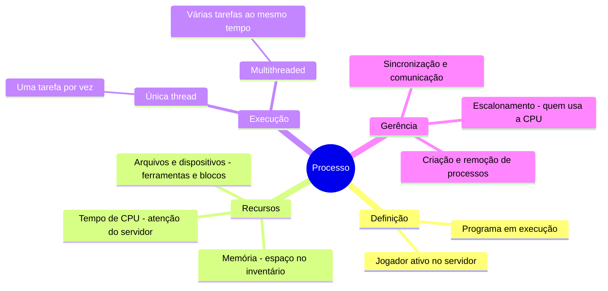

# 1.8 Gerência de processos

Um **processo** é como um jogador em um servidor de Minecraft. Um programa (arquivo no disco) é só um conjunto de instruções, mas quando ele é executado, vira um processo (jogador ativo). Cada processo precisa de recursos como tempo de CPU (atenção do servidor), memória (espaço no inventário), e dispositivos de E/S (ferramentas e blocos).

1. **Processo vs. Programa**:
   - **Programa**: É como um livro de instruções para construir algo no Minecraft (passivo).
   - **Processo**: É um jogador seguindo essas instruções e construindo ativamente (ativo).

2. **Recursos do Processo**:
   - Cada processo (jogador) recebe recursos do sistema operacional (administrador do servidor), como tempo de CPU, memória e acesso a arquivos ou dispositivos.
   - Quando o processo termina (jogador sai), os recursos são devolvidos ao sistema.

3. **Execução de Processos**:
   - Um processo de **única thread** é como um jogador com uma única tarefa, seguindo uma sequência de instruções (contador de programa).
   - Um processo **multithreaded** é como um jogador com várias tarefas ao mesmo tempo (vários contadores de programa).

4. **Gerência de Processos**:
   - O sistema operacional (administrador) gerencia os processos (jogadores), decidindo quem usa a CPU (escalonamento), criando ou removendo processos, e garantindo que eles não interfiram uns com os outros (sincronização e comunicação).

### Resumo visual:

Em resumo, um processo é como um jogador ativo no servidor de Minecraft, usando recursos e seguindo instruções. O sistema operacional é o administrador que gerencia todos os jogadores, garantindo que tudo funcione sem problemas.