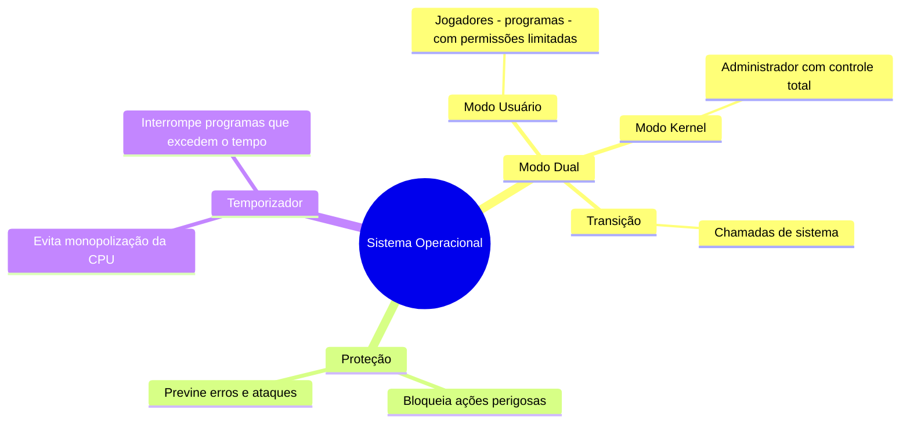

# 1.7 Operações do Sistema Operacional

## Resumo com analogias ao Minecraft:

O **sistema operacional** é como o "administrador" de um servidor de Minecraft, controlando tudo que acontece no mundo (sistema). Ele usa **interrupções** e **traps** para lidar com eventos, como um jogador tentando fazer algo que não deveria (erro) ou pedindo ajuda (chamada de sistema).

1. **Modo Dual (Usuário e Kernel)**:
   - **Modo Usuário**: Onde os jogadores (programas de usuário) operam. Eles têm permissão limitada, como construir ou minerar, mas não podem alterar o servidor diretamente.
   - **Modo Kernel**: Onde o administrador (sistema operacional) opera. Ele tem controle total sobre o servidor, como gerenciar recursos, corrigir erros ou expulsar jogadores problemáticos.
   - **Transição**: Quando um jogador precisa de algo que só o administrador pode fazer (como abrir um portal), ele faz uma **chamada de sistema**, e o servidor muda para o modo kernel temporariamente.

2. **Proteção**:
   - O sistema operacional protege o servidor de jogadores mal-intencionados ou erros. Por exemplo, se um jogador tentar destruir o servidor (executar uma instrução privilegiada no modo usuário), o sistema bloqueia a ação e notifica o administrador.

3. **Temporizador**:
   - Para evitar que um jogador monopolize o servidor (loop infinito), o sistema usa um **temporizador**. Se um jogador ficar muito tempo sem ceder a vez, o sistema interrompe e passa o controle para outro jogador ou para o administrador.

4. **Ciclo de Execução**:
   - O sistema operacional começa no modo kernel (administrador) ao ligar o servidor. Ele carrega os jogadores (programas) no modo usuário e alterna entre os modos conforme necessário, garantindo que tudo funcione sem problemas.

### Resumo visual:

Em resumo, o sistema operacional é como um administrador de servidor de Minecraft, alternando entre modos para garantir que os jogadores (programas) possam jogar sem causar problemas, enquanto mantém o controle total sobre o sistema.