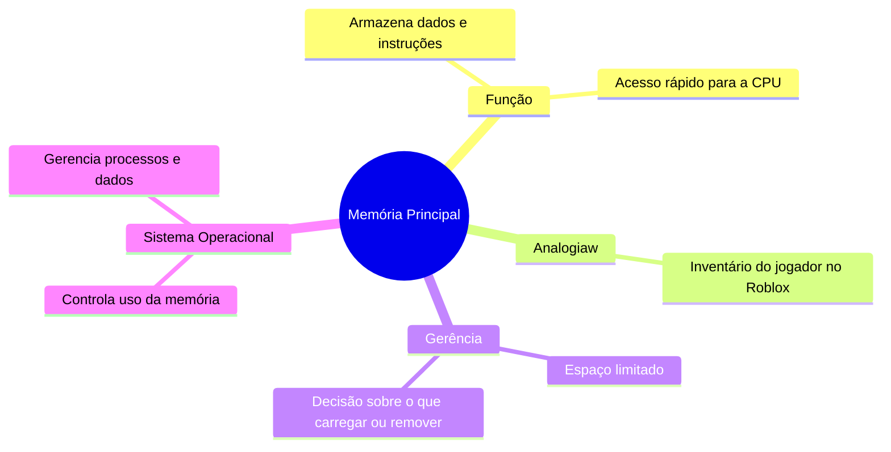

# 1.9 Gerência de memória

### Resumo com analogias ao Minecraft:

A **memória principal** é como o inventário do jogador no Minecraft. Ela armazena dados e instruções que a CPU (jogador) precisa para executar tarefas rapidamente. Assim como o inventário tem espaço limitado, a memória principal também tem um tamanho finito e precisa ser gerenciada com cuidado.

1. **Função da Memória Principal**:
   - É o "inventário" do computador, onde a CPU busca instruções e dados para executar programas.
   - Para que um programa rode, ele precisa ser carregado na memória, como colocar itens no inventário.

2. **Acesso Direto**:
   - A CPU só pode acessar diretamente a memória principal. Dados de dispositivos como discos (baús externos) precisam ser transferidos para a memória antes de serem usados.

3. **Gerência de Memória**:
   - O sistema operacional (administrador) gerencia o espaço na memória, decidindo quais programas (itens) ficam na memória e quais são removidos quando o espaço acaba.
   - Isso é crucial para manter vários programas rodando ao mesmo tempo, como ter vários itens no inventário para diferentes tarefas.

4. **Atividades do Sistema Operacional**:
   - Controlar quais partes da memória estão em uso e por quem.
   - Decidir quais processos (tarefas) e dados devem ser carregados ou removidos da memória.

### Resumo visual:

