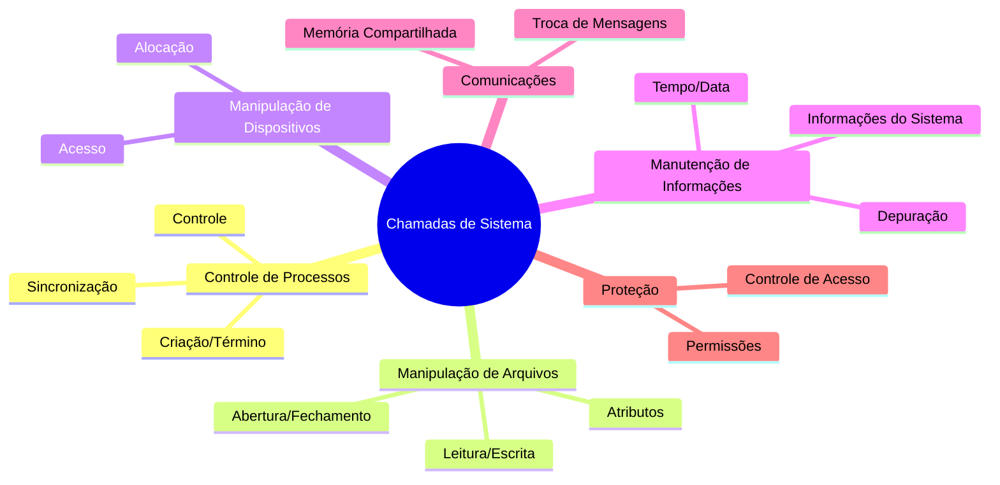

# 2.4 Tipos de chamadas de sistema

#### **1. Controle de Processos**
- **Função**: Gerenciar a execução de programas (processos).
- **Exemplos de Chamadas**:
  - **Criação/Término**: `fork()`, `create process()`, `exit()`, `abort()`.
  - **Controle**: `wait()`, `signal()`, `get/set process attributes()`.
  - **Sincronização**: `acquire lock()`, `release lock()`.
- **Casos de Uso**:
  - Iniciar, pausar ou finalizar processos.
  - Esperar por eventos ou processos filhos.
  - Gerenciar concorrência e compartilhamento de recursos.

---

#### **2. Manipulação de Arquivos**
- **Função**: Criar, ler, escrever e gerenciar arquivos e diretórios.
- **Exemplos de Chamadas**:
  - **Abertura/Fechamento**: `open()`, `close()`.
  - **Leitura/Escrita**: `read()`, `write()`.
  - **Atributos**: `get file attributes()`, `set file attributes()`.
- **Casos de Uso**:
  - Criar, excluir ou renomear arquivos.
  - Ler e escrever dados em arquivos.
  - Gerenciar permissões e atributos de arquivos.

---

#### **3. Manipulação de Dispositivos**
- **Função**: Gerenciar dispositivos de hardware (físicos ou virtuais).
- **Exemplos de Chamadas**:
  - **Acesso**: `read()`, `write()`, `ioctl()`.
  - **Alocação**: `request device()`, `release device()`.
- **Casos de Uso**:
  - Ler/escrever em dispositivos como impressoras ou discos.
  - Controlar dispositivos com operações específicas (ex.: ajustar resolução de tela).

---

#### **4. Manutenção de Informações**
- **Função**: Obter e definir informações do sistema e do usuário.
- **Exemplos de Chamadas**:
  - **Tempo/Data**: `get time()`, `set time()`.
  - **Informações do Sistema**: `get system info()`, `get process info()`.
  - **Depuração**: `dump memory()`, `trace()`.
- **Casos de Uso**:
  - Obter informações como uso de memória, número de usuários ou versão do sistema.
  - Depurar programas com ferramentas como dump de memória ou perfil de tempo.

---

#### **5. Comunicações**
- **Função**: Facilitar a comunicação entre processos (no mesmo computador ou em rede).
- **Modelos**:
  - **Troca de Mensagens**: `send message()`, `receive message()`.
  - **Memória Compartilhada**: `shared memory create()`, `shared memory attach()`.
- **Casos de Uso**:
  - Trocar mensagens entre processos (ex.: cliente-servidor).
  - Compartilhar memória para comunicação rápida entre processos.

---

#### **6. Proteção**
- **Função**: Controlar o acesso a recursos do sistema.
- **Exemplos de Chamadas**:
  - **Permissões**: `set permission()`, `get permission()`.
  - **Controle de Acesso**: `allow user()`, `deny user()`.
- **Casos de Uso**:
  - Definir permissões de acesso a arquivos, dispositivos ou processos.
  - Proteger o sistema contra acessos não autorizados.

