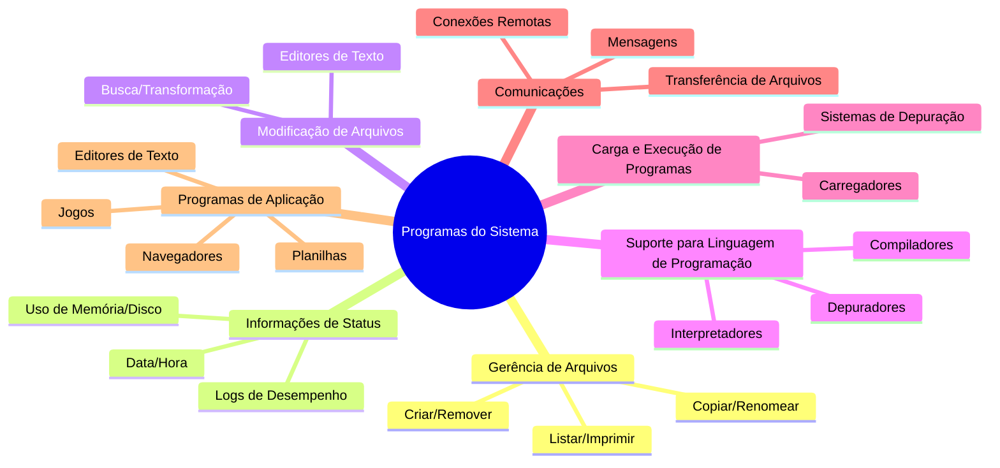

# 2.5 Programas do sistema

### Resumo:

Os **programas do sistema** (ou utilitários) são ferramentas incluídas no sistema operacional para facilitar o desenvolvimento, execução e gerenciamento de programas. Eles se dividem em categorias como:

1. **Gerência de Arquivos**: Criar, remover, copiar, renomear e manipular arquivos/diretórios.
2. **Informações de Status**: Obter dados como hora, uso de memória, espaço em disco e logs de desempenho.
3. **Modificação de Arquivos**: Editores de texto e ferramentas para buscar/transformar conteúdo.
4. **Suporte para Linguagem de Programação**: Compiladores, interpretadores e depuradores.
5. **Carga e Execução de Programas**: Carregadores e sistemas de depuração para executar programas.
6. **Comunicações**: Ferramentas para conexões remotas, transferência de arquivos e mensagens.
7. **Programas de Aplicação**: Navegadores, editores de texto, planilhas, jogos, etc.

Além disso, a experiência do usuário é definida pelos programas de aplicação e interfaces (GUI ou CLI), que podem variar mesmo no mesmo hardware (ex.: dual-booting entre Mac OS X e Windows).

---

