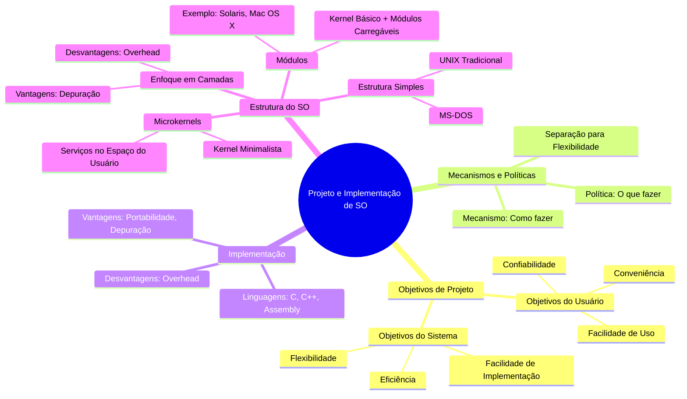

# 2.6 Projeto e implementação do sistema operacional

O **projeto e implementação de sistemas operacionais** envolvem desafios complexos, como definir objetivos, separar políticas de mecanismos, escolher linguagens de programação e estruturar o sistema de forma eficiente. Aqui estão os principais pontos:

---

#### **1. Objetivos de Projeto**
- **Objetivos do Usuário**: Conveniência, facilidade de uso, confiabilidade, segurança e velocidade.
- **Objetivos do Sistema**: Facilidade de projeto, implementação, manutenção, flexibilidade e eficiência.
- **Desafio**: Não há uma solução única; os requisitos variam conforme o tipo de sistema (batch, tempo real, multiusuário, etc.).

---

#### **2. Mecanismos e Políticas**
- **Mecanismo**: Como algo é feito (ex.: temporizador para proteção da CPU).
- **Política**: O que deve ser feito (ex.: tempo alocado para cada usuário).
- **Separação**: Mantém o sistema flexível, permitindo mudanças de políticas sem alterar mecanismos.

---

#### **3. Implementação**
- **Linguagens**: Sistemas operacionais modernos são escritos em linguagens de alto nível (ex.: C, C++), com trechos em assembly para otimização.
- **Vantagens**: Código mais rápido de escrever, compacto, portável e fácil de depurar.
- **Desvantagens**: Potencial redução de desempenho, mas compensada por otimizações de compiladores modernos.

---

#### **4. Estrutura do Sistema Operacional**
- **Estrutura Simples**: Sistemas como MS-DOS e UNIX inicial tinham designs monolíticos, com pouca separação de componentes.
- **Enfoque em Camadas**: Divide o sistema em níveis, facilitando depuração e manutenção, mas pode adicionar overhead.
- **Microkernels**: Kernel minimalista, com serviços essenciais (gerência de processos, memória e comunicação). Serviços adicionais rodam no espaço do usuário, aumentando segurança e modularidade.
- **Módulos**: Combina vantagens de camadas e microkernels. O kernel básico carrega módulos dinamicamente (ex.: drivers, sistemas de arquivos), oferecendo flexibilidade e eficiência.

---

#### **5. Exemplos de Estruturas**
- **MS-DOS**: Monolítico, sem proteção de hardware.
- **UNIX Tradicional**: Kernel grande e monolítico, difícil de manter.
- **Solaris**: Usa módulos carregáveis para sistemas de arquivos, drivers e escalonamento.
- **Mac OS X**: Híbrido, com microkernel Mach e componentes BSD para redes, sistemas de arquivos e threads.

---

### Mindmap em Mermaid:

