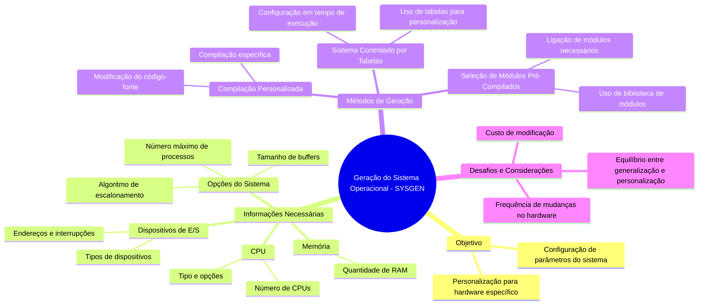

# 2.8 Geração do sistema operacional

A **geração do sistema operacional (SYSGEN)** é o processo de configurar um sistema operacional para uma máquina específica, considerando seu hardware, periféricos e necessidades do usuário. Esse processo garante que o sistema operacional funcione de forma otimizada para a configuração do computador. Aqui estão os principais pontos:

---

#### **1. Objetivo da Geração do Sistema**
- **Personalização**: Adaptar o sistema operacional para uma máquina específica.
- **Configuração**: Definir parâmetros como CPU, memória, dispositivos de E/S e opções do sistema.

---

#### **2. Informações Necessárias para SYSGEN**
- **CPU**:
  - Tipo de processador e opções instaladas (ex.: aritmética de ponto flutuante).
  - Número de CPUs em sistemas multiprocessados.
- **Memória**:
  - Quantidade de memória RAM disponível.
- **Dispositivos de E/S**:
  - Tipos de dispositivos (ex.: discos, impressoras, placas de rede).
  - Endereços de hardware, interrupções e características específicas.
- **Opções do Sistema**:
  - Tamanho de buffers, algoritmo de escalonamento, número máximo de processos, etc.

---

#### **3. Métodos de Geração do Sistema**
1. **Compilação Personalizada**:
   - Modifica o código-fonte do sistema operacional com base nas informações coletadas.
   - Compila o sistema operacional para gerar uma versão específica para a máquina.
   - **Vantagem**: Altamente personalizado.
   - **Desvantagem**: Processo lento e complexo.

2. **Seleção de Módulos Pré-Compilados**:
   - Usa uma biblioteca de módulos pré-compilados.
   - Seleciona e liga apenas os módulos necessários para a configuração.
   - **Vantagem**: Mais rápido que a compilação personalizada.
   - **Desvantagem**: Menos personalizado.

3. **Sistema Controlado por Tabelas**:
   - Todo o código do sistema operacional está presente.
   - A configuração é feita em tempo de execução, usando tabelas.
   - **Vantagem**: Flexível e fácil de modificar.
   - **Desvantagem**: Pode ser menos eficiente.

---

#### **4. Desafios e Considerações**
- **Frequência de Mudanças**:
  - A necessidade de reconfiguração depende da frequência com que o hardware muda.
- **Custo de Modificação**:
  - Alterar o sistema para suportar novos dispositivos pode ser caro e demorado.
- **Equilíbrio entre Generalização e Personalização**:
  - Sistemas muito genéricos podem ser menos eficientes.
  - Sistemas muito personalizados podem ser difíceis de manter.

---

