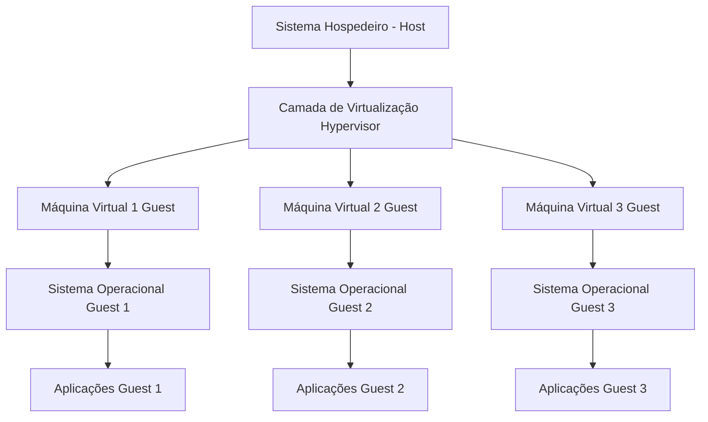
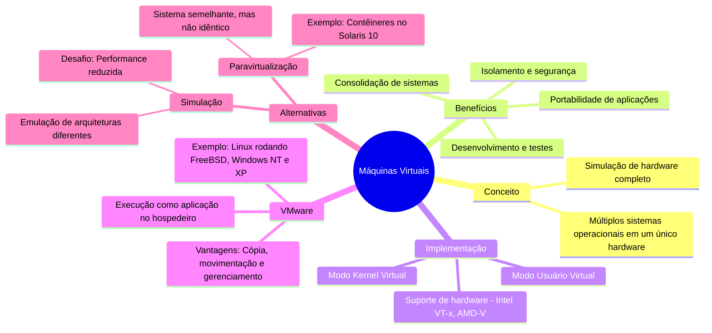

# 2.7 Máquinas virtuais

### Resumo:

As **máquinas virtuais (VMs)** são ambientes isolados que simulam um computador completo, permitindo a execução de múltiplos sistemas operacionais simultaneamente em um único hardware. Aqui estão os principais pontos:

1. **Sistema Hospedeiro (Host)**:
   - É o sistema físico que contém o hardware real (CPU, memória, disco, etc.).
   - Roda o sistema operacional principal (ex.: Linux, Windows).

2. **Camada de Virtualização (Hypervisor)**:
   - É o software que gerencia as máquinas virtuais.
   - Pode ser do Tipo 1 (executa diretamente no hardware) ou Tipo 2 (executa como uma aplicação no sistema hospedeiro).

3. **Máquinas Virtuais (Guests)**:
   - São ambientes isolados que simulam um computador completo.
   - Cada máquina virtual tem seu próprio sistema operacional e aplicações.

4. **Sistemas Operacionais Guests**:
   - Sistemas operacionais rodando dentro das máquinas virtuais (ex.: Windows, Linux, macOS).

5. **Aplicações Guests**:
   - Programas que rodam dentro dos sistemas operacionais guests.

---

#### **1. Conceito de Máquinas Virtuais**
- **Definição**: Separação do hardware em múltiplos ambientes de execução, cada um com seu próprio sistema operacional.
- **Funcionamento**: Usa técnicas de escalonamento de CPU e memória virtual para criar a ilusão de um computador dedicado para cada VM.
- **Exemplo**: Um sistema físico pode rodar Windows, Linux e macOS simultaneamente como VMs.

---

#### **2. Benefícios das Máquinas Virtuais**
- **Isolamento**: Protege o sistema hospedeiro e outras VMs de falhas ou vírus.
- **Desenvolvimento e Testes**: Permite testar sistemas operacionais e aplicações em ambientes isolados sem afetar o sistema principal.
- **Consolidação de Sistemas**: Reduz custos ao executar múltiplos sistemas em um único hardware.
- **Portabilidade**: Facilita a migração de aplicações entre sistemas.

---

#### **3. Implementação de Máquinas Virtuais**
- **Desafios**: Simular o hardware completo, incluindo modos de operação (usuário e kernel).
- **Técnicas**:
  - **Modo Usuário Virtual**: Simula o modo usuário dentro do modo usuário físico.
  - **Modo Kernel Virtual**: Simula o modo kernel dentro do modo usuário físico.
- **Suporte de Hardware**: CPUs modernas (ex.: Intel VT-x, AMD-V) facilitam a virtualização com modos hospedeiro e guest.

---

#### **4. VMware**
- **Funcionamento**: Executa como uma aplicação no sistema hospedeiro, criando VMs independentes.
- **Exemplo**: Um sistema Linux pode rodar FreeBSD, Windows NT e Windows XP como VMs.
- **Vantagens**: Facilita a cópia, movimentação e gerenciamento de sistemas guest.

---

#### **5. Alternativas à Virtualização**
- **Simulação**:
  - **Definição**: Emula uma arquitetura de hardware diferente da do sistema hospedeiro.
  - **Uso**: Executar programas antigos em hardware moderno.
  - **Desafio**: Performance reduzida, pois cada instrução é traduzida.
- **Paravirtualização**:
  - **Definição**: Apresenta um sistema semelhante, mas não idêntico, ao hardware real.
  - **Uso**: Requer modificações no sistema operacional guest, mas oferece melhor desempenho.
  - **Exemplo**: Contêineres no Solaris 10, que virtualizam o sistema operacional, não o hardware.

---

