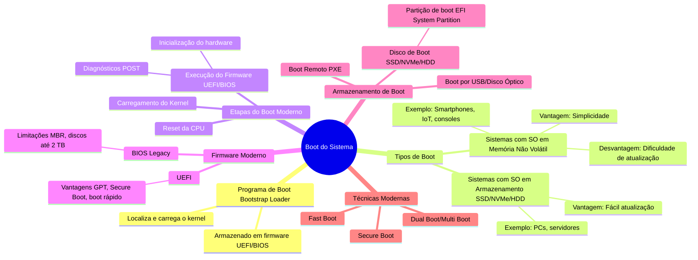

# 2.9 Boot do sistema

O **boot do sistema** é o processo de inicialização do computador, que carrega o sistema operacional na memória e o prepara para execução. Com avanços tecnológicos, o processo de boot evoluiu, mas mantém os princípios básicos. Aqui estão os principais pontos atualizados:

---

#### **1. Programa de Boot (Bootstrap Loader)**
- **Função**: Localiza o kernel do sistema operacional, carrega-o na memória e inicia sua execução.
- **Localização**: Armazenado em firmware (UEFI/BIOS) ou em memória não volátil (como chips SPI Flash).
- **Processo**:
  - A CPU começa a execução em um endereço predefinido após o reset.
  - O programa de boot realiza diagnósticos (POST - Power-On Self-Test) e inicializa o hardware.
  - Carrega o kernel do sistema operacional na memória.

---

#### **2. Tipos de Boot**
- **Sistemas com Sistema Operacional em Memória Não Volátil**:
  - Usado em dispositivos embarcados, como smartphones, IoT e consoles modernos.
  - Vantagem: Simplicidade e operação reforçada.
  - Desvantagem: Dificuldade de atualização (requer reflash do firmware).
- **Sistemas com Sistema Operacional em Armazenamento (SSD/NVMe/HDD)**:
  - Usado em PCs, servidores e dispositivos modernos.
  - O programa de boot (armazenado em firmware UEFI) carrega o sistema operacional do armazenamento para a memória.
  - Vantagem: Fácil atualização (basta modificar o sistema operacional no armazenamento).

---

#### **3. Etapas do Boot Moderno**
1. **Reset da CPU**: A CPU começa a execução em um endereço predefinido (definido pelo firmware UEFI/BIOS).
2. **Execução do Firmware (UEFI/BIOS)**:
   - Realiza diagnósticos do hardware (POST).
   - Inicializa dispositivos básicos (memória, controladores de armazenamento, etc.).
   - Localiza e executa o **bootloader** (ex.: GRUB, Windows Boot Manager).
3. **Carregamento do Kernel**:
   - O bootloader carrega o kernel do sistema operacional na memória.
   - Inicia a execução do kernel, que inicializa o sistema operacional.

---

#### **4. Firmware Moderno (UEFI vs BIOS)**
- **BIOS (Legacy)**:
  - Mais antigo, com limitações (ex.: suporte a discos de até 2 TB).
  - Usa o MBR (Master Boot Record) para gerenciar o boot.
- **UEFI (Unified Extensible Firmware Interface)**:
  - Substituiu o BIOS na maioria dos sistemas modernos.
  - Oferece suporte a discos maiores (GPT - GUID Partition Table).
  - Permite boot mais rápido e seguro (Secure Boot).
  - Suporta drivers e aplicativos UEFI.

---

#### **5. Armazenamento de Boot**
- **Disco de Boot (SSD/NVMe/HDD)**:
  - Contém o sistema operacional e o bootloader.
  - Partição de boot (ex.: EFI System Partition no UEFI).
- **Boot Remoto (PXE)**:
  - Usado em servidores e sistemas corporativos.
  - O sistema operacional é carregado pela rede.
- **Boot por USB/Disco Óptico**:
  - Usado para instalação ou recuperação de sistemas operacionais.

---

#### **6. Técnicas Modernas de Boot**
- **Fast Boot**:
  - Reduz o tempo de boot ao pular verificações desnecessárias.
- **Secure Boot**:
  - Verifica a integridade do bootloader e do kernel para evitar malware.
- **Dual Boot/Multi Boot**:
  - Permite a escolha entre múltiplos sistemas operacionais no boot.

---

