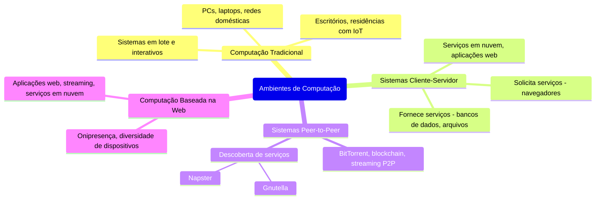

# 1.13 Ambientes de Computação

## 1.12.1 Computação Tradicional
- **O que é?**  
  A computação tradicional refere-se ao uso de PCs, servidores e mainframes em ambientes como escritórios e residências. Antigamente, os sistemas eram centralizados, com terminais conectados a mainframes ou PCs ligados a redes locais. Hoje, a computação tradicional se expandiu com o uso de tecnologias web, dispositivos portáteis e conexões de alta velocidade.

- **Evolução**:  
  - **Antes**: Sistemas em lote (batch) e interativos, com tempo compartilhado para otimizar recursos.  
  - **Hoje**: PCs potentes, laptops, tablets e smartphones com acesso remoto e portabilidade.  
  - **Tendências**: Portais web, sincronização de dispositivos e redes domésticas inteligentes.

- **Exemplos Modernos**:  
  - **Escritórios**: Uso de laptops, desktops e servidores em nuvem (como Google Workspace ou Microsoft 365).  
  - **Residências**: Redes domésticas com dispositivos IoT (smart TVs, assistentes virtuais) e conexões de alta velocidade (fibra óptica, 5G).

---

## 1.12.2 Sistemas Cliente-Servidor
- **O que é?**  
  Neste modelo, os sistemas são divididos em dois papéis:  
  - **Cliente**: Solicita serviços (ex.: navegador web).  
  - **Servidor**: Fornece serviços (ex.: servidor de arquivos ou banco de dados).

- **Tipos de Servidores**:  
  - **Servidor de Processamento (Compute-Server)**: Executa ações e retorna resultados (ex.: servidor de banco de dados).  
  - **Servidor de Arquivos (File-Server)**: Gerencia arquivos e os disponibiliza para clientes (ex.: servidor web).

- **Vantagens**:  
  - Centralização de recursos e dados.  
  - Facilidade de gerenciamento e segurança.

- **Exemplos Modernos**:  
  - Serviços em nuvem (AWS, Google Cloud).  
  - Aplicações web (Netflix, Spotify).

---

## 1.12.3 Sistemas Peer-to-Peer (P2P)
- **O que é?**  
  No modelo P2P, todos os nós (dispositivos) na rede são iguais, podendo atuar como clientes e servidores. Não há centralização, e os serviços são distribuídos entre os nós.

- **Funcionamento**:  
  - **Descoberta de Serviços**:  
    - **Centralizada**: Um servidor central mantém um índice de serviços (ex.: Napster).  
    - **Descentralizada**: Os nós enviam requisições por broadcast (ex.: Gnutella).

- **Vantagens**:  
  - Eliminação de gargalos (não há um único servidor).  
  - Escalabilidade e resiliência.

- **Exemplos Modernos**:  
  - Compartilhamento de arquivos (BitTorrent).  
  - Criptomoedas (blockchain, Bitcoin).  
  - Streaming P2P (ex.: plataformas de vídeo descentralizadas).

---

## 1.12.4 Computação Baseada na Web
- **O que é?**  
  A computação baseada na web transformou a forma como acessamos e utilizamos recursos computacionais. Ela permite o acesso a serviços e dados por meio de navegadores e dispositivos conectados à internet.

- **Características**:  
  - **Onipresença**: Acesso de qualquer lugar, a qualquer hora.  
  - **Diversidade de Dispositivos**: PCs, smartphones, tablets, IoT.  
  - **Conectividade**: Redes sem fio (Wi-Fi, 5G) e balanceadores de carga para distribuição de tráfego.

- **Exemplos Modernos**:  
  - Aplicações web (Google Docs, Figma).  
  - Plataformas de streaming (YouTube, Twitch).  
  - Serviços em nuvem (Dropbox, iCloud).

---

