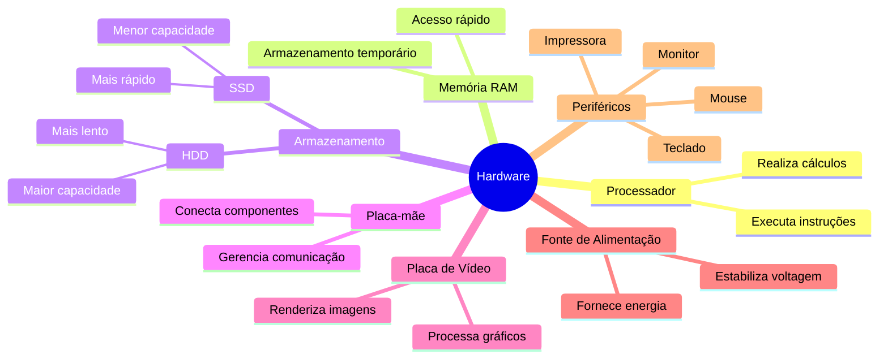

# 1.1.1 Hardware

O hardware de um computador é como os blocos fundamentais de Minecraft que compõem o mundo do seu computador. Assim como você precisa de diferentes tipos de blocos para construir estruturas complexas em Minecraft, um computador precisa de vários componentes de hardware para funcionar.

## Componentes Principais

### Processador (CPU)
Pense no processador como o jogador em Minecraft. Assim como o jogador executa ações e toma decisões, a CPU processa instruções e realiza cálculos. É o cérebro do computador.

### Memória RAM
A RAM é como o inventário do jogador em Minecraft. Ela armazena temporariamente informações que o processador precisa acessar rapidamente, assim como você mantém itens importantes no seu inventário para uso imediato.

### Armazenamento (HDD/SSD)
O armazenamento é semelhante aos baús em Minecraft. HDDs e SSDs guardam dados a longo prazo, como programas e arquivos, assim como os baús armazenam itens que você não precisa carregar o tempo todo.

### Placa-mãe
A placa-mãe é como o terreno em Minecraft onde você constrói. Ela conecta todos os outros componentes, permitindo que eles se comuniquem entre si.

### Placa de Vídeo (GPU)
A GPU é como o mecanismo de renderização em Minecraft. Ela processa gráficos e imagens, tornando possível ver o mundo digital na sua tela.

### Fonte de Alimentação
A fonte de alimentação é como a energia redstone em Minecraft. Ela fornece energia para todos os componentes, mantendo tudo funcionando.

## Mindmap do Hardware

Este mindmap ilustra os principais componentes de hardware de um computador, mostrando como eles se relacionam entre si, assim como diferentes estruturas em Minecraft se conectam para formar um mundo funcional.

Entender o hardware é essencial para compreender como os sistemas operacionais interagem com os componentes físicos do computador, gerenciando recursos e otimizando o desempenho, assim como um bom jogador de Minecraft gerencia seus recursos para construir e explorar eficientemente.
