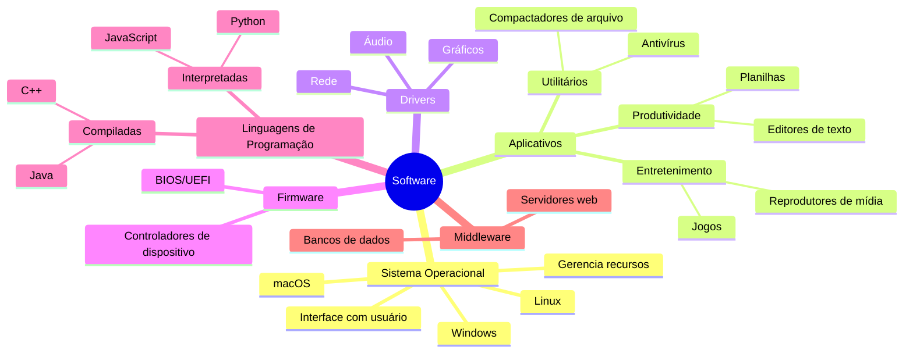

# 1.1.2 Software

Software é como o conjunto de regras e mecânicas que fazem o mundo de Minecraft funcionar. Assim como Minecraft tem diferentes tipos de mecânicas (como física, geração de mundo, interações de itens), um computador tem diferentes tipos de software que trabalham juntos para criar uma experiência funcional e interativa.

## Tipos de Software

### Sistema Operacional
O sistema operacional é como o modo de jogo em Minecraft (Sobrevivência, Criativo, etc.). Ele define as regras básicas de como o computador funciona e como os outros programas podem interagir com o hardware.

### Aplicativos
Aplicativos são como os mods em Minecraft. Eles adicionam funcionalidades específicas ao sistema, permitindo que você realize tarefas como escrever documentos, navegar na internet ou editar imagens.

### Drivers
Drivers são semelhantes aos comandos de bloco em Minecraft. Eles permitem que o sistema operacional se comunique com o hardware específico, assim como os comandos de bloco permitem interações complexas com o mundo do jogo.

### Firmware
O firmware é como as configurações internas dos blocos em Minecraft. É um software embutido no hardware que fornece instruções básicas para o funcionamento do dispositivo.

### Linguagens de Programação
As linguagens de programação são como a linguagem de comandos em Minecraft. Elas permitem que os desenvolvedores criem software, assim como os comandos permitem aos jogadores criar comportamentos complexos no jogo.

## Mindmap do Software

Este mindmap ilustra os principais tipos e categorias de software, mostrando como eles se relacionam e se organizam no ecossistema digital, assim como diferentes elementos se combinam para criar a experiência completa de Minecraft.