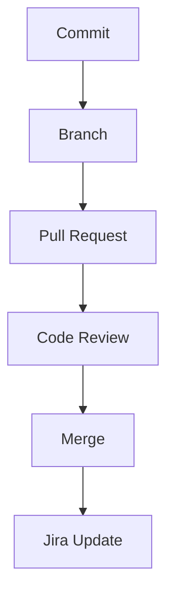
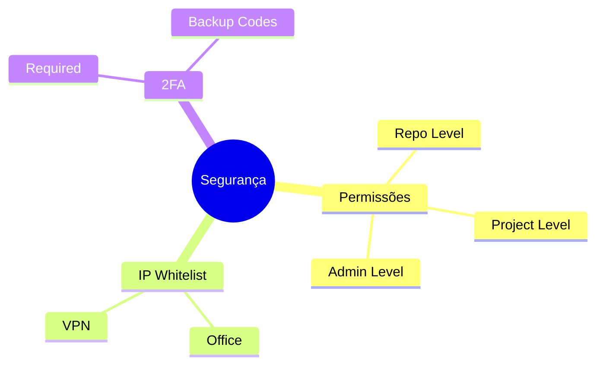
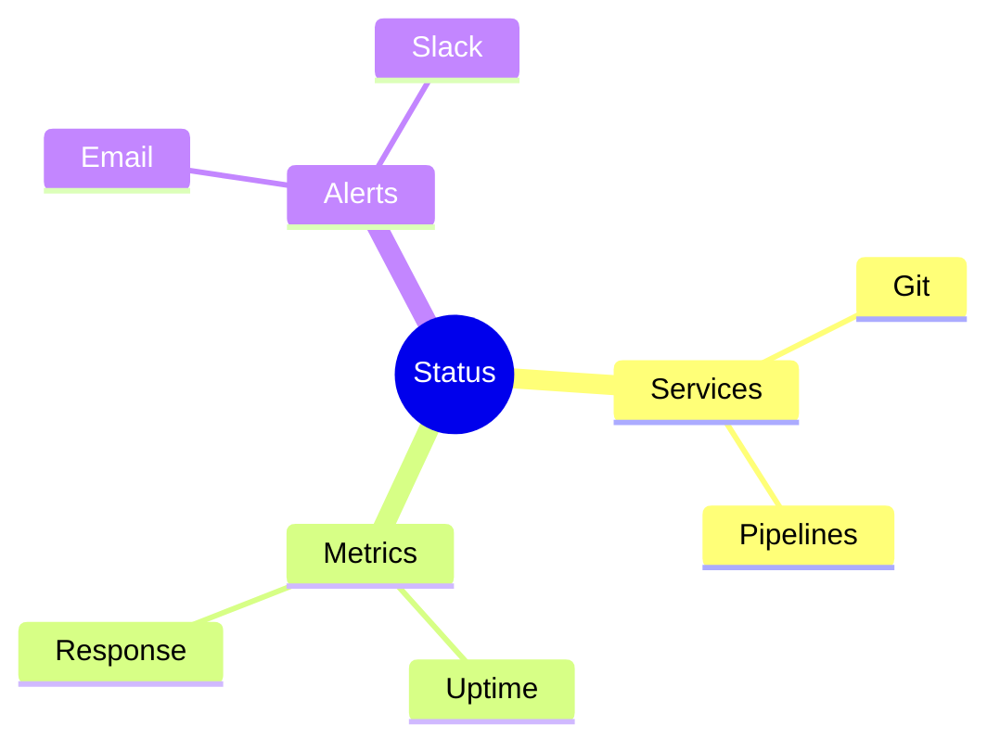

# Bitbucket: Recursos e Funcionalidades Específicas

## Pipelines

### Configuração Básica
```yaml
# bitbucket-pipelines.yml
image: node:16

pipelines:
  default:
    - step:
        name: Build and Test
        caches:
          - node
        script:
          - npm install
          - npm test
        artifacts:
          - dist/**
```

### Pipeline Avançada
```yaml
pipelines:
  branches:
    main:
      - step:
          name: Build
          script:
            - npm install
            - npm run build
      - step:
          name: Test
          script:
            - npm test
      - step:
          name: Deploy to Production
          deployment: production
          script:
            - pipe: atlassian/aws-elasticbeanstalk-deploy
```

## Integração Jira

### Smart Commits
```bash
# Formato
git commit -m "PROJ-123 #time 2h #comment Implementando feature"
```

### Workflow Integration


## Confluence Integration

### Documentação Automática
```markdown
# Template de Página
{code:title=Exemplo|language=java}
public class Example {
    // Código aqui
}
{code}

{status:colour=Green|title=Build Status}
Passed
{status}
```

### Code Snippets
```yaml
# Macro de código
{bitbucket:repo=project/repo|file=src/main.js|lines=10-20}
```

## Segurança

### Access Management


### Branch Restrictions
```ascii
+------------------------+
|    PROTEÇÕES          |
|                       |
| • Merge Check        |
| • Build Status       |
| • Approvals          |
| • Branch Pattern     |
+------------------------+
```

## Code Insights

### SonarQube Integration
```yaml
definitions:
  services:
    sonar:
      image: sonarqube:latest

pipelines:
  default:
    - step:
        services:
          - sonar
        script:
          - sonar-scanner
```

### Code Coverage
```yaml
- step:
    name: Code Coverage
    script:
      - npm run coverage
    after-script:
      - pipe: atlassian/bitbucket-upload-coverage
        variables:
          COVERAGE_REPORTS: 'coverage/lcov.info'
```

## Deployment

### Environments
```yaml
deployments:
  staging:
    - step:
        script:
          - aws deploy create-deployment
  production:
    - step:
        trigger: manual
        script:
          - aws deploy create-deployment
```

### Deployment Variables
```bash
# Configuração de variáveis
bitbucket pipelines variables add \
  --key AWS_ACCESS_KEY_ID \
  --value $ACCESS_KEY \
  --secured
```

## Webhooks e API

### Webhook Configuration
```json
{
  "url": "https://api.example.com/webhook",
  "events": [
    "repo:push",
    "pullrequest:created",
    "pullrequest:merged"
  ]
}
```

### API Usage
```python
from atlassian import Bitbucket

bitbucket = Bitbucket(
    url='https://bitbucket.org',
    username='admin',
    password='admin'
)

# Get repository info
repo = bitbucket.get_repo('project', 'repository')
```

## Backup e Manutenção

### Backup Strategy


### Maintenance Scripts
```bash
#!/bin/bash
# Backup script
for repo in $(bitbucket repos list); do
  git clone --mirror $repo
  tar czf "${repo}.tar.gz" "${repo}.git"
done
```

## Monitoramento

### Status Page


### Performance Metrics
```ascii
+------------------------+
|    MÉTRICAS           |
|                       |
| • Response Time      |
| • Build Time         |
| • Success Rate       |
| • Error Rate         |
+------------------------+
```

## Próximos Passos

### Recursos Adicionais
- [Bitbucket Cloud Documentation](https://support.atlassian.com/bitbucket-cloud/)
- [Pipelines Examples](https://bitbucket.org/product/features/pipelines)
- [API Documentation](https://developer.atlassian.com/cloud/bitbucket/)

> **Dica Pro**: Use Smart Commits para integração eficiente com Jira e automatização de workflows.
