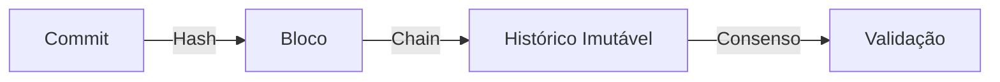
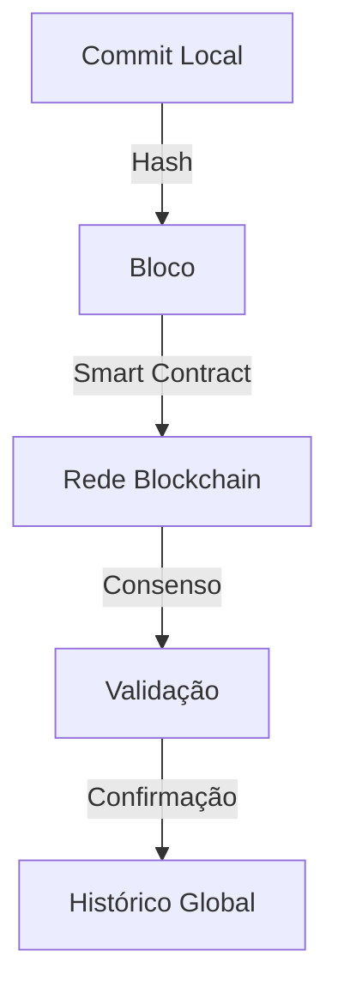
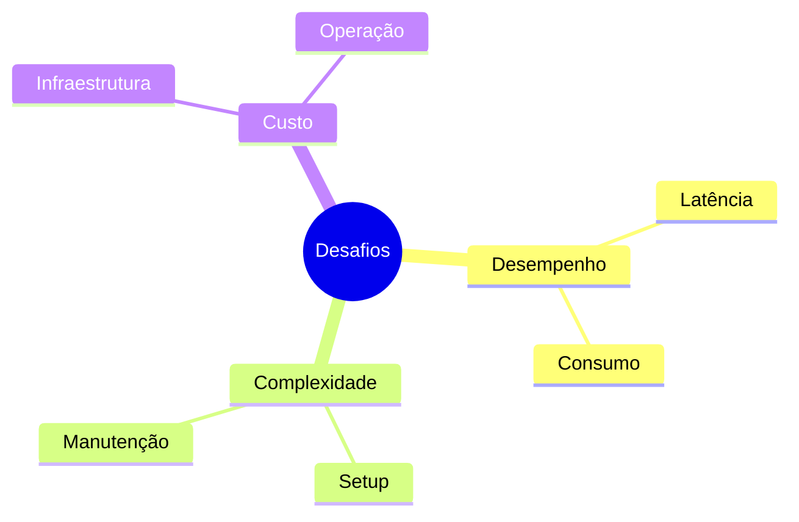
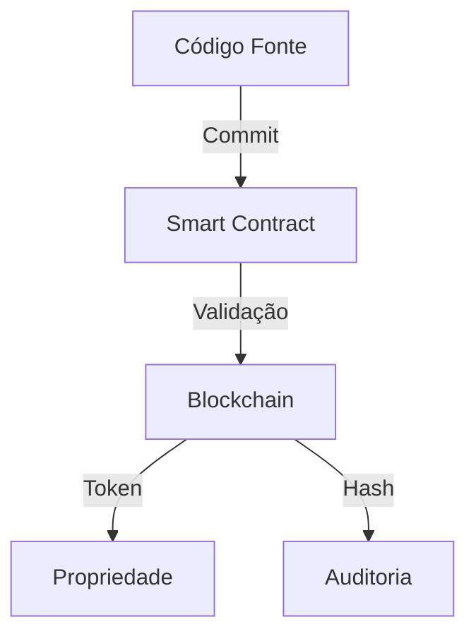
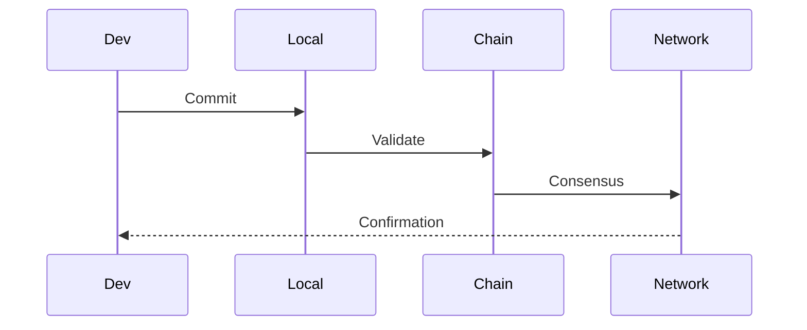
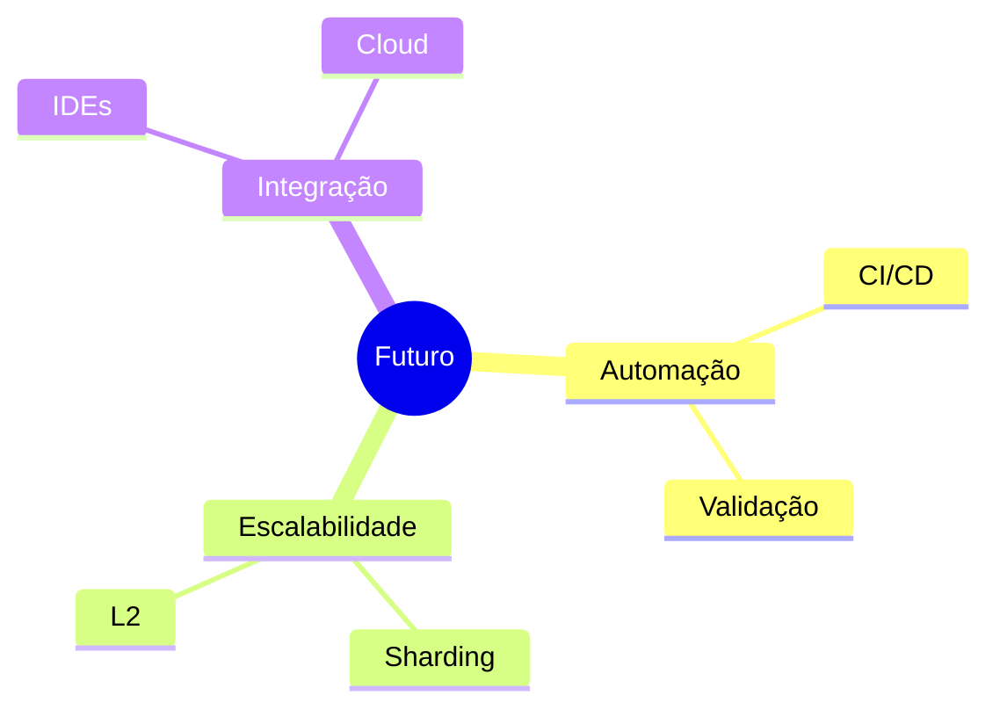

# Controle de Versão Baseado em Blockchain

O controle de versão baseado em blockchain é uma abordagem inovadora que combina os princípios de sistemas de controle de versão distribuídos com a tecnologia blockchain.

## Conceitos Fundamentais

### O que é Controle de Versão Blockchain?


### Características Principais
- **Imutabilidade**: Histórico permanente e inalterável
- **Descentralização**: Sem servidor central
- **Transparência**: Todas as alterações são rastreáveis
- **Criptografia**: Segurança integrada
- **Consenso**: Validação distribuída de alterações

## Implementações

### GitChain


### Características do GitChain
- Integração com Git existente
- Smart contracts para validação
- Tokens para governança
- Prova de trabalho otimizada

## Vantagens e Desvantagens

### Vantagens
- Histórico imutável
- Auditoria garantida
- Descentralização real
- Propriedade verificável
- Segurança criptográfica

### Desvantagens


## Casos de Uso

### Ideal Para
- Software crítico
- Contratos inteligentes
- Projetos regulamentados
- Propriedade intelectual
- Auditorias rigorosas

### Exemplos Práticos


## Ferramentas e Plataformas

### Populares
- **CodeChain**: Plataforma blockchain para código
- **VersionX**: Sistema híbrido Git+Blockchain
- **BlockVCS**: Controle de versão descentralizado

### Integração
```bash
# Exemplo de uso com CodeChain
cchain init
cchain commit -m "feat: nova funcionalidade"
cchain validate
cchain push --network ethereum
```

## Melhores Práticas

### Recomendações
1. Use redes privadas para testes
2. Implemente validação em múltiplas camadas
3. Mantenha backups locais
4. Monitore custos de transação
5. Planeje a governança

### Workflow Sugerido


## Futuro e Tendências

### Desenvolvimentos
- Integração com CI/CD
- Redes específicas para código
- Otimização de recursos
- Governança automatizada

### Inovações Esperadas


## Recursos Adicionais

### Documentação
- [CodeChain Docs](https://codechain.example.com)
- [BlockVCS Guide](https://blockvcs.example.com)
- [Git+Blockchain Paper](https://research.example.com)

### Comunidade
- Fóruns de discussão
- Grupos de desenvolvedores
- Conferências especializadas

> **Dica Pro**: Comece com uma rede privada para experimentar antes de migrar para uma rede pública!