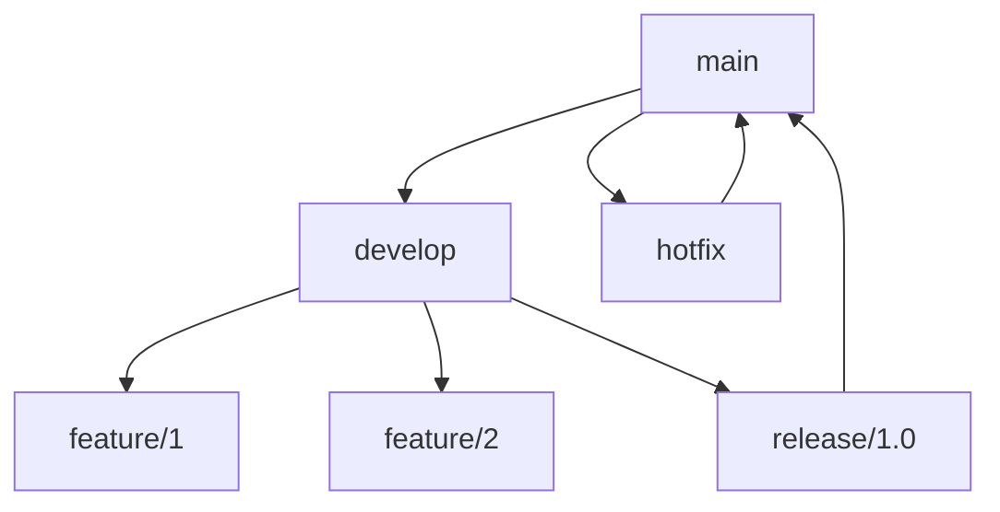
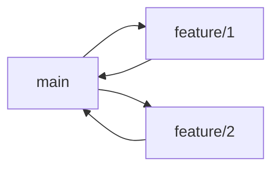

# Estratégias de Branch

## Modelos Principais

### GitFlow


### Trunk-Based


## Nomenclatura

### Padrões
```ascii
feature/   - Novas funcionalidades
fix/       - Correções de bugs
hotfix/    - Correções urgentes
release/   - Preparação para release
docs/      - Documentação
refactor/  - Refatoração
```

## Proteções

### Regras de Branch
```yaml
branches:
  main:
    protection:
      required_reviews: 2
      required_checks: true
      enforce_admins: true
```

## Fluxo de Trabalho

### Feature Branch
1. Criar branch da main
2. Desenvolver feature
3. Criar Pull Request
4. Code Review
5. Merge após aprovação

### Hotfix
1. Branch da main
2. Correção rápida
3. Merge direto para main
4. Sincronizar develop

## Automação

### GitHub Actions
```yaml
name: Branch Protection
on:
  pull_request:
    branches: [main]
jobs:
  validate:
    runs-on: ubuntu-latest
    steps:
      - uses: actions/checkout@v3
      - name: Run Tests
        run: npm test
```