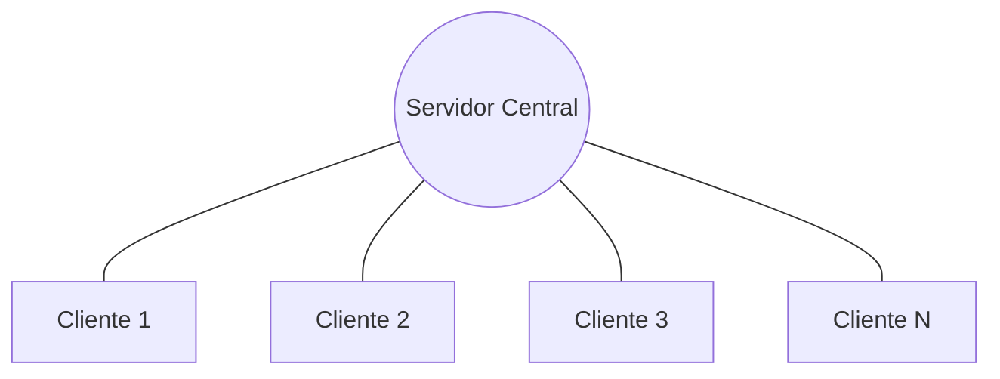
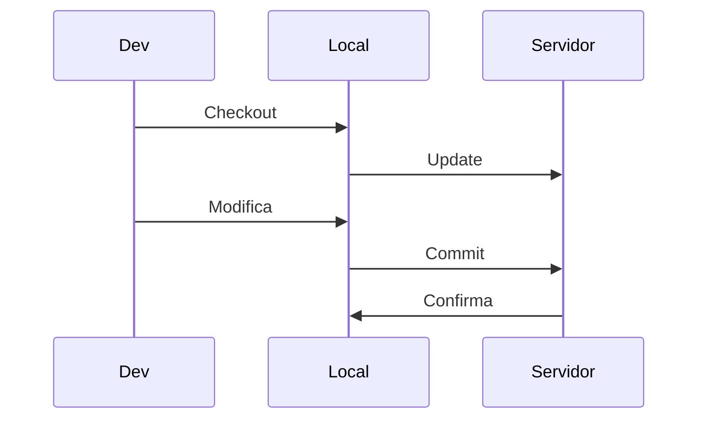
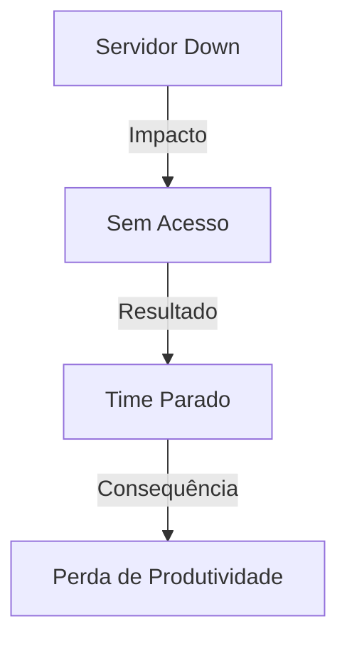
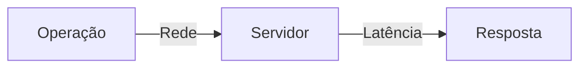
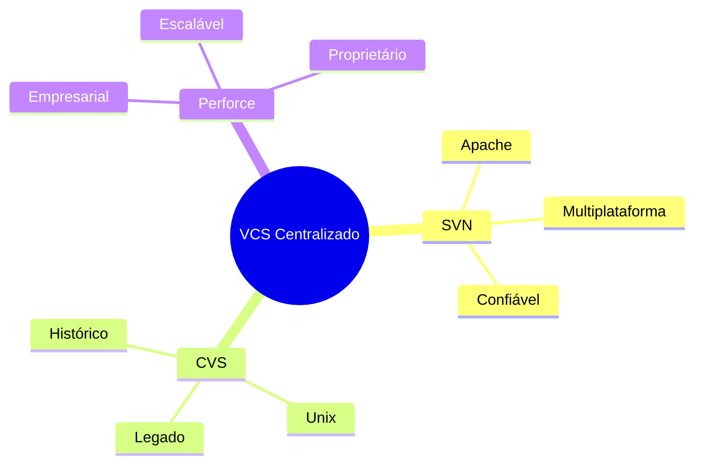
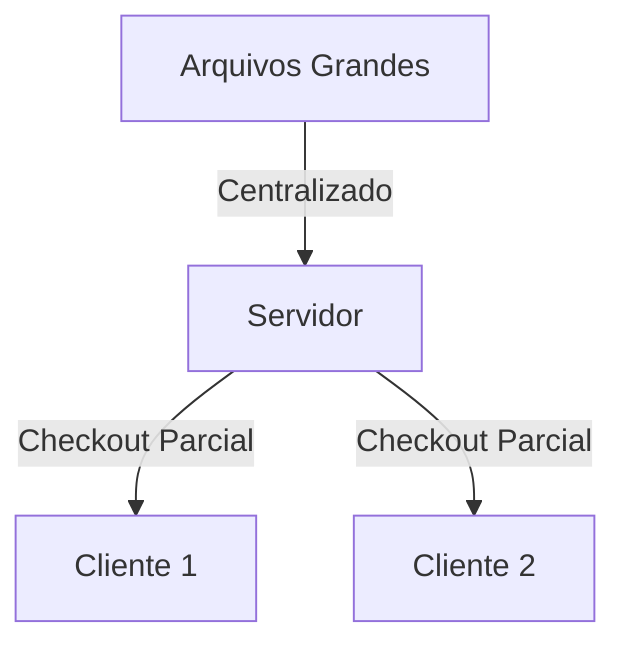
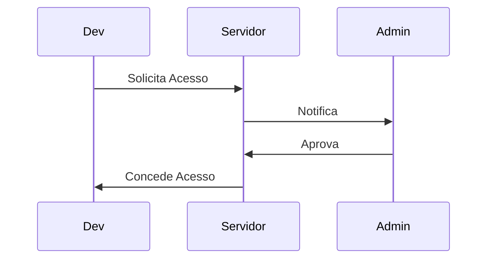
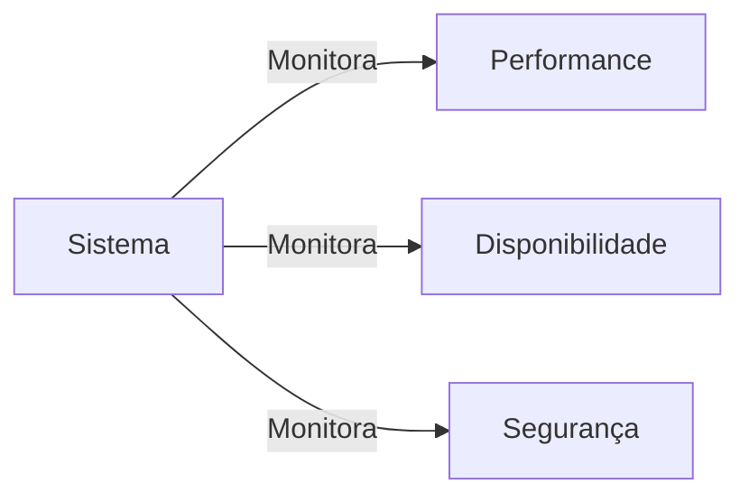
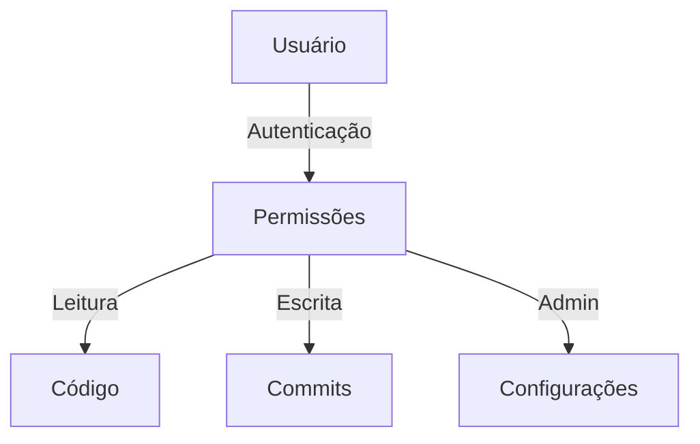
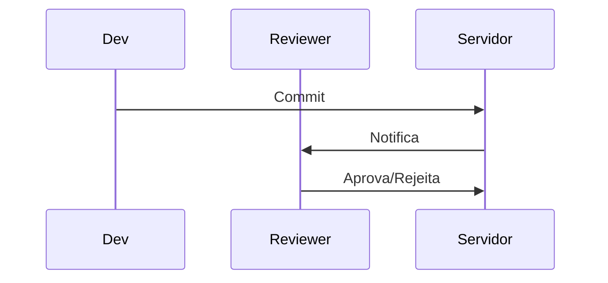

# Sistemas de Controle de Versão Centralizado

Um sistema de controle de versão centralizado (CVCS) é como uma festa na casa da mãe do Stifler - todos precisam ir ao mesmo lugar para participar! Este sistema utiliza um servidor central que armazena todos os arquivos versionados e permite que múltiplos desenvolvedores colaborem no mesmo projeto.

## Características Principais

### 1. Servidor Central
- Repositório único e autoritativo
- Controle de acesso centralizado
- Backup centralizado
- Administração simplificada

### 2. Clientes
- Checkout de arquivos específicos
- Histórico parcial
- Dependência de conectividade
- Workspace local limitado

## A Casa da Mãe do Stifler

Como uma festa na casa da mãe do Stifler, todos precisam ir ao mesmo lugar para participar!

### Arquitetura



### Estrutura do Sistema
```ascii
      +----------------+
      |    Servidor    |
      |    Central     |
      +----------------+
            ||||
    +-------++-+-------+
    |        |         |
+-------+ +-------+ +-------+
|Cliente| |Cliente| |Cliente|
|   1   | |   2   | |   3   |
+-------+ +-------+ +-------+
```

### Fluxo de Operações


## Vantagens e Desvantagens

### Vantagens
1. **Controle Centralizado**
   - Governança simplificada
   - Políticas uniformes
   - Backup único
   - Auditoria facilitada

2. **Administração Simples**
   - Gerenciamento de usuários
   - Controle de permissões
   - Monitoramento de uso
   - Manutenção única

3. **Visibilidade do Projeto**
   - Visão única do projeto
   - Status em tempo real
   - Progresso transparente
   - Colaboração sincronizada

### Desvantagens
1. **Ponto Único de Falha**


2. **Dependência de Rede**
```ascii
Servidor
    ^
    |
    X (Conexão Perdida)
    |
Cliente
```

3. **Performance Limitada**


## Exemplos Famosos


## Casos de Uso Ideais

### 1. Equipes Localizadas
```ascii
+----------------+
|   Escritório   |
|  +----------+  |
|  | Time Dev |  |
|  +----------+  |
+----------------+
        |
   Servidor VCS
```

### 2. Projetos com Ativos Grandes


### 3. Controle Rigoroso


## Melhores Práticas

### 1. Backup Regular
```ascii
Servidor Principal
      |
      v
Backup Diário
      |
      v
Backup Offsite
```

### 2. Monitoramento


### 3. Políticas de Acesso


## Ferramentas de Suporte

### 1. Integração Contínua
```ascii
+----------------+
| Build Server   |
|  +----------+  |
|  | CI/CD    |  |
|  +----------+  |
+----------------+
```

### 2. Code Review


### 3. Rastreamento de Issues
```ascii
+----------------+
| Issue Tracker  |
|  #123 Bug     |
|  #124 Feature |
|  #125 Task    |
+----------------+
```