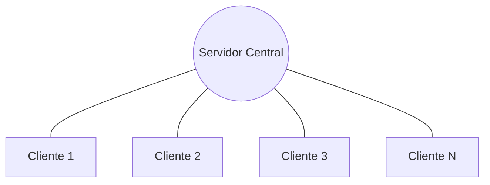
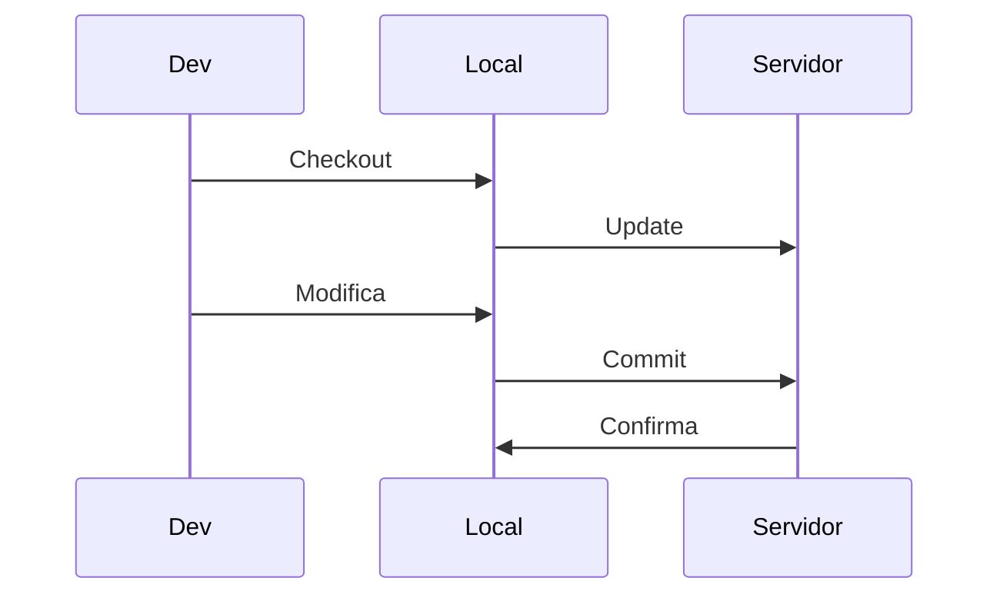
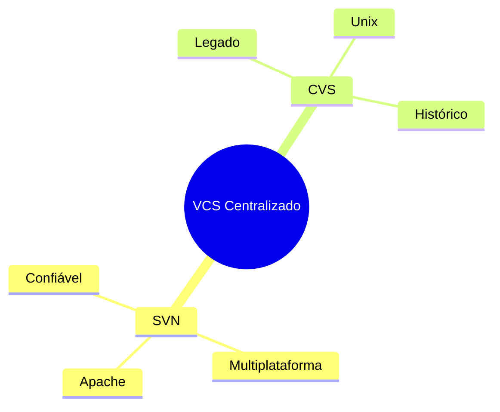

# Sistemas de Controle de Versão Centralizado

## A Casa da Mãe do Stifler

Como uma festa na casa da mãe do Stifler, todos precisam ir ao mesmo lugar para participar!

### Arquitetura



### Estrutura do Sistema
```ascii
      +----------------+
      |    Servidor    |
      |    Central     |
      +----------------+
            ||||
    +-------++-+-------+
    |        |         |
+-------+ +-------+ +-------+
|Cliente| |Cliente| |Cliente|
|   1   | |   2   | |   3   |
+-------+ +-------+ +-------+
```

### Fluxo de Operações


### Exemplos Famosos
