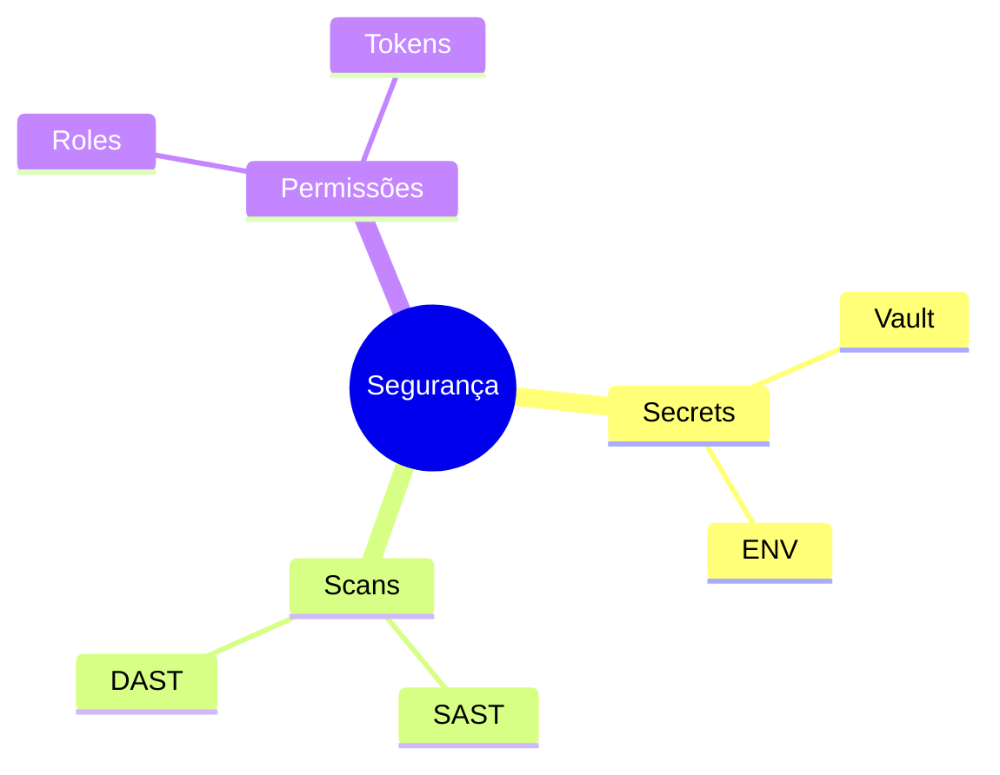

# Integração com CI/CD

A integração entre controle de versão e CI/CD (Integração Contínua/Entrega Contínua) automatiza o processo de build, teste e deploy.

## Pipeline Básico


## Ferramentas Populares

### 1. GitHub Actions
```yaml
name: CI
on: [push]
jobs:
  build:
    runs-on: ubuntu-latest
    steps:
      - uses: actions/checkout@v2
      - name: Build
        run: npm install && npm build
      - name: Test
        run: npm test
```

### 2. GitLab CI
```yaml
stages:
  - build
  - test
  - deploy

build:
  stage: build
  script:
    - npm install
    - npm build
```

### 3. Jenkins
```groovy
pipeline {
    agent any
    stages {
        stage('Build') {
            steps {
                sh 'npm install'
                sh 'npm build'
            }
        }
    }
}
```

## Melhores Práticas

### 1. Configuração
- Cache de dependências
- Ambientes isolados
- Variáveis secretas
- Logs detalhados

### 2. Segurança


## Monitoramento

### Métricas Importantes
- Tempo de build
- Taxa de sucesso
- Cobertura de testes
- Vulnerabilidades
- Performance