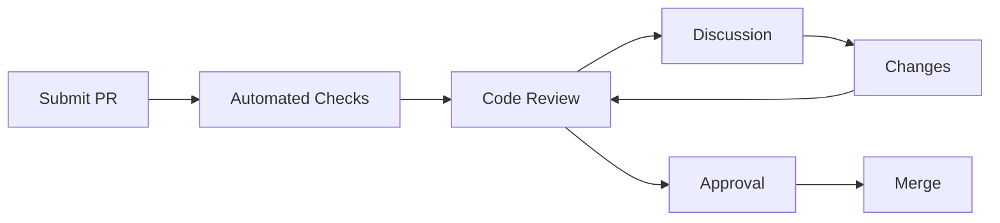

# Práticas de Code Review

## Princípios Fundamentais

### Objetivos
- Qualidade de código
- Compartilhamento de conhecimento
- Consistência
- Detecção precoce de bugs

## Processo

### Fluxo de Review


## Checklist

### Aspectos Técnicos
```ascii
✓ Funcionalidade
  └─ Atende requisitos
  └─ Casos de borda
  └─ Tratamento de erros

✓ Código
  └─ Legibilidade
  └─ Manutenibilidade
  └─ Performance
  └─ Segurança

✓ Testes
  └─ Cobertura
  └─ Qualidade
  └─ Casos relevantes
```

## Feedback

### Boas Práticas
- Seja construtivo
- Foque no código, não no autor
- Explique o "porquê"
- Sugira melhorias
- Use exemplos

### Formato
```markdown
### Feedback Template

**Contexto**
- Arquivo/função em questão

**Observação**
- Descrição clara do ponto

**Sugestão**
- Proposta de melhoria

**Exemplo**
```código sugerido```
```

## Automação

### GitHub Actions
```yaml
name: Code Review
on: [pull_request]
jobs:
  review:
    runs-on: ubuntu-latest
    steps:
      - uses: actions/checkout@v3
      - name: Code Analysis
        uses: github/codeql-action/analyze@v2
```