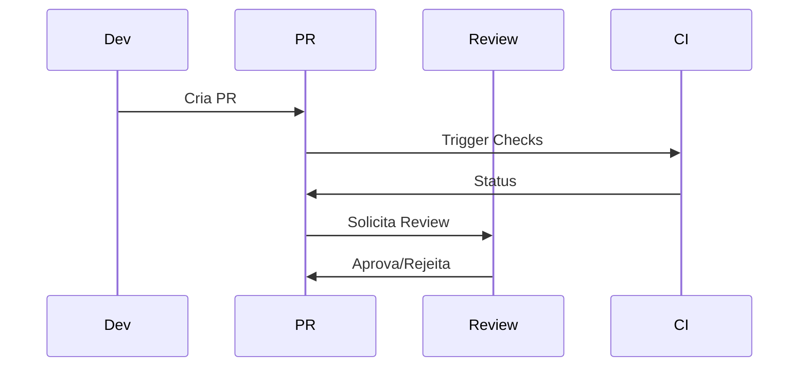
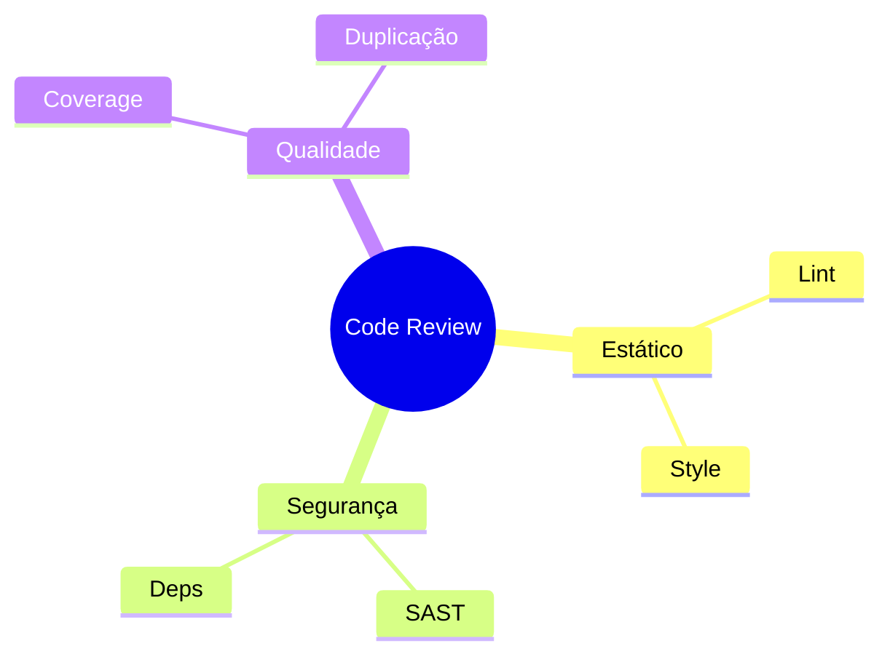
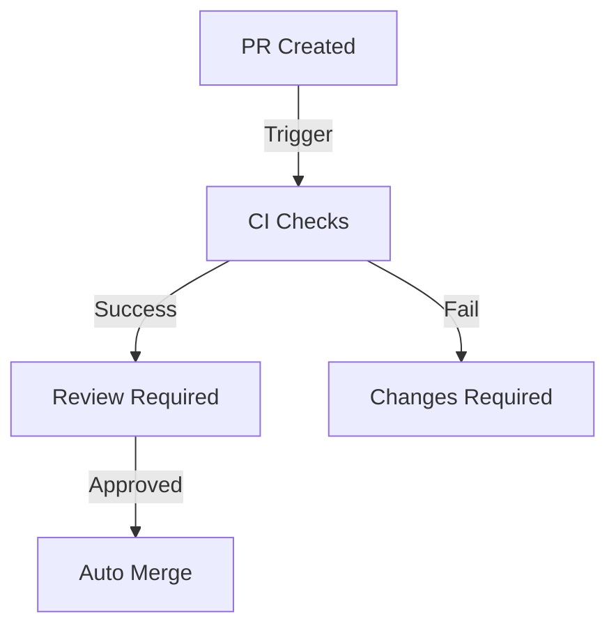

# Ferramentas de Code Review

As ferramentas de code review são essenciais para manter a qualidade do código e promover colaboração efetiva.

## Plataformas Principais

### 1. GitHub Pull Requests


### 2. GitLab Merge Requests
- Discussões inline
- Aprovações múltiplas
- CI/CD integrado
- Security scanning

### 3. Gerrit
- Code-review específico
- Verificação automatizada
- Integração com CI
- Workflows customizados

## Funcionalidades Essenciais

### 1. Análise de Código


### 2. Colaboração
- Comentários inline
- Sugestões de código
- Threads de discussão
- Menções (@username)

## Melhores Práticas

### 1. Processo
1. Revisão automatizada
2. Revisão humana
3. Testes verificados
4. Documentação atualizada

### 2. Checklist
```ascii
✓ Código limpo
✓ Testes adequados
✓ Documentação
✓ Performance
✓ Segurança
✓ Standards
```

## Automações Recomendadas

### 1. Checks Automáticos
- Lint
- Formatação
- Testes unitários
- Coverage
- Vulnerabilidades

### 2. Integrações
