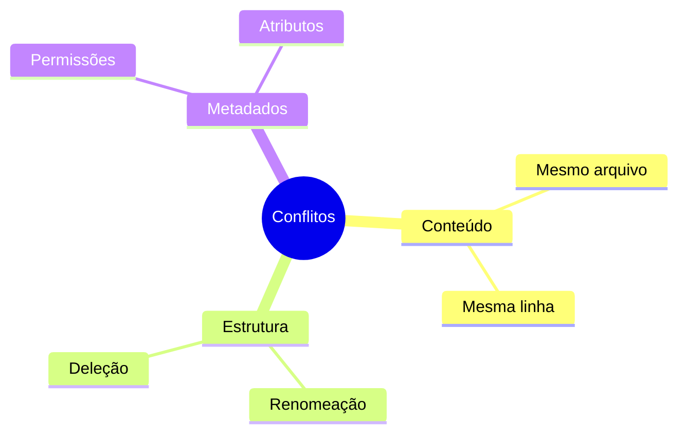
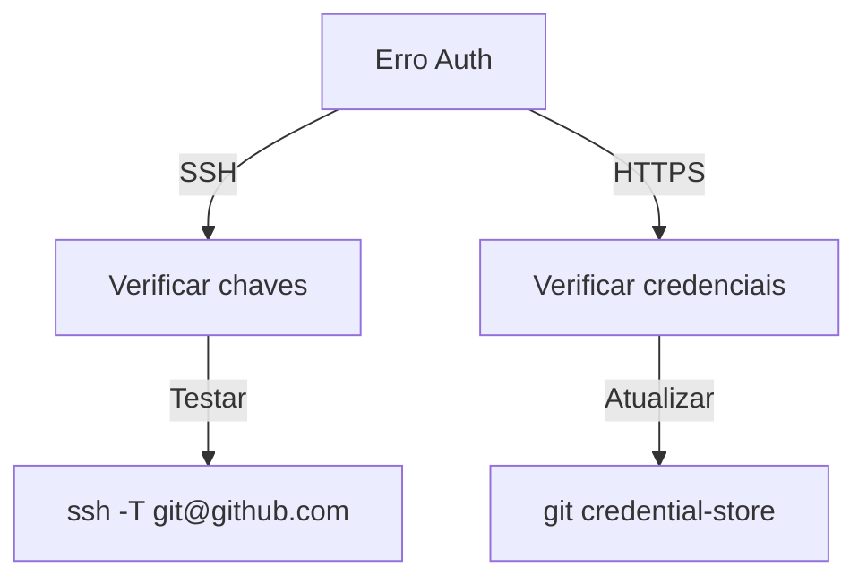

# Problemas Comuns do Git

## Conflitos de Merge

### Tipos de Conflitos


### Resolução
```bash
# Ver arquivos em conflito
git status

# Resolver usando ferramenta
git mergetool

# Após resolver
git add .
git commit -m "resolve conflitos"
```

## Problemas de Permissão

### Diagnóstico
```bash
# Verificar permissões
ls -la .git/

# Corrigir permissões
chmod -R u+rwX .git/
chmod -R g+rwX .git/
```

## Estados Inesperados

### Problemas Comuns
```ascii
+------------------------+
|    ESTADOS COMUNS     |
|                       |
| • Detached HEAD      |
| • Untracked files    |
| • Staged changes     |
| • Stash conflicts    |
| • Branch divergence  |
+------------------------+
```

### Soluções
```bash
# Detached HEAD
git checkout -b nova-branch
git checkout main

# Limpar working directory
git clean -fd

# Desfazer alterações
git reset --hard HEAD
```

## Problemas de Rede

### Diagnóstico
```bash
# Testar conectividade
git ls-remote origin

# Debug detalhado
GIT_CURL_VERBOSE=1 git fetch

# Verificar remote
git remote -v
```

## Problemas de Autenticação

### Soluções Comuns


## Próximos Passos

### Recursos Adicionais
- [Performance Issues](performance-issues.md)
- [Large Repositories](large-repositories.md)
- [Recovery Procedures](recovery-procedures.md)

> **Dica Pro**: Mantenha aliases para comandos comuns de troubleshooting no seu `.gitconfig`.