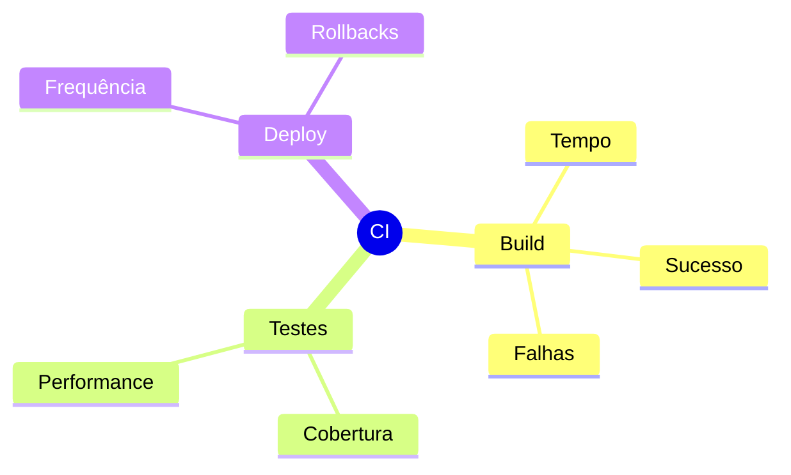

# Integração Contínua

## Pipeline Básico

### Estrutura


## Configuração

### GitHub Actions
```yaml
name: CI
on:
  push:
    branches: [main]
  pull_request:
    branches: [main]

jobs:
  build:
    runs-on: ubuntu-latest
    steps:
      - uses: actions/checkout@v3
      - name: Setup
        run: npm install
      - name: Build
        run: npm run build
      - name: Test
        run: npm test
```

## Automação

### Scripts
```bash
#!/bin/sh
# build.sh
npm install
npm run lint
npm test
npm run build
```

## Qualidade

### Checks
```ascii
✓ Lint
  └─ Estilo
  └─ Padrões
  └─ Boas práticas

✓ Testes
  └─ Unitários
  └─ Integração
  └─ E2E

✓ Build
  └─ Compilação
  └─ Bundling
  └─ Otimização
```

## Monitoramento

### Métricas


## Segurança

### Scans
```yaml
security:
  runs-on: ubuntu-latest
  steps:
    - uses: actions/checkout@v3
    - name: Security Scan
      uses: snyk/actions/node@master
    - name: SAST
      uses: github/codeql-action/analyze@v2
```