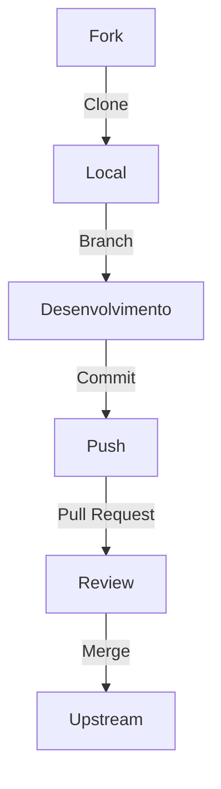

# Contribuindo para o Git Pie 🤝

## Antes de Começar

Antes de fazer uma contribuição, certifique-se de:

1. Verificar se já não existe uma Issue similar
2. Ler nosso Código de Conduta
3. Entender nossas diretrizes de contribuição

## Como Contribuir

### 1. Preparando o Ambiente

```bash
# Clone o repositório
git clone https://github.com/seu-usuario/git-pie.git

# Entre no diretório
cd git-pie

# Instale as dependências
npm install
```

### 2. Criando uma Nova Feature

```bash
# Crie uma nova branch
git checkout -b feature/nova-funcionalidade

# Faça suas alterações
# ...

# Commit das mudanças
git commit -m "feat: adiciona nova funcionalidade"

# Push para seu fork
git push origin feature/nova-funcionalidade
```

### 3. Submetendo Alterações



## Tipos de Contribuição

### 1. Documentação 📚
- Correções de texto
- Melhorias na explicação
- Novos exemplos
- Traduções

### 2. Código 💻
- Novos recursos
- Correções de bugs
- Melhorias de performance
- Testes

### 3. Design 🎨
- Melhorias no layout
- Novos diagramas
- Imagens e ilustrações
- Temas e estilos

## Diretrizes

### Commits
Seguimos o padrão Conventional Commits:

```bash
feat: nova funcionalidade
fix: correção de bug
docs: atualização de documentação
style: formatação de código
refactor: refatoração de código
test: adição/modificação de testes
chore: alterações em arquivos de build
```

### Pull Requests

Seu PR deve incluir:

- Descrição clara das mudanças
- Screenshots (se aplicável)
- Referência a Issues relacionadas
- Checklist de alterações

### Código

- Siga o estilo de código do projeto
- Adicione testes quando necessário
- Mantenha a documentação atualizada
- Evite alterações não relacionadas

## Processo de Review

1. Verificação automatizada
2. Review por mantenedores
3. Feedback e ajustes
4. Aprovação e merge

## Reconhecimento

Todos os contribuidores são reconhecidos em nosso arquivo CONTRIBUTORS.md e na documentação do projeto.

## Precisa de Ajuda?

- Abra uma Issue
- Entre em contato com os mantenedores
- Participe de nossas discussões

---

> **Próximos Passos**: Veja nossa [lista de Issues](issues.md) para encontrar algo para trabalhar.