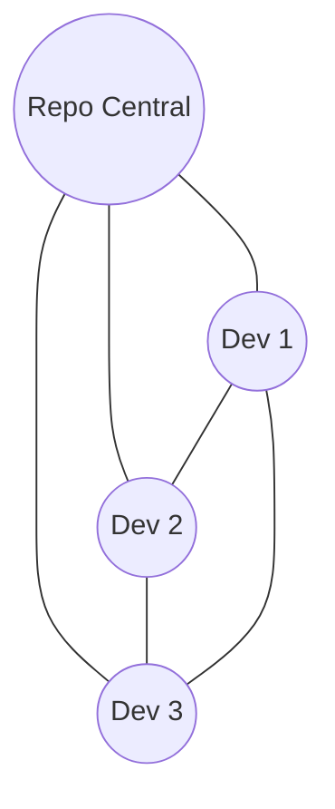
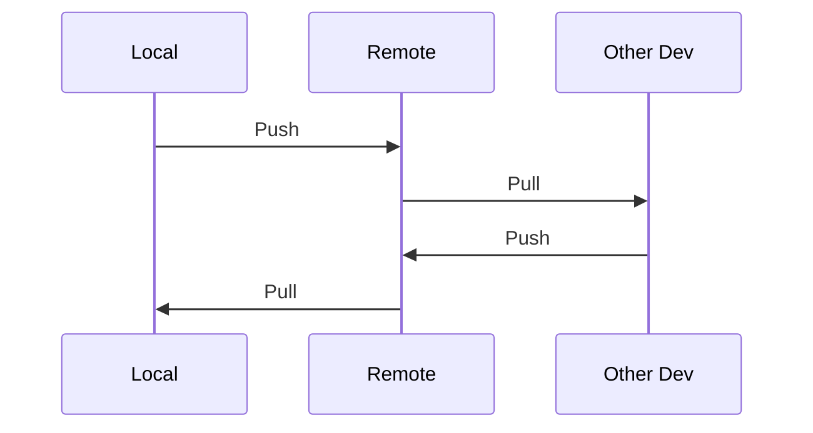
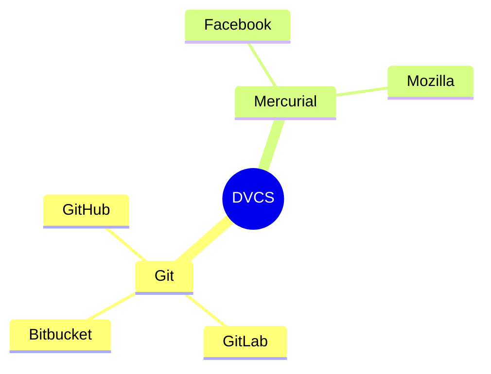

# Sistemas de Controle de Versão Distribuído

## A Rede Social das Milfs

Como uma rede social onde todo mundo tem sua própria cópia de tudo!

### Conceito



### Estrutura Distribuída
```ascii
    +----------------+
    |  Repositório   |
    |    Remoto      |
    +----------------+
     /      |       \
+-------+ +-----+ +-------+
| Clone | |Clone| | Clone |
|   1   | |  2  | |   3   |
+-------+ +-----+ +-------+
```

### Fluxo de Trabalho


### Sistemas Populares
