# Sistemas de Controle de Versão Distribuído

## A Rede Social das Milfs

Sabe aquela rede social onde todo mundo tem sua própria cópia das fotos e vídeos? Pois é, um sistema distribuído é exatamente assim! Cada desenvolvedor tem uma cópia completa do projeto, como se cada um tivesse sua própria festa particular.

## Por que é tipo uma Rede Social?

### Todo Mundo tem Tudo
Imagine que o Stifler, o Jim e o Finch estão trabalhando juntos. Cada um tem uma cópia completa do projeto no seu computador. É como se cada um tivesse baixado todas as fotos e vídeos da festa - ninguém depende do celular dos outros pra ter acesso às memórias da noitada.

### Trabalho Offline? Pode Sim!
Diferente do sistema centralizado (onde todo mundo depende da casa da mãe do Stifler), aqui cada um pode trabalhar no seu canto. O Jim pode codar mesmo quando sua internet cair, o Finch pode fazer alterações no ônibus, e o Stifler... bem, ele pode programar onde ele quiser (provavelmente enquanto procura milfs no Tinder).

### Compartilhando as Novidades
Quando alguém quer mostrar seu trabalho, é só dar um "push" (tipo postar na rede social). E quando quer ver o que os outros fizeram? Dá um "pull" (como dar aquela stalkeada básica no feed dos amigos).

## Conceito Básico

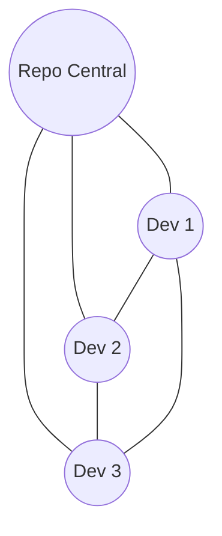

### Estrutura Distribuída
```ascii
    +----------------+
    |  Repositório   |
    |    Remoto      |
    +----------------+
     /      |       \
+-------+ +-----+ +-------+
| Clone | |Clone| | Clone |
|   1   | |  2  | |   3   |
+-------+ +-----+ +-------+
```

### Fluxo de Trabalho
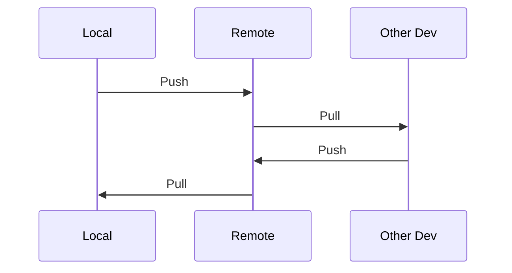

## Características Principais

### 1. Independência Total
- Trabalho offline como um campeão
- Commits locais sem depender de ninguém
- Sua festa, suas regras

### 2. Backup Distribuído
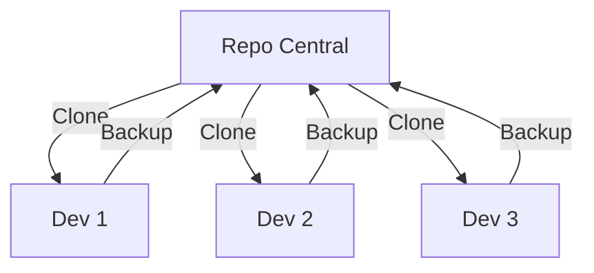

### 3. Performance Aprimorada
```ascii
Local Operations
    ⚡️ SUPER RÁPIDO ⚡️
    └── Commits
    └── Branches
    └── History
    └── Diffs
```


## Vantagens de Ter Sua Própria Festa

### 1. Independência Total
- Faça commits sem precisar de internet
- Crie branches experimentais sem medo
- Trabalhe no seu ritmo
- Teste coisas malucas sem ninguém saber

### 2. Backup em Todo Lugar
Lembra quando o Stifler perdeu todas as fotos da festa porque derrubou cerveja no computador? Com DVCS isso não seria um problema! Como todo mundo tem uma cópia completa, é praticamente impossível perder o código. É tipo ter backup até no backup do backup.

### 3. Performance Insana
Quase tudo é local, então é mais rápido que o Stifler correndo atrás de uma milf. Commits, branches, histórico - tudo acontece na velocidade da luz porque não precisa ficar perguntando pro servidor.

## Como Funciona na Prática?

### O Dia a Dia
1. **Clone**: Primeiro você clona o repositório - é tipo fazer o download da festa inteira
2. **Trabalho Local**: Faz suas alterações na sua cópia - como editar suas fotos antes de postar
3. **Commit**: Salva as alterações localmente - guardando suas edições no rascunho
4. **Push**: Envia para o repositório remoto - finalmente postando na rede social
5. **Pull**: Baixa alterações dos outros - atualizando seu feed

### Quando Tem Treta

Às vezes duas pessoas mudam a mesma coisa - tipo o Stifler e o Jim editando a mesma foto. Isso gera um conflito, mas não é o fim do mundo:

1. O sistema avisa que tem conflito
2. Você decide qual versão manter (ou combina as duas)
3. Faz um novo commit com a resolução
4. Todo mundo fica feliz!


### 1. Flexibilidade Máxima
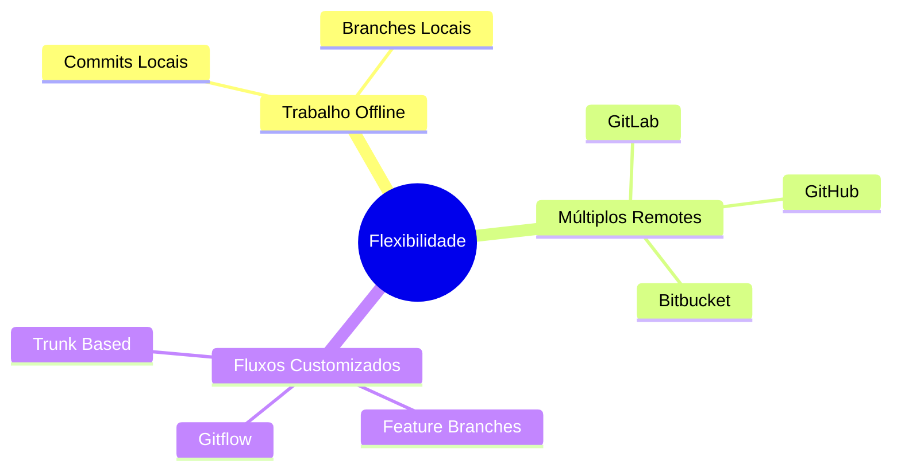

### 2. Colaboração Avançada
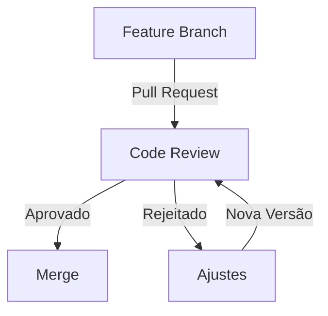

### 3. Segurança Reforçada
```ascii
+-------------------+
|   Repo Central    |
+-------------------+
        |||
   +----------+
   | Clones   |
   +----------+
   | Backups  |
   +----------+
   | História |
   +----------+
```

## Sistemas Populares
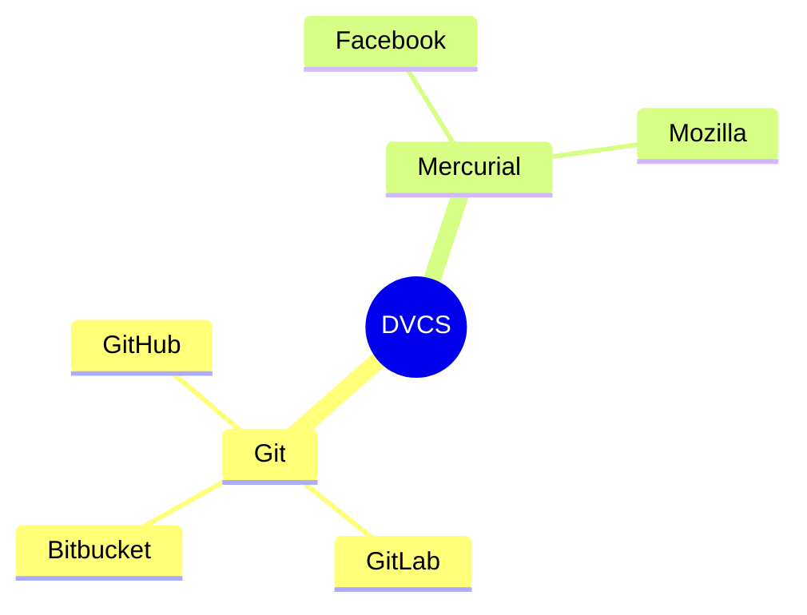

## Workflows Populares

### 1. Feature Branch
Cada nova funcionalidade ganha sua própria branch. É como se cada nova ideia maluca do Stifler tivesse seu próprio espaço para não bagunçar a festa principal.

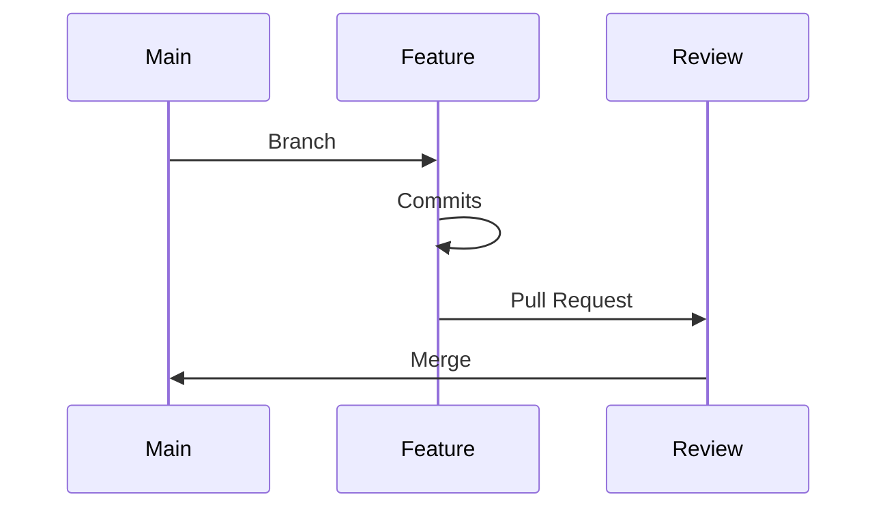

### 2. Gitflow
Um workflow mais estruturado, com branches específicas para desenvolvimento, features, releases e hotfixes. É tipo ter áreas VIP, pista de dança e bar separados na festa.


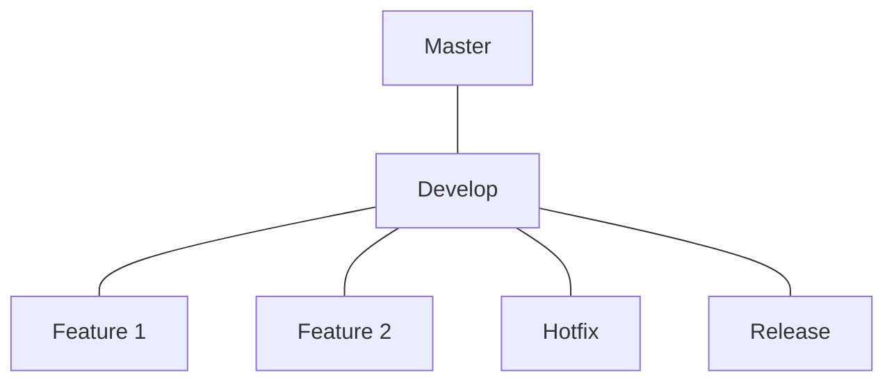

### 3. Trunk Based
Desenvolvimento direto na main com branches curtas. É como uma festa mais intimista, onde todo mundo fica no mesmo ambiente.


```ascii
main
 |
 ├── feature/quick
 |     └── merge rápido
 |
 ├── feature/small
 |     └── merge rápido
 |
 └── atual
```

## Melhores Práticas

### 1. Commits Atômicos
- Faça commits pequenos e focados
- Escreva mensagens que façam sentido
- Não commita código quebrado
- Imagine que você vai ler isso bêbado depois

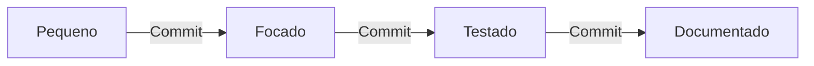

### 2. Branches Organizados
- Crie uma branch pra cada feature nova
- Mantenha a main/master sempre funcionando
- Não tenha medo de experimentar em branches
- Merge só quando tiver certeza

```ascii
main
 ├── feature/
 │    ├── nova-festa
 │    └── mais-milfs
 ├── hotfix/
 │    └── bug-critico
 └── release/
      └── v2.0
```

### 3. Sincronização Regular
- Dê pull antes de começar a trabalhar
- Push quando terminar algo importante
- Mantenha seu código atualizado
- Não deixe commits acumularem

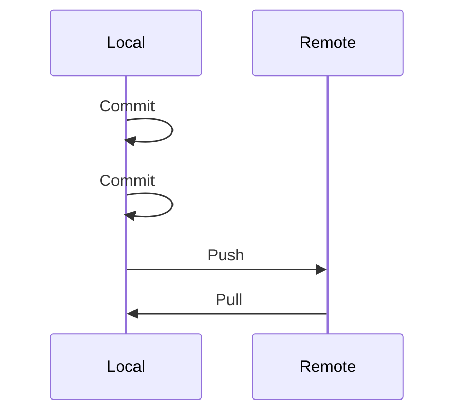

## Ferramentas Essenciais

### 1. Interfaces Gráficas
- GitKraken
- SourceTree
- GitHub Desktop

### 2. Extensões IDE
```ascii
+---------------+
| IDE           |
|  +----------+ |
|  | Git      | |
|  | Tools    | |
|  +----------+ |
+---------------+
```
Toda IDE que se preze tem integração com Git. Use e abuse delas!


### 3. CLI Aprimorada
Personalize seu terminal para trabalhar melhor com Git. Aliases e prompts podem salvar seu dia!
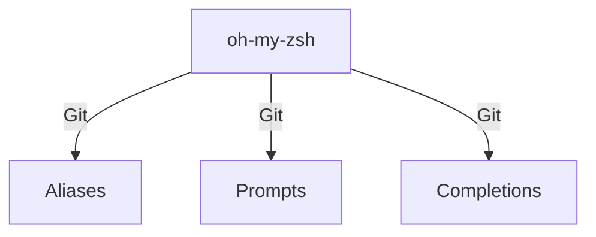

## Conclusão

DVCS é como ter uma festa particular que pode se conectar com outras festas quando quiser. Cada um tem seu espaço, suas regras, mas todo mundo pode compartilhar quando estiver pronto! É a democracia do código - todo mundo tem poder igual, ninguém depende de um servidor central, e a festa nunca para!

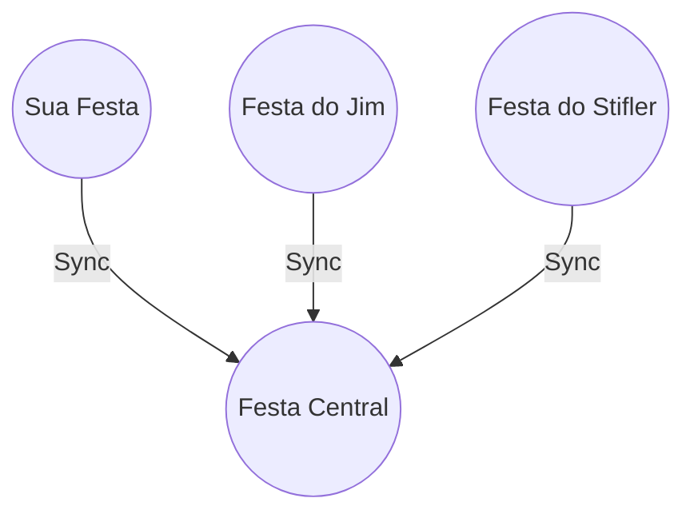