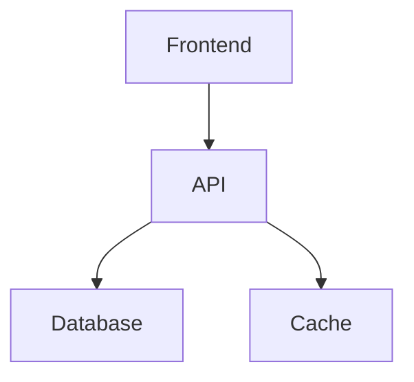

# Práticas de Documentação

## Estrutura

### Hierarquia
```ascii
docs/
├── README.md
├── CONTRIBUTING.md
├── CHANGELOG.md
└── technical/
    ├── architecture.md
    ├── api.md
    └── deployment.md
```

## Componentes Essenciais

### README
```markdown
# Projeto XYZ

## Visão Geral
Breve descrição do projeto

## Instalação
```bash
npm install
npm start
```

## Uso
Exemplos básicos

## Contribuição
Como contribuir

## Licença
MIT
```

## Documentação Técnica

### API
```yaml
/users:
  get:
    description: Lista usuários
    parameters:
      - name: limit
        type: integer
    responses:
      200:
        description: Sucesso
```

### Arquitetura


## Automação

### Geração de Docs
```yaml
name: Docs
on:
  push:
    branches: [main]
jobs:
  build:
    runs-on: ubuntu-latest
    steps:
      - uses: actions/checkout@v3
      - name: Build Docs
        run: |
          npm install
          npm run docs
```

## Manutenção

### Checklist
- Atualizar após mudanças
- Revisar periodicamente
- Validar exemplos
- Manter changelog
- Verificar links