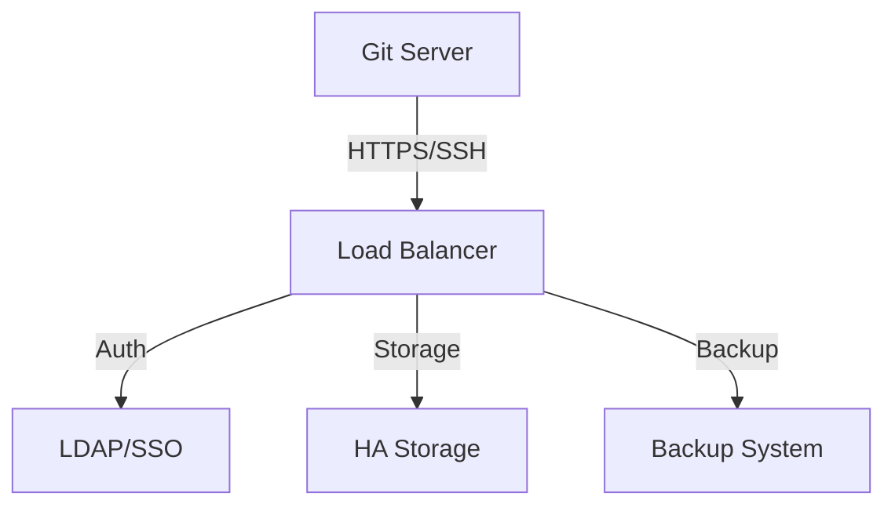
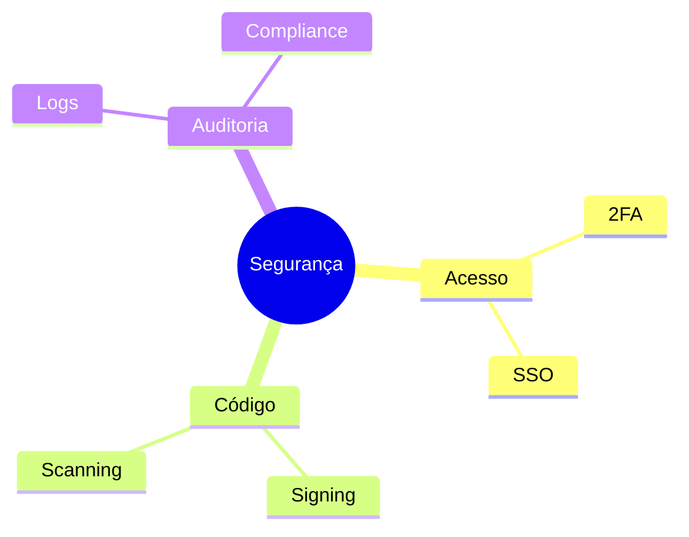
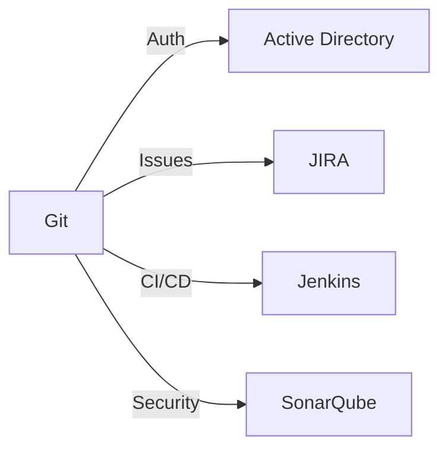
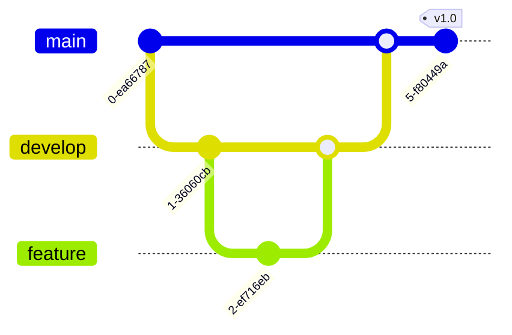
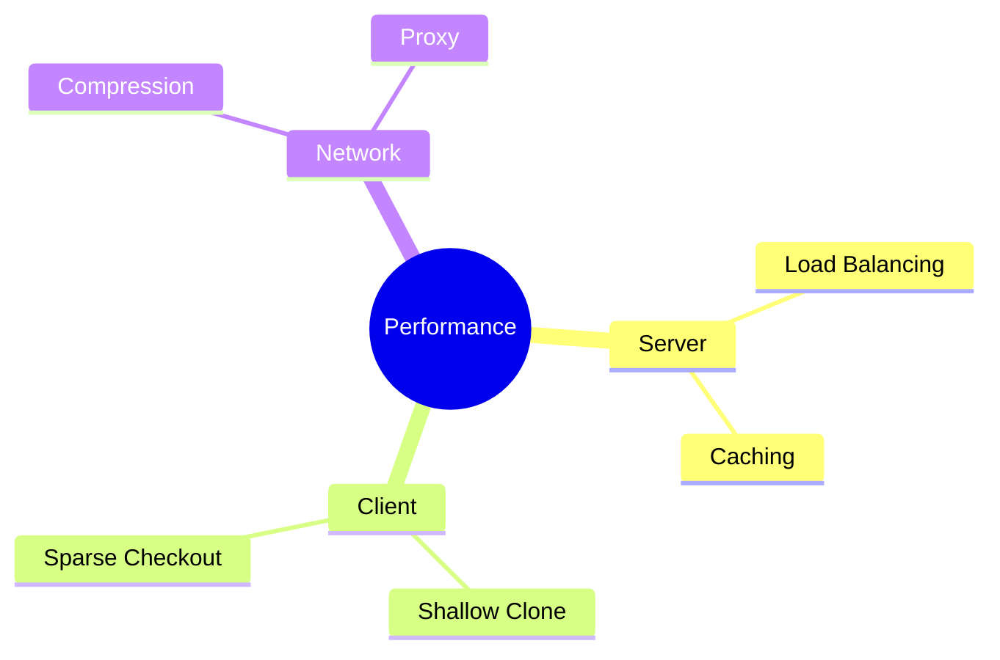
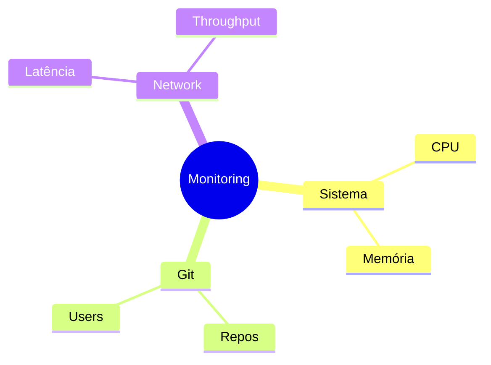

# Git Empresarial

## Características

O Git em ambiente empresarial requer considerações especiais de segurança, escalabilidade e governança.

## Infraestrutura

### Arquitetura


## Segurança

### Políticas


### Configurações
```bash
# Força HTTPS
git config --global http.sslVerify true

# Signing commits
git config --global commit.gpgsign true

# Credentials timeout
git config --global credential.helper 'cache --timeout=3600'
```

## Governança

### Estrutura
```ascii
+------------------------+
|     GOVERNANÇA        |
|                       |
| • Políticas         |
| • Padrões          |
| • Compliance       |
| • Auditoria        |
| • Treinamento      |
+------------------------+
```

## Integração

### Sistemas Corporativos


## Workflows

### Branching Strategy


## Performance

### Otimizações


## Backup e DR

### Estratégias
1. Backup incremental
2. Replicação geográfica
3. Snapshot periódico
4. Teste de recuperação

### Configuração
```bash
# Backup script
#!/bin/bash
DATE=$(date +%Y%m%d)
git bundle create backup-$DATE.bundle --all
```

## Monitoramento

### Métricas Principais


## Compliance

### Requisitos
```ascii
+------------------------+
|     COMPLIANCE        |
|                       |
| • SOX               |
| • GDPR              |
| • ISO 27001         |
| • PCI DSS           |
| • HIPAA             |
+------------------------+
```

## Próximos Passos

### Tópicos Relacionados
- [Git Security](git-security.md)
- [Git Migration](git-migration.md)
- [Large Repositories](large-repositories.md)

> **Dica Pro**: Implemente hooks de servidor para forçar políticas de segurança e qualidade de código.