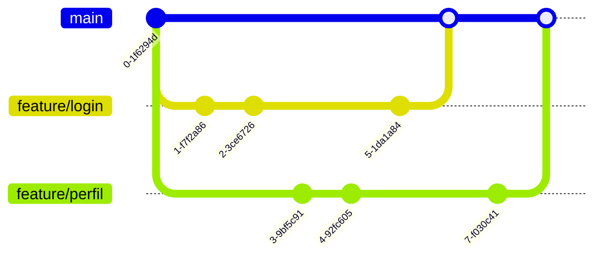
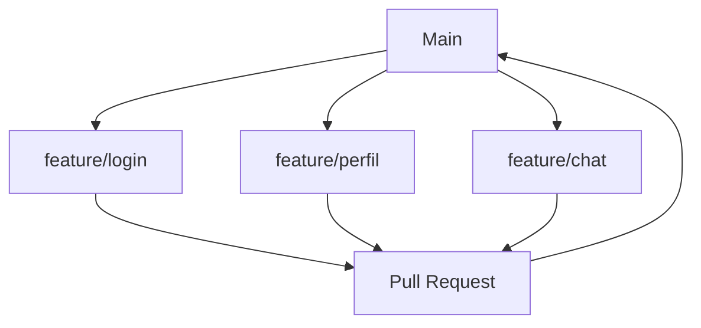
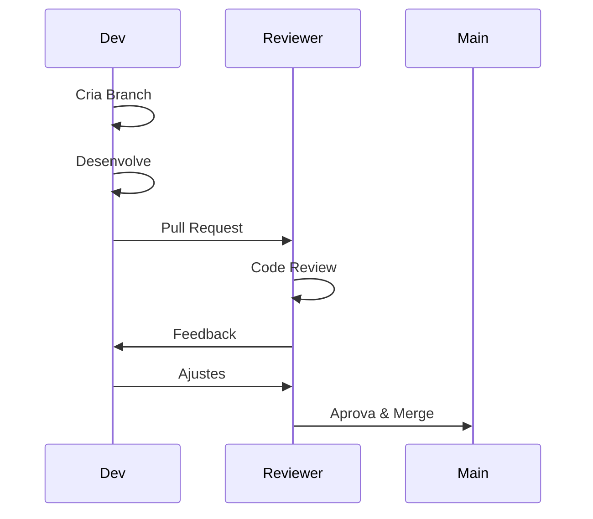
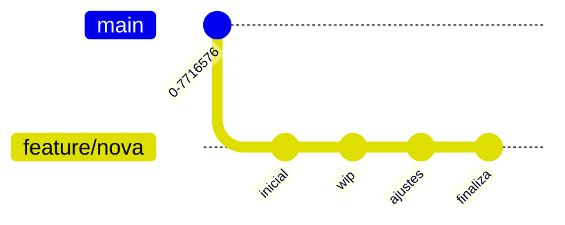
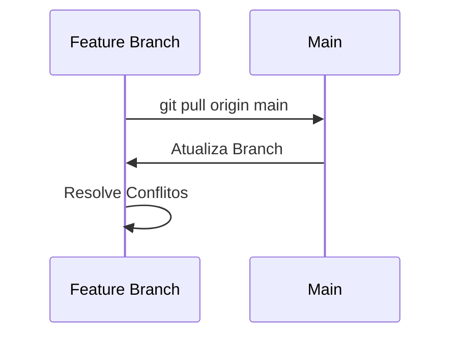
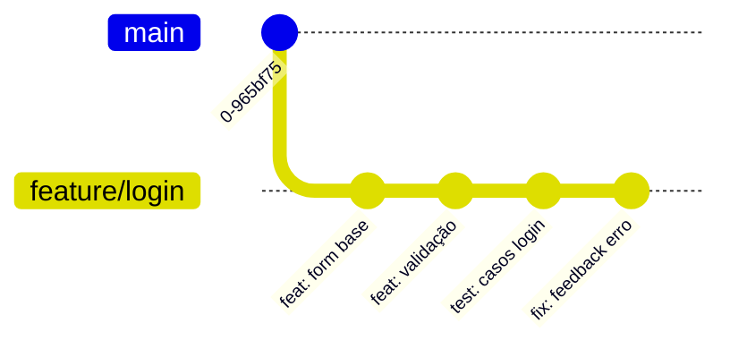
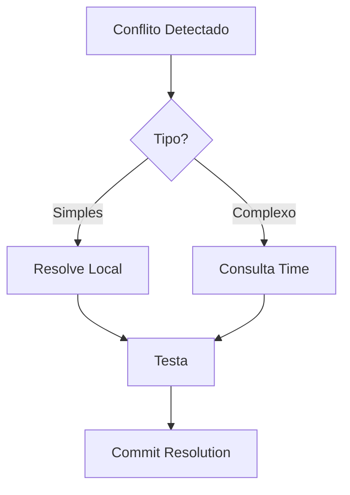
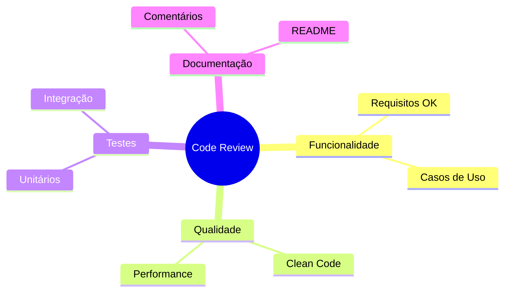
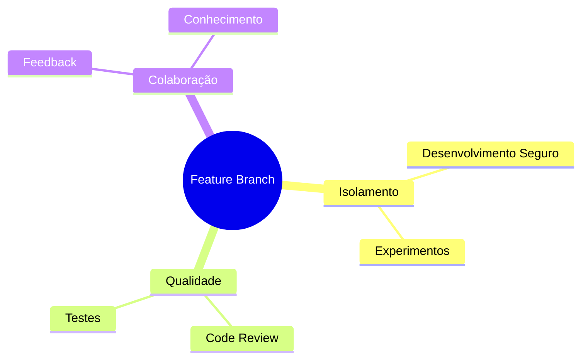

# Feature Branch Workflow

Imagine que cada nova funcionalidade é como uma nova cena do American Pie - precisa ser filmada separadamente antes de entrar no filme final!

## Como Funciona?



## Regras do Jogo

### 1. Uma Branch por Feature


### 2. Processo de Review


## Anatomia de uma Feature Branch

```ascii
main
  │
  ├── feature/login
  │   ├── commit: "Adiciona form"
  │   ├── commit: "Valida campos"
  │   └── commit: "Integra API"
  │
  ├── feature/perfil
  │   ├── commit: "Layout base"
  │   └── commit: "Upload foto"
  │
  └── feature/chat
      └── commit: "MVP chat"
```

## Fluxo de Trabalho

### 1. Iniciando uma Feature
```bash
git checkout -b feature/nova-funcionalidade
```

### 2. Desenvolvimento


### 3. Mantendo Atualizado


## Boas Práticas

### 1. Nomes de Branches
```ascii
✅ feature/adiciona-login
✅ feature/perfil-usuario
✅ feature/chat-tempo-real

❌ feature/f1
❌ nova-coisa
❌ mudancas-jim
```

### 2. Commits Organizados


## Pull Requests

### Estrutura Ideal
```ascii
📝 Pull Request: Adiciona Sistema de Login

✨ O que foi feito:
- Form de login responsivo
- Validação de campos
- Integração com API
- Testes unitários

🔍 Como testar:
1. Checkout na branch
2. npm install
3. npm run test
4. Teste manual do form

📸 Screenshots:
[imagens do antes/depois]
```

## Resolução de Conflitos



## Dicas de Sobrevivência

### 1. Mantenha as Features Pequenas
```ascii
Grande Feature ❌
├── 2 semanas
├── 50 arquivos
└── Difícil review

Features Menores ✅
├── 2-3 dias
├── 5-10 arquivos
└── Review tranquilo
```

### 2. Review Checklist


## Métricas de Sucesso

```ascii
📊 Indicadores Saudáveis

Tempo de Branch     ┌────────────┐
2-3 dias           |██████░░░░░░| ✅

Tamanho do PR      ┌────────────┐
200-400 linhas     |████░░░░░░░░| ✅

Taxa de Aprovação  ┌────────────┐
Primeira review    |████████░░░░| ✅
```

## Conclusão

Feature Branch Workflow é como dirigir na sua própria pista: você tem liberdade para desenvolver no seu ritmo, mas sempre seguindo as regras de trânsito para chegar seguro ao destino!

