# Forking Workflow

Se o Feature Branch é uma festa na casa do Stifler e o Gitflow é o baile de formatura, o Forking Workflow é como organizar vários American Pie ao mesmo tempo - cada um tem sua própria versão, mas todos contribuem para a franquia!

## O que é Fork?

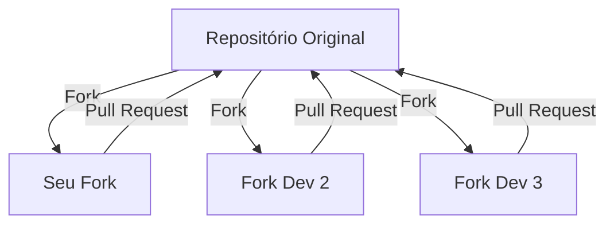

## Fluxo Básico

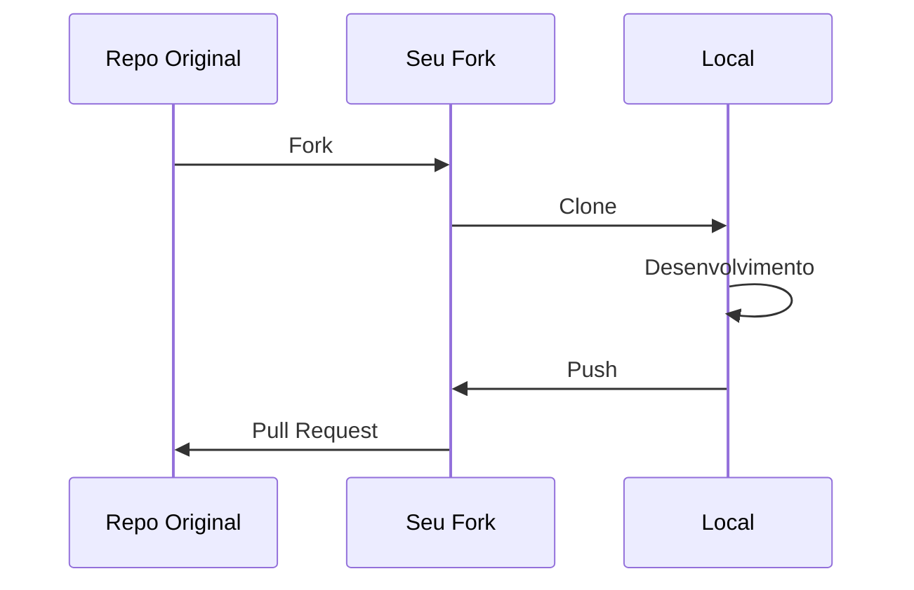

## Estrutura do Workflow

### 1. Setup Inicial
```bash
# Fork via interface do GitHub/GitLab

# Clone do seu fork
git clone https://github.com/seu-usuario/projeto.git

# Adicionar upstream
git remote add upstream https://github.com/projeto-original/projeto.git
```

### 2. Mantendo Sincronizado
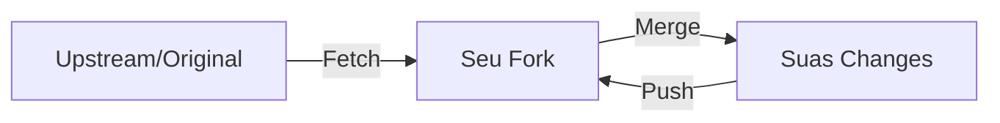

## Ciclo de Desenvolvimento

### 1. Atualizando seu Fork
```bash
# Buscar mudanças do original
git fetch upstream

# Atualizar sua main
git checkout main
git merge upstream/main
```

### 2. Feature Development
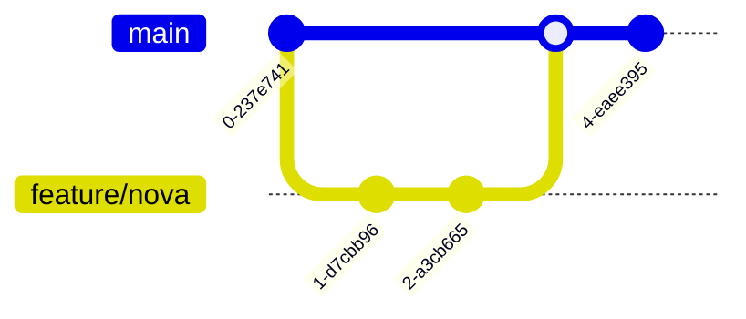

## Processo de Contribuição

### 1. Preparando o Pull Request
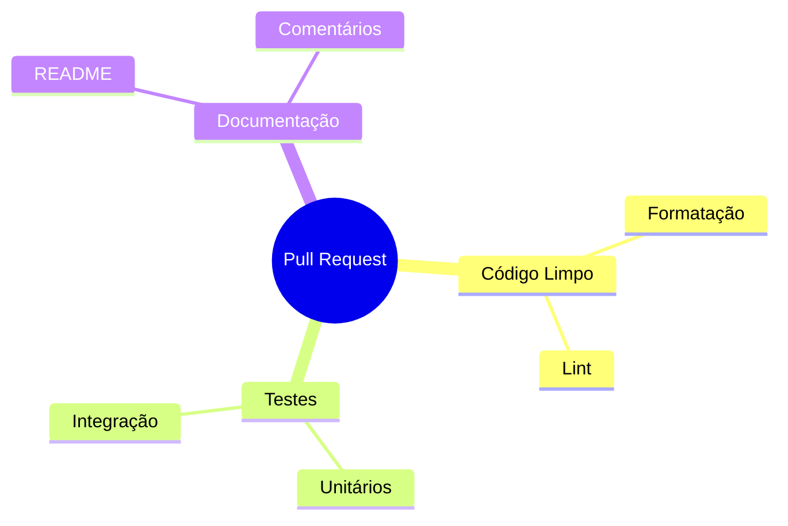

### 2. Fluxo de Review
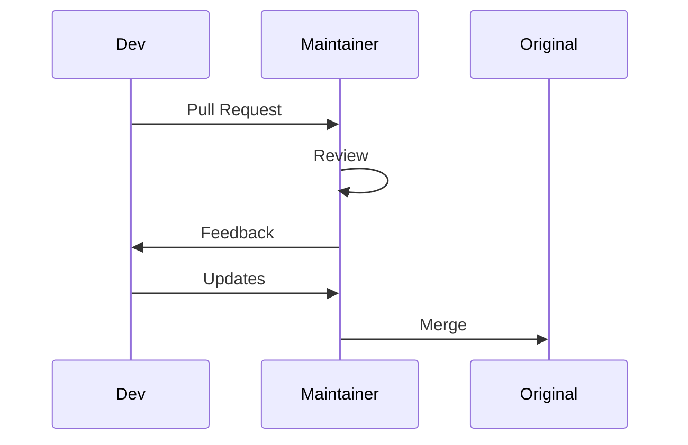

## Boas Práticas

### 1. Organização de Branches
```ascii
origem/
  ├── main
  └── feature/
      ├── nova-funcionalidade
      └── bugfix-importante

seu-fork/
  ├── main
  └── feature/
      └── sua-contribuicao
```

### 2. Commits Organizados
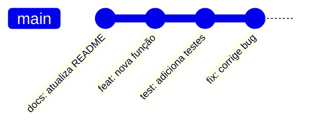

## Vantagens do Forking

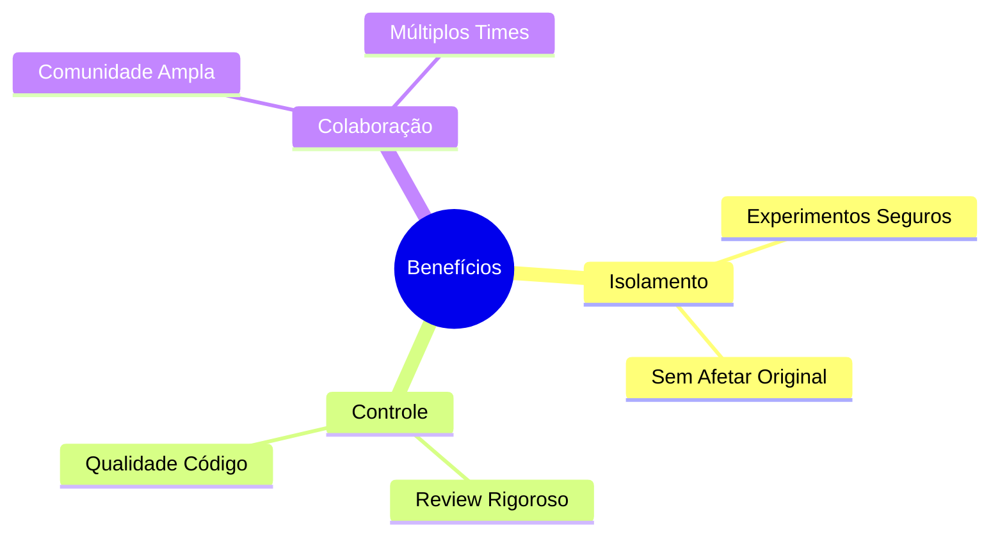

## Desafios Comuns

### 1. Sincronização
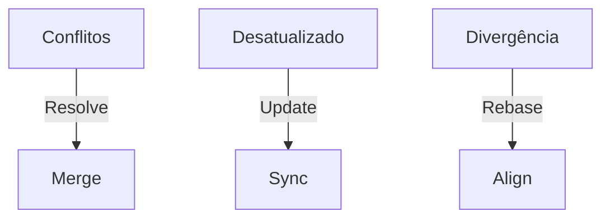

### 2. Checklist de Contribuição
```ascii
📋 Antes do PR:

1. [ ] Fork atualizado
2. [ ] Código testado
3. [ ] Docs atualizados
4. [ ] Commits organizados
5. [ ] Branch limpa
```

## Ferramentas Úteis

### 1. GitHub/GitLab Features
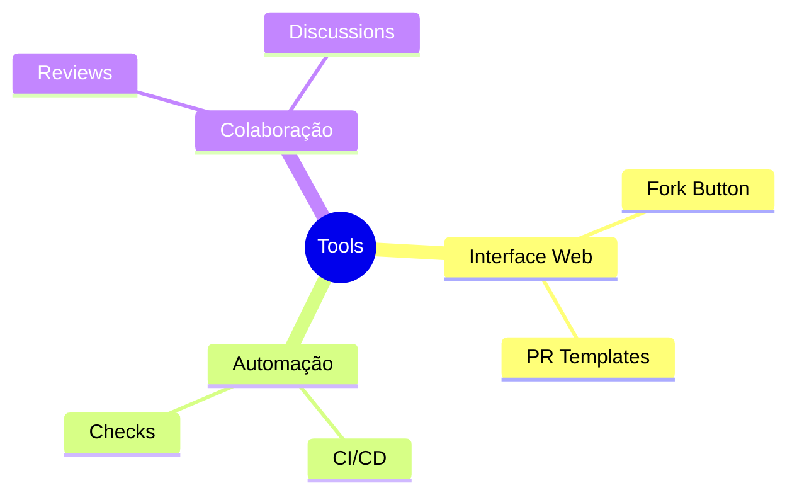

### 2. Comandos Essenciais
```bash
# Sincronizar com upstream
git fetch upstream
git merge upstream/main

# Atualizar fork remoto
git push origin main

# Criar feature
git checkout -b feature/nova
```

## Dicas de Sucesso

### 1. Comunicação
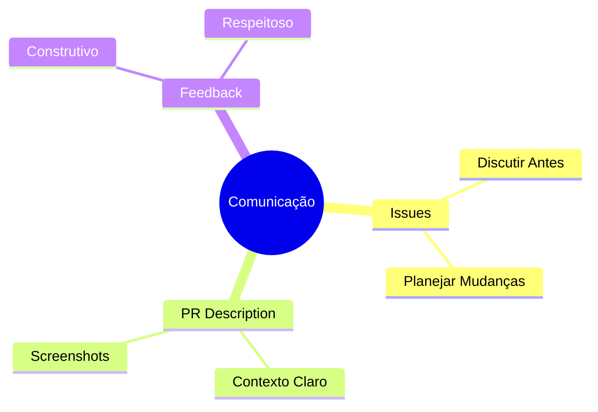

### 2. Manutenção
```ascii
🔄 Rotina de Manutenção

Daily:
  - Sync com upstream
  - Review PRs
  - Responder issues

Weekly:
  - Cleanup branches
  - Update docs
  - Check stale PRs
```

## Conclusão

O Forking Workflow é como criar seu próprio American Pie enquanto contribui para a saga original - você tem liberdade criativa, mas precisa manter a essência que fez a franquia um sucesso!

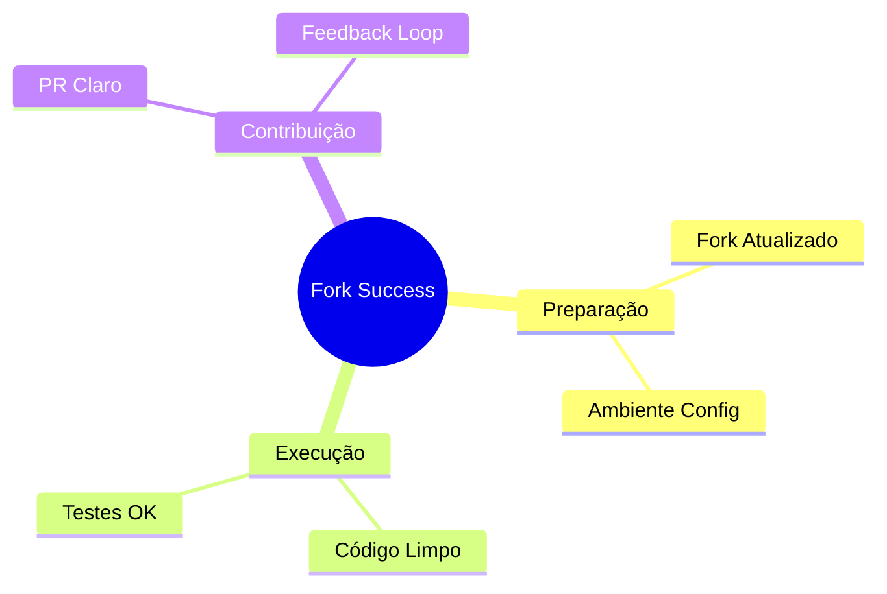