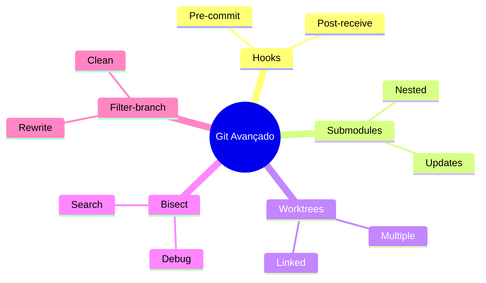
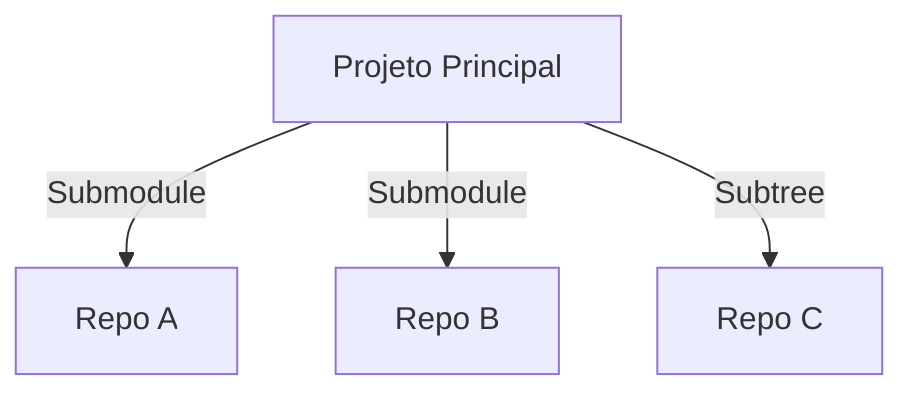
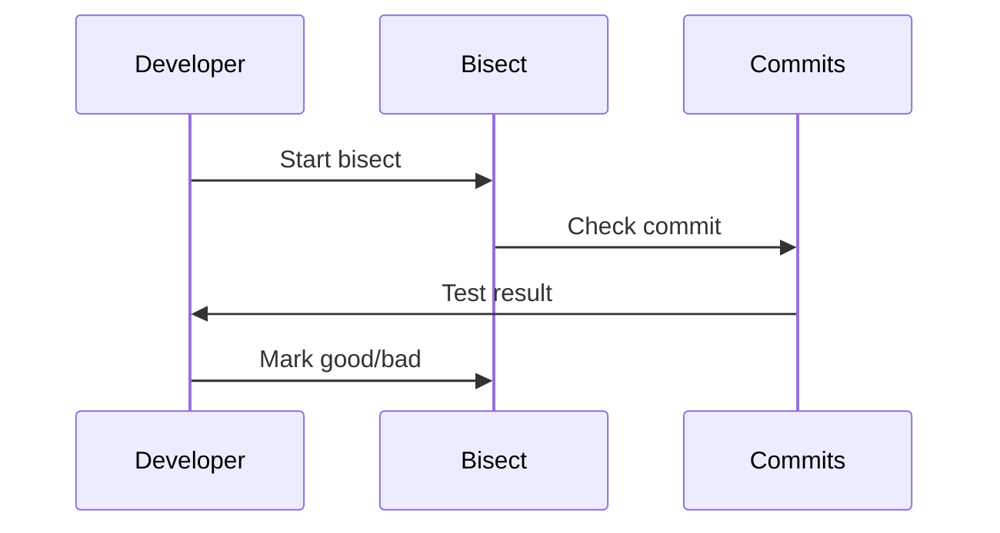
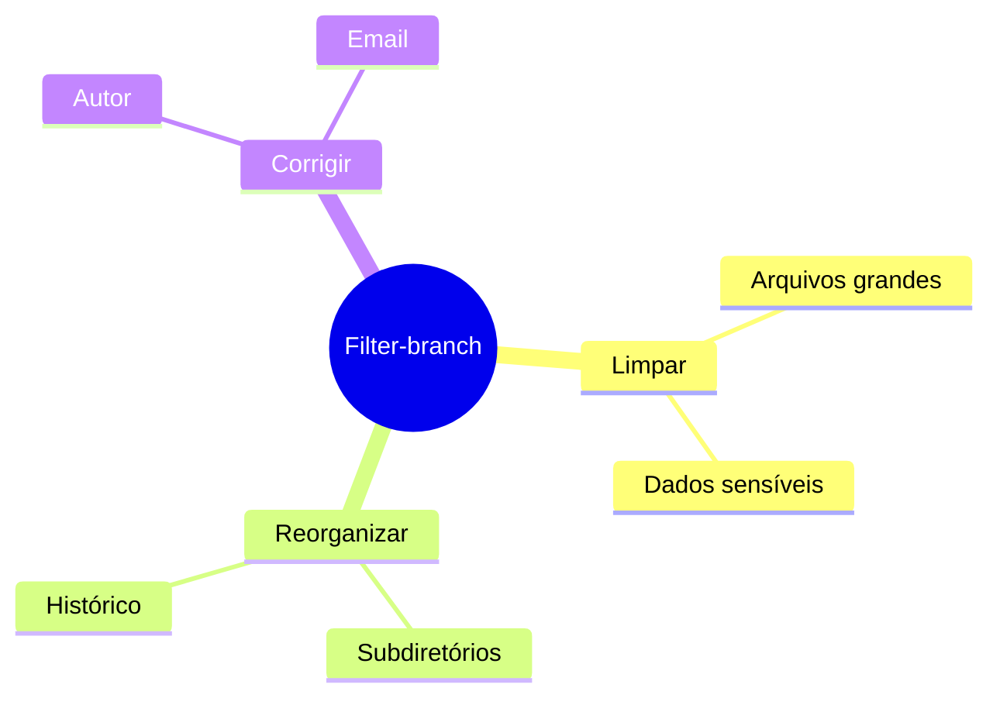
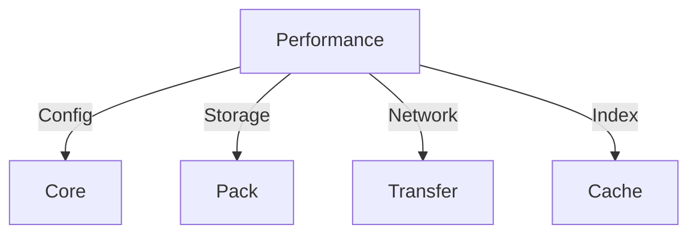
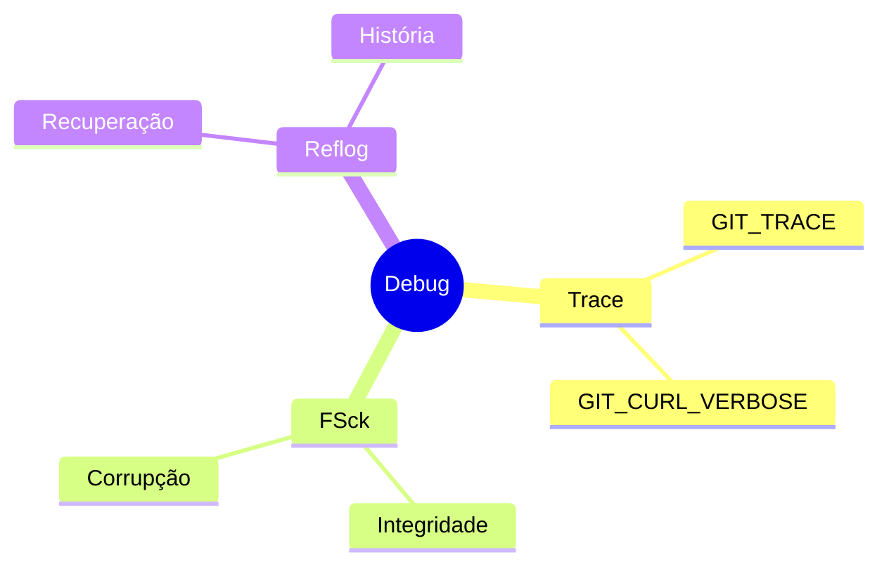

# Git Avançado: Recursos e Técnicas Poderosas

```ascii
+------------------------+
|    Git Avançado       |
|                       |
| Hooks + Submodules    |
| Worktrees + Bisect    |
| Filter-branch + LFS   |
|                       |
| Power User Features   |
+------------------------+
```

## Recursos Avançados

### Visão Geral


## Git Hooks

### Tipos Principais
```ascii
+------------------+
|     HOOKS       |
+------------------+
| • pre-commit    |
| • post-commit   |
| • pre-push      |
| • post-receive  |
+------------------+
```

### Exemplos Práticos
```bash
# Hook de qualidade de código
#!/bin/sh
./lint.sh
./test.sh

# Hook de mensagem de commit
#!/bin/sh
commit_msg=$(cat "$1")
if ! echo "$commit_msg" | grep -qE "^(feat|fix|docs|style|refactor|test|chore):"; then
    echo "Erro: Mensagem não segue convenção"
    exit 1
fi
```

## Submodules e Subtrees

### Gerenciamento


### Comandos Essenciais
```bash
# Submodules
git submodule add <repo>
git submodule update --init --recursive

# Subtrees
git subtree add --prefix=lib <repo> master
git subtree pull --prefix=lib <repo> master
```

## Worktrees

### Uso Múltiplo
```ascii
+------------------+
|   WORKTREES     |
+------------------+
| main  → /main   |
| feat  → /feat   |
| hotfix → /fix   |
+------------------+
```

### Comandos Básicos
```bash
# Criar worktree
git worktree add ../feat feature-branch

# Listar worktrees
git worktree list

# Remover worktree
git worktree remove ../feat
```

## Git Bisect

### Processo de Debug


### Uso Prático
```bash
# Iniciar bisect
git bisect start
git bisect bad HEAD
git bisect good v1.0

# Automatizar
git bisect run ./test.sh
```

## Filter-branch

### Casos de Uso


### Exemplos
```bash
# Remover arquivo do histórico
git filter-branch --tree-filter 'rm -f senha.txt' HEAD

# Alterar email
git filter-branch --commit-filter '
    if [ "$GIT_AUTHOR_EMAIL" = "old@email.com" ];
    then
        GIT_AUTHOR_EMAIL="new@email.com";
        git commit-tree "$@";
    else
        git commit-tree "$@";
    fi' HEAD
```

## Git LFS

### Configuração
```ascii
+------------------+
|    Git LFS      |
+------------------+
| • Track files   |
| • Push/Pull     |
| • Migrate       |
+------------------+
```

### Comandos LFS
```bash
# Iniciar LFS
git lfs install

# Rastrear arquivos
git lfs track "*.psd"

# Status
git lfs status
```

## Otimizações Avançadas

### Técnicas


### Configurações
```bash
# Performance
git config core.preloadindex true
git config core.fsmonitor true
git config gc.auto 256
```

## Segurança Avançada

### Práticas
```ascii
+------------------+
|   SEGURANÇA     |
+------------------+
| • GPG signing   |
| • SSH keys      |
| • Hooks sec     |
| • Audit log     |
+------------------+
```

### Configurações
```bash
# Assinar commits
git config commit.gpgsign true

# Verificar objetos
git config transfer.fsckObjects true
```

## Troubleshooting Avançado

### Ferramentas


### Comandos Debug
```bash
# Debug detalhado
GIT_TRACE=1 git pull origin main

# Verificar repo
git fsck --full

# Ver reflog
git reflog expire --expire=now --all
```

## Próximos Passos

### Tópicos Relacionados
- [Git Hooks](git-hooks.md)
- [Git Submodules](git-submodules.md)
- [Git Worktrees](git-worktrees.md)
- [Git Bisect](git-bisect.md)
- [Git Filter-branch](git-filter-branch.md)

> **Dica Pro**: Mantenha um ambiente de teste para experimentar recursos avançados antes de aplicá-los em projetos reais.