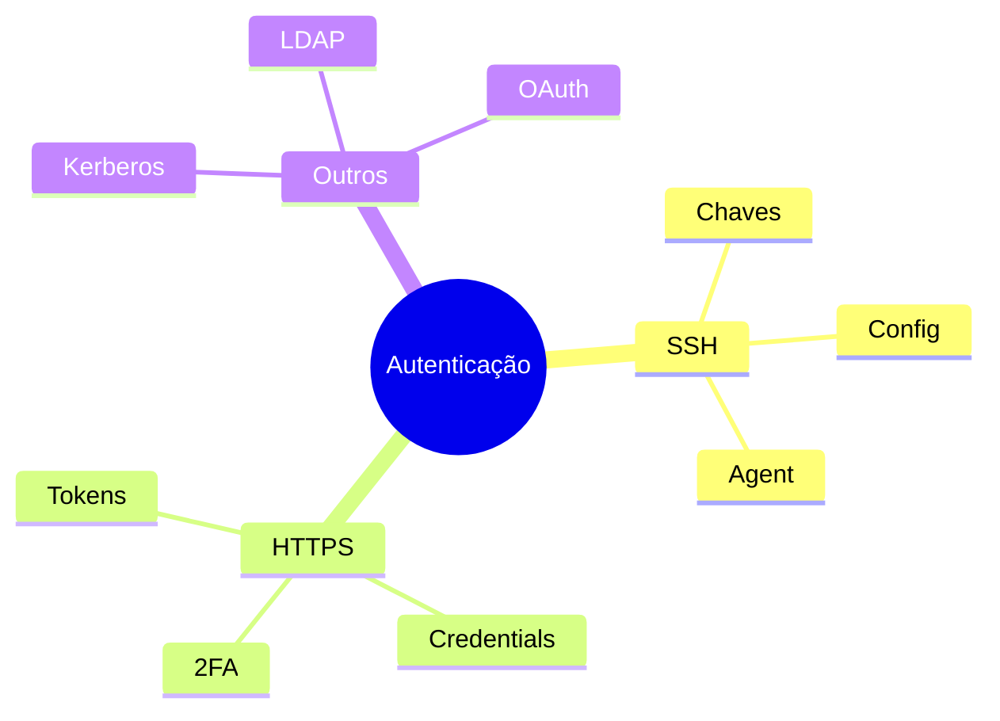
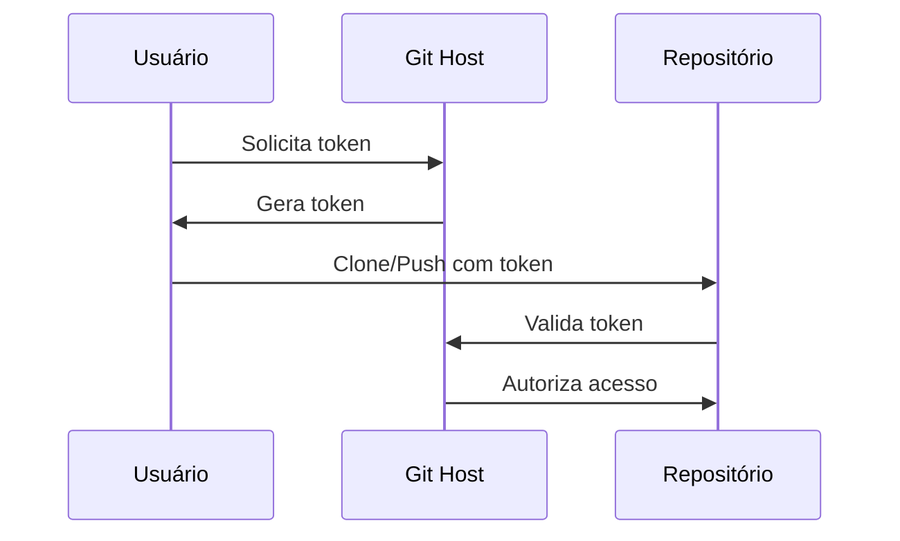
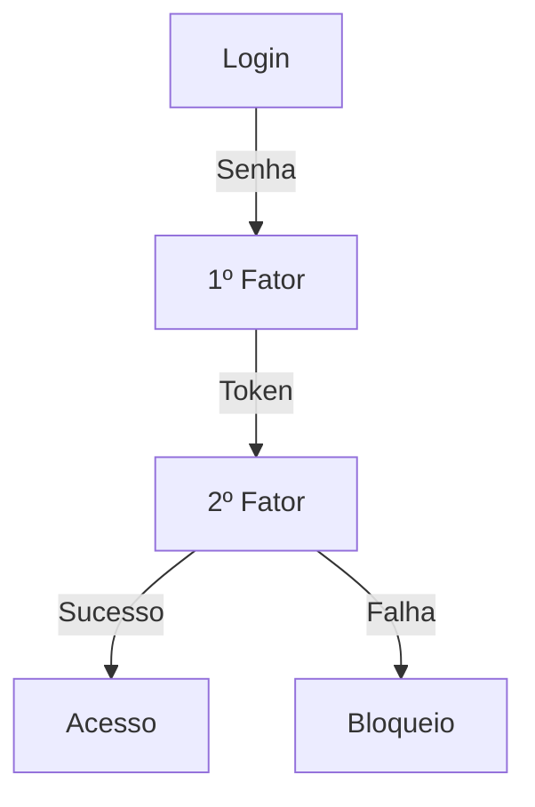
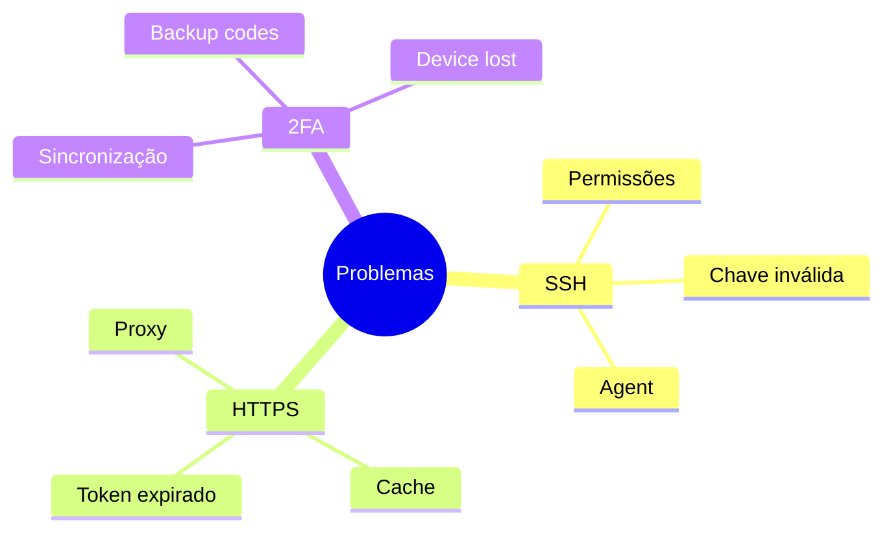
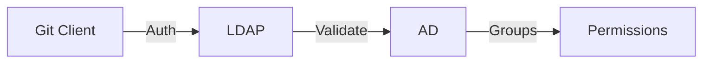
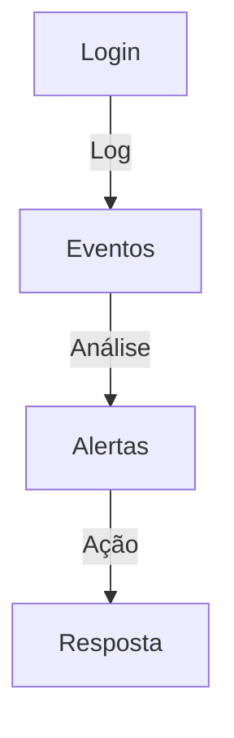

# Autenticação no Git

## Métodos de Autenticação

### Visão Geral


## SSH

### Configuração
```bash
# Gerar chave SSH
ssh-keygen -t ed25519 -C "email@example.com"

# Iniciar ssh-agent
eval "$(ssh-agent -s)"
ssh-add ~/.ssh/id_ed25519

# Testar conexão
ssh -T git@github.com
```

### Estrutura
```ascii
~/.ssh/
├── config
├── id_ed25519
├── id_ed25519.pub
└── known_hosts
```

## HTTPS

### Token de Acesso


### Credential Helper
```bash
# Windows
git config --global credential.helper manager

# macOS
git config --global credential.helper osxkeychain

# Linux
git config --global credential.helper cache
```

## Multi-Factor Authentication (MFA)

### Fluxo 2FA


### Configuração
1. Aplicativo autenticador
2. SMS/Email backup
3. Chaves de recuperação
4. Dispositivos confiáveis

## Gestão de Credenciais

### Boas Práticas
```ascii
+------------------------+
|    BOAS PRÁTICAS      |
|                       |
| • Rotação regular     |
| • Escopos mínimos    |
| • Auditoria de uso   |
| • Backup seguro      |
| • Revogação rápida   |
+------------------------+
```

### Automação
```yaml
name: Token Rotation
on:
  schedule:
    - cron: '0 0 1 * *'
jobs:
  rotate:
    runs-on: ubuntu-latest
    steps:
      - name: Rotate credentials
        run: ./rotate-credentials.sh
```

## Troubleshooting

### Problemas Comuns


### Soluções
```bash
# Verificar SSH
ssh -vT git@github.com

# Limpar cache
git credential-cache exit

# Testar conexão
git ls-remote
```

## Integração Enterprise

### LDAP/AD


### SSO
1. SAML 2.0
2. OAuth 2.0
3. OpenID Connect
4. Custom providers

## Monitoramento

### Auditoria


### Métricas
1. Tentativas de login
2. Falhas de autenticação
3. Token usage
4. MFA compliance

## Próximos Passos

### Tópicos Relacionados
- Políticas de acesso
- Gestão de identidade
- Automação de segurança
- Compliance

> **Dica Pro**: Implemente uma estratégia de autenticação em camadas, combinando diferentes métodos para maior segurança.