# Git Automation: Otimizando Workflows

```ascii
+------------------------+
|    Git Automation     |
|                       |
| Scripts               |
| Hooks                 |
| CI/CD                 |
|                       |
| Produtividade         |
+------------------------+
```

## Fundamentos

### Tipos de Automação

```mermaid
mindmap
    root((Automação))
        Scripts
            Shell
            Python
        Hooks
            Pre-commit
            Post-commit
        CI/CD
            Actions
            Pipelines
```


## Scripts de Automação

### Workflow Scripts
```bash
#!/bin/bash
# Script de automação de workflow
automate_workflow() {
    # Update branches
    git fetch --all
    git pull origin main
    
    # Clean old branches
    git branch --merged | grep -v "\*" | xargs -n 1 git branch -d
    
    # Run tests
    ./run_tests.sh
    
    # Update dependencies
    npm update
}
```

### Batch Operations
```python
def batch_operations():
    """
    Operações em lote no Git
    """
    repos = get_all_repos()
    for repo in repos:
        with cd(repo):
            update_dependencies()
            run_tests()
            create_backup()
```

## Git Hooks

### Pre-commit Hook
```bash
#!/bin/bash
# .git/hooks/pre-commit
set -e

echo "🔍 Verificando código..."
npm run lint

echo "🧪 Executando testes..."
npm test

echo "📦 Verificando build..."
npm run build
```

### Post-commit Hook
```bash
#!/bin/bash
# .git/hooks/post-commit
set -e

# Notify team
./notify_team.sh

# Update documentation
./update_docs.sh

# Run deployment if on main
if [[ $(git branch --show-current) == "main" ]]; then
    ./deploy.sh
fi
```

## CI/CD Automation

### GitHub Actions
```yaml
name: Git Automation
on:
  push:
    branches: [main]
  pull_request:
    branches: [main]
jobs:
  automate:
    runs-on: ubuntu-latest
    steps:
      - uses: actions/checkout@v2
      - name: Run Automation
        run: |
          ./automate_workflow.sh
```

### Jenkins Pipeline
```groovy
pipeline {
    agent any
    stages {
        stage('Automate') {
            steps {
                sh './automate_workflow.sh'
            }
        }
    }
}
```

## Ferramentas

### CLI Tools


### Integrations
```ascii
+------------------------+
|    INTEGRATIONS       |
|                       |
| • GitHub             |
| • GitLab             |
| • Bitbucket          |
| • Jenkins            |
| • Travis CI          |
+------------------------+
```

## Boas Práticas

### Organização
```bash
.
├── scripts/
│   ├── automation/
│   ├── hooks/
│   └── ci/
├── .github/
│   └── workflows/
└── tools/
    └── automation/
```

### Logging
```python
def log_automation(action, status, message):
    """
    Log automation actions
    """
    timestamp = datetime.now()
    log_entry = f"[{timestamp}] {action}: {status} - {message}"
    logging.info(log_entry)
```

## Monitoramento

### Métricas

```mermaid
graph TD
    A[Coleta] -->|Dados| B[Análise]
    B -->|Insights| C[Otimização]
    C -->|Melhorias| D[Implementação]
```


### Alertas
```yaml
alerts:
  - name: automation_failure
    condition: status != 'success'
    channels:
      - slack
      - email
    threshold: 1
```

## Troubleshooting

### Debug
```bash
#!/bin/bash
# Debug automation
set -x
export DEBUG=true

run_automation() {
    echo "Starting automation..."
    ./automate_workflow.sh 2>&1 | tee automation.log
}
```

### Recovery
```bash
#!/bin/bash
# Recovery script
recover_automation() {
    # Backup current state
    git stash
    
    # Reset to last known good state
    git reset --hard last_good_commit
    
    # Retry automation
    ./automate_workflow.sh
}
```

## Próximos Passos

### Tópicos Relacionados
- [Git Testing](git-testing.md)
- [Git CI/CD](git-cicd.md)
- [Git DevOps](git-devops.md)

> **Dica Pro**: Automatize tarefas repetitivas, mas mantenha a flexibilidade para casos especiais.