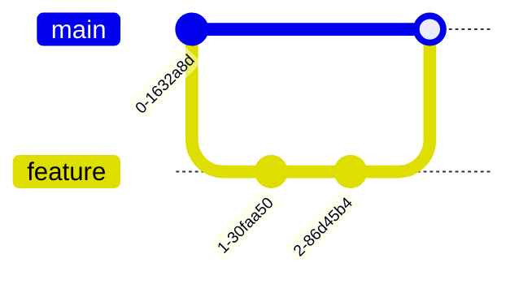

# Conceitos Básicos do Git

## Como o Git Funciona
O Git funciona de forma diferente de outros VCS. Em um outro VCS ele terá os arquivos e quando houver alteração eles criam uma lista somente das alterações.

Em um outro VCS ele terá os arquivos e quando houver alteração eles criam uma lista somente das alterações: 

> 

Agora com o Git ele faz diferente, já que vai tirando *snapshots* que são como fotos quando ocorre uma mudança e caso tenha algum arquivo que não foi alterado será guardado uma referencia para ele, assim pode ser recuperado.

## Estrutura de Diretórios
Assim temos três níveis principais:
- Diretório de trabalho (Working Directory)
- Área de preparo (Staging Area)
- Diretório `.git` que vai ser o repositório ou banco de dados local

> 
> Diretórios quando se trabalha com Git

### Working Directory
É onde você realmente trabalha com seus arquivos. Aqui você pode:
- Criar novos arquivos
- Modificar arquivos existentes
- Deletar arquivos


### Staging Area
Também conhecida como "Index", é uma área intermediária onde você prepara as mudanças que farão parte do próximo commit.


### Repositório Local (.git)
O coração do Git, onde todo o histórico do projeto é armazenado:
- Commits
- Branches
- Tags
- Configurações

## Estados dos Arquivos

### Ciclo de Vida


### Estados Possíveis
1. **Untracked**: Arquivos que o Git não conhece
2. **Tracked**: Arquivos que o Git está monitorando
   - Modified: Alterados mas não preparados
   - Staged: Preparados para commit
   - Committed: Salvos no repositório

## Comandos Básicos Essenciais

### Configuração Inicial
```bash
# Configuração global
git config --global user.name "Stifler"
git config --global user.email "stifler@milfsgo.com"

# Configuração local (por repositório)
git config user.name "Stifler"
git config user.email "stifler@milfsgo.com"
```

### Iniciando um Repositório
```bash
# Criar novo repositório
git init

# Clonar repositório existente
git clone https://github.com/user/repo.git
```

### Operações Básicas
```bash
# Verificar status
git status

# Adicionar arquivos
git add arquivo.txt    # Arquivo específico
git add .              # Todos os arquivos

# Criar commit
git commit -m "feat: adiciona função de busca de milfs"

# Ver histórico
git log
git log --oneline     # Formato resumido
git log --graph       # Com representação gráfica
```

## Boas Práticas de Commit

### Mensagens de Commit


### Conventional Commits
Padrão para mensagens de commit:
- `feat`: Nova funcionalidade
- `fix`: Correção de bug
- `docs`: Documentação
- `style`: Formatação
- `refactor`: Refatoração
- `test`: Testes
- `chore`: Tarefas gerais

```bash
feat: adiciona busca por localização
fix: corrige bug no filtro de idade
docs: atualiza README
```

## Desfazendo Alterações

### No Working Directory
```bash
# Descartar mudanças em arquivo
git checkout -- arquivo.txt

# Descartar todas as mudanças
git checkout -- .
```

### Na Staging Area
```bash
# Remover arquivo do stage
git reset HEAD arquivo.txt

# Remover todos os arquivos
git reset HEAD .
```

### Em Commits
```bash
# Desfazer último commit mantendo alterações
git reset --soft HEAD^

# Desfazer último commit descartando alterações
git reset --hard HEAD^
```

## Branches

### Conceitos Básicos


### Operações com Branches
```bash
# Criar branch
git branch nova-feature

# Mudar de branch
git checkout nova-feature

# Criar e mudar (atalho)
git checkout -b nova-feature

# Listar branches
git branch

# Deletar branch
git branch -d nova-feature
```

## Merge e Rebase

### Merge


```bash
git checkout main
git merge feature
```

### Rebase


```bash
git checkout feature
git rebase main
```

## Resolução de Conflitos

### Tipos Comuns de Conflitos
1. **Edição na mesma linha**
2. **Arquivo deletado x modificado**
3. **Renomeação x modificação**

### Processo de Resolução


## Dicas e Truques

### Aliases Úteis
```bash
git config --global alias.st status
git config --global alias.co checkout
git config --global alias.br branch
git config --global alias.ci commit
```

### Ferramentas Visuais
- GitKraken
- SourceTree
- GitHub Desktop
- VS Code Git

### Produtividade


## Próximos Passos

### O que Estudar Depois
1. Git Remoto (GitHub, GitLab, etc)
2. Workflows avançados
3. Git Hooks
4. CI/CD com Git

### Recursos Recomendados
- [Git Book](https://git-scm.com/book/pt-br/v2)
- [Learn Git Branching](https://learngitbranching.js.org/)
- [Oh My Git!](https://ohmygit.org/)

> **Dica**: Pratique! Git é como andar de bicicleta, só se aprende fazendo
> (e ocasionalmente caindo)