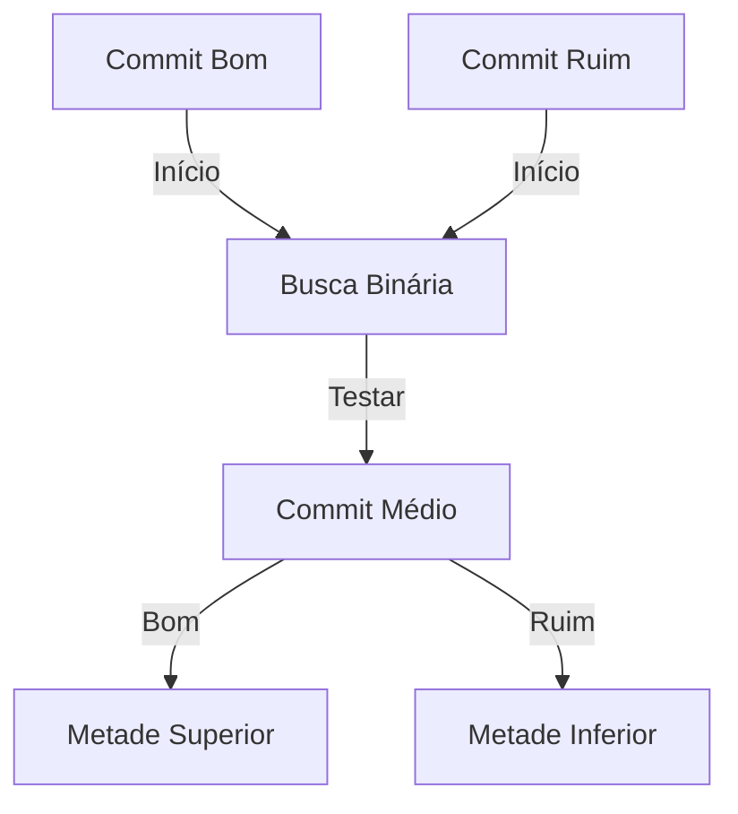
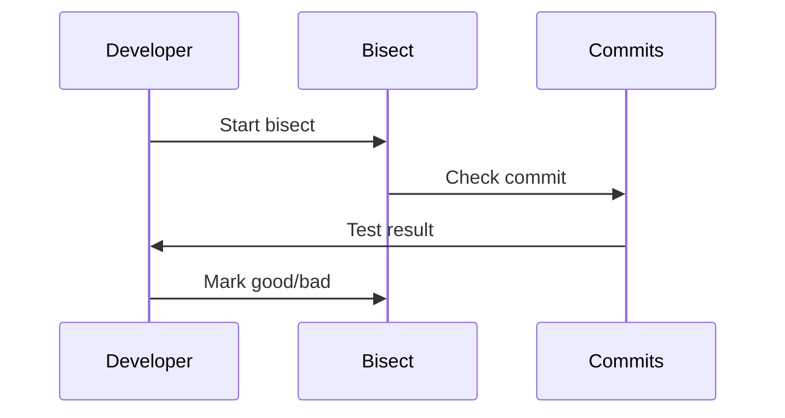
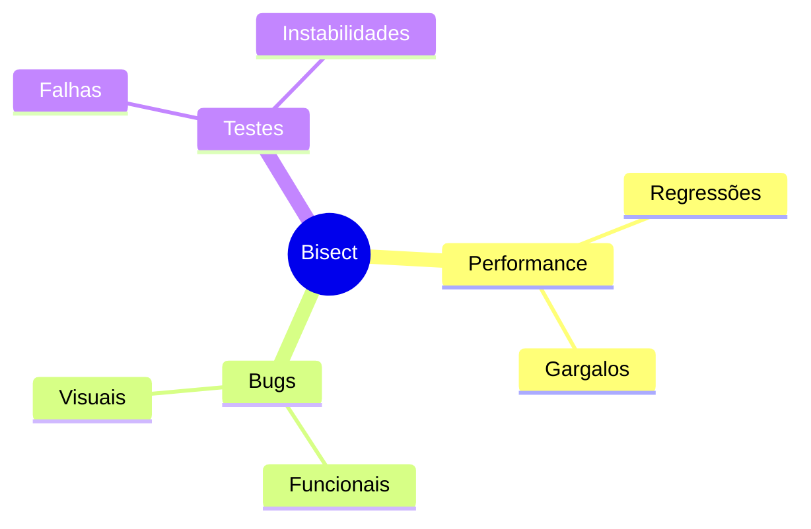
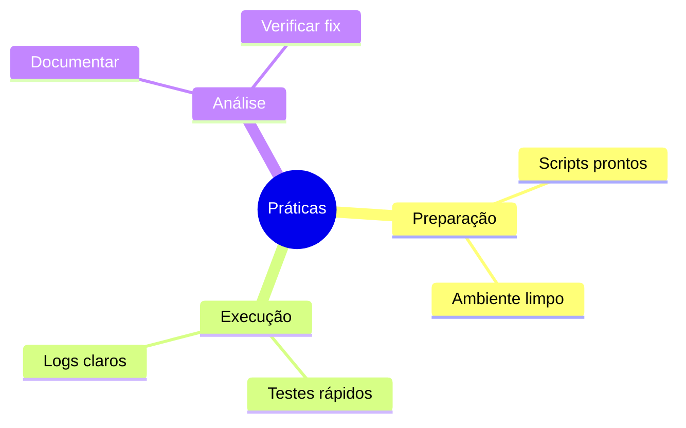
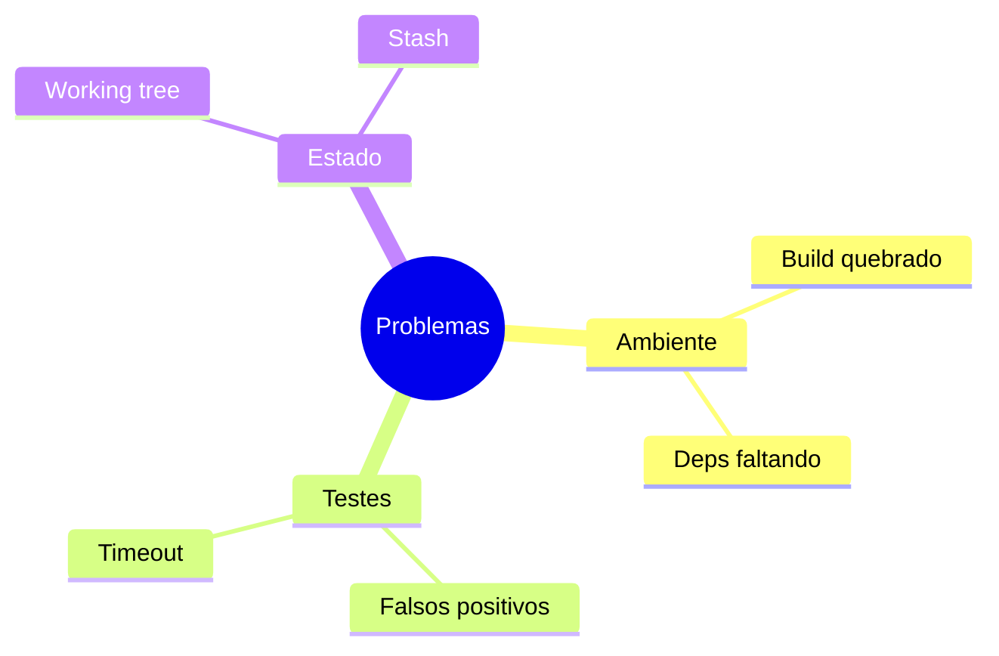
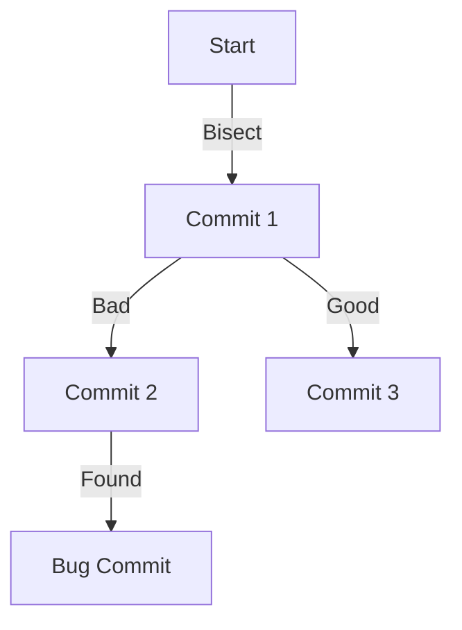
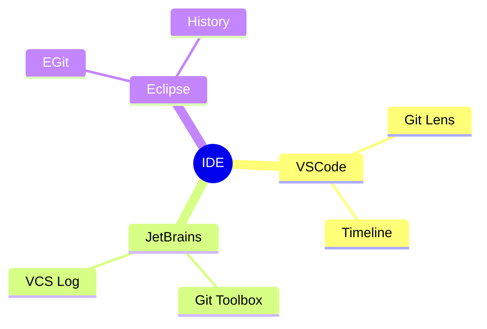

# Git Bisect: Encontrando Bugs com Busca Binária

```ascii
+------------------------+
|      Git Bisect       |
|                       |
| Bug Hunting           |
| Binary Search         |
| Automated Testing     |
|                       |
| Efficient Debugging   |
+------------------------+
```

## Conceitos Básicos

### Como Funciona


### Processo de Debug


## Comandos Essenciais

### Operações Básicas
```bash
# Iniciar bisect
git bisect start
git bisect bad HEAD
git bisect good v1.0.0

# Marcar commits
git bisect good
git bisect bad

# Finalizar
git bisect reset
```

### Automação
```bash
# Criar script de teste
echo '#!/bin/sh
make test' > test.sh
chmod +x test.sh

# Executar bisect automático
git bisect start
git bisect bad HEAD
git bisect good v1.0.0
git bisect run ./test.sh
```

## Casos de Uso

### Cenários Comuns


### Workflow Típico
```ascii
+------------------------+
|    WORKFLOW           |
|                       |
| 1. Identificar bug   |
| 2. Definir limites   |
| 3. Iniciar bisect    |
| 4. Testar commits    |
| 5. Encontrar causa   |
+------------------------+
```

## Boas Práticas

### Recomendações


### Automação
```bash
# Script de teste completo
cat << 'EOF' > test.sh
#!/bin/sh
make build
if ! make test; then
    exit 1
fi
if ! ./performance_test.sh; then
    exit 1
fi
exit 0
EOF
```

## Troubleshooting

### Problemas Comuns


### Soluções
```bash
# Salvar trabalho atual
git stash

# Limpar ambiente
git clean -fdx

# Restaurar estado
git bisect reset
git stash pop
```

## Workflows Avançados

### CI Integration
```bash
#!/bin/sh
# Script para CI
git bisect start HEAD v1.0.0
git bisect run docker-compose run tests
```

### Visualização


## Dicas Avançadas

### Performance
```bash
# Skip builds desnecessários
git bisect skip HEAD
git bisect skip v2.1.0..v2.2.0

# Log detalhado
git bisect log > bisect_log.txt
```

### Debug Avançado
```ascii
+------------------------+
|    DEBUG AVANÇADO     |
|                       |
| • Logs detalhados    |
| • Skip commits       |
| • Visualização       |
| • Replay bisect     |
| • Terms custom      |
+------------------------+
```

## Integração com Ferramentas

### IDE Support


## Próximos Passos

### Tópicos Relacionados
- [Git Debug](git-debug.md)
- [Git Testing](git-testing.md)
- [Git Automation](git-automation.md)

> **Dica Pro**: Mantenha scripts de teste prontos e otimizados para usar com bisect, economizando tempo em debugs futuros.