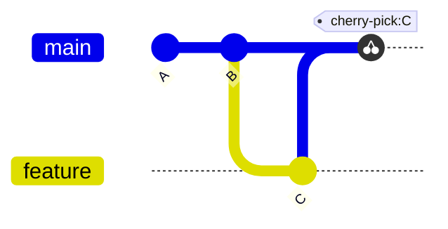
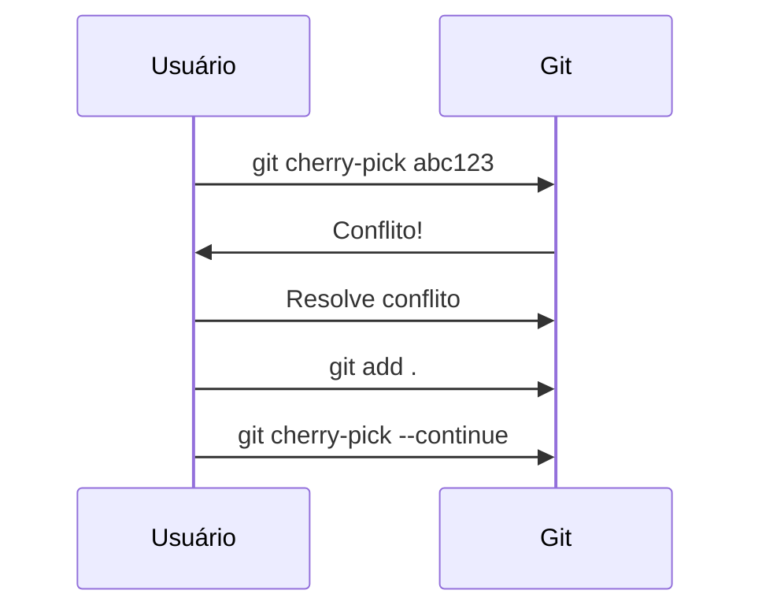
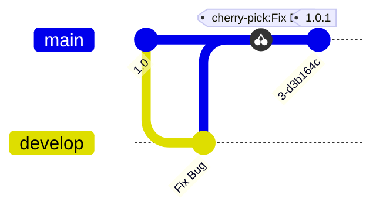
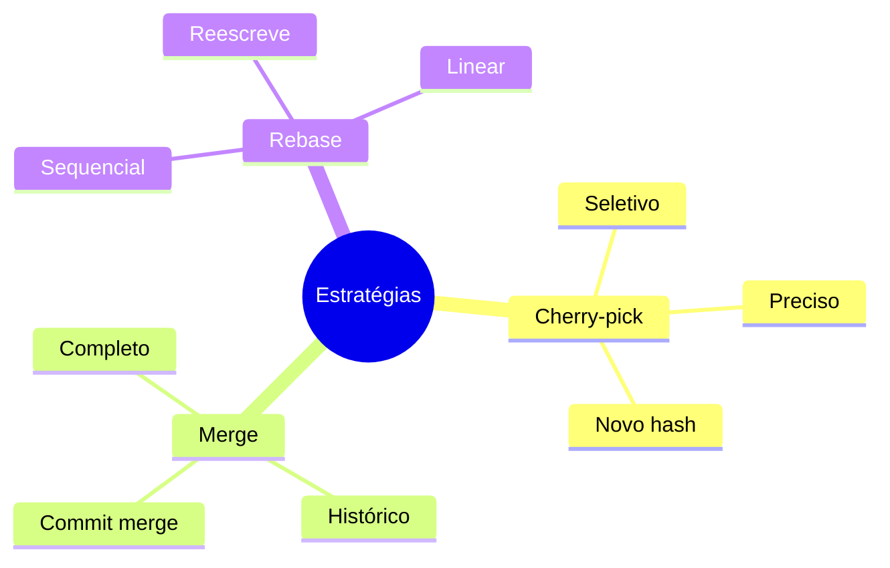
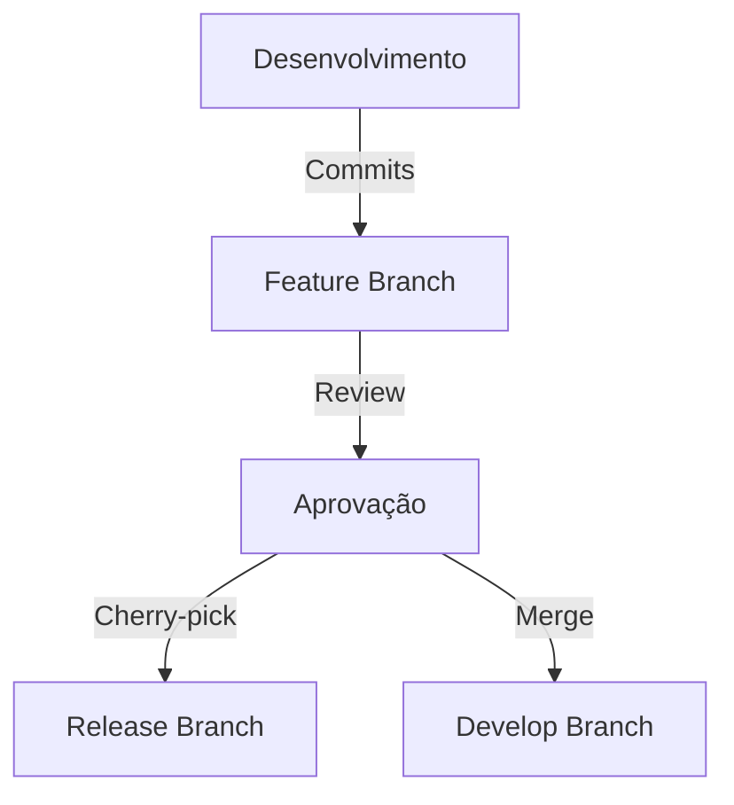
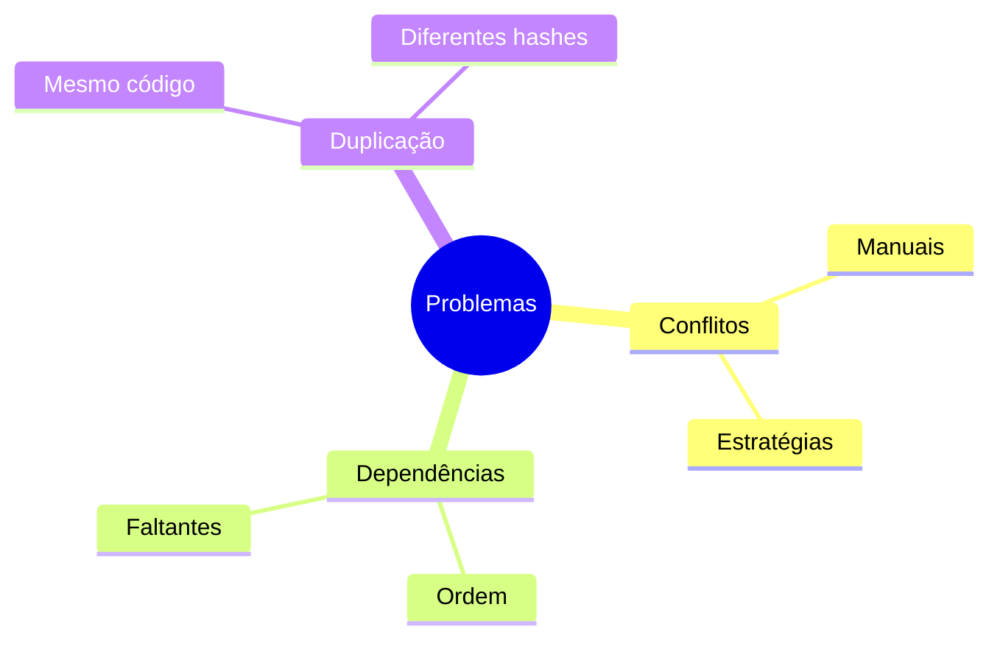

# Git Cherry-pick: Aplicando Commits Seletivamente

```ascii
+------------------------+
|    Git Cherry-pick    |
|                       |
| Seleção de Commits    |
| Aplicação Precisa     |
| Integração Seletiva   |
|                       |
| Controle Granular     |
+------------------------+
```

## Fundamentos do Cherry-pick

### O que é Cherry-pick?
O cherry-pick é como um rebase para um único commit. Ele pega as alterações introduzidas em um commit específico e as aplica na branch atual, criando um novo commit com o mesmo conteúdo, mas com um hash diferente.



### Sintaxe Básica
```bash
# Formato básico
git cherry-pick <commit-hash>

# Exemplo prático
git cherry-pick abc123

# Cherry-pick múltiplos commits
git cherry-pick abc123 def456

# Cherry-pick de um range
git cherry-pick abc123^..def456
```

## Técnicas Avançadas

### Cherry-pick com Opções
```bash
# Cherry-pick sem commit automático
git cherry-pick --no-commit abc123

# Cherry-pick mantendo autoria original
git cherry-pick -x abc123

# Cherry-pick com mensagem personalizada
git cherry-pick -e abc123

# Cherry-pick apenas registrando (sem alterações)
git cherry-pick --signoff abc123
```

### Resolvendo Conflitos


```bash
# Quando ocorrer conflito
git cherry-pick abc123
# ... conflito ocorre ...

# Resolver conflitos manualmente
# Depois:
git add .
git cherry-pick --continue

# Ou abortar o processo
git cherry-pick --abort
```

## Casos de Uso

### Backport de Correções


```bash
# Backport de uma correção
git checkout release/1.0
git cherry-pick abc123  # commit da correção
git tag v1.0.1
git push origin v1.0.1
```

### Seleção de Features
```ascii
+------------------------+
|    CASOS DE USO       |
|                       |
| • Backport de fixes   |
| • Seleção de features |
| • Recuperação parcial |
| • Migração seletiva   |
| • Testes isolados     |
+------------------------+
```

## Estratégias e Padrões

### Cherry-pick vs Merge vs Rebase


### Workflow com Cherry-pick


## Boas Práticas

### Quando Usar
```ascii
✅ USE QUANDO:
• Precisa de commits específicos
• Backport de correções
• Migração seletiva
• Testes isolados

❌ EVITE QUANDO:
• Precisa de toda a branch
• Muitos commits sequenciais
• Histórico é importante
• Commits interdependentes
```

### Dicas de Produtividade
```bash
# Alias útil para cherry-pick
git config --global alias.cp 'cherry-pick'

# Cherry-pick com mensagem personalizada
git cp -e abc123

# Cherry-pick múltiplos commits
git cp --no-commit abc123 def456 ghi789
git commit -m "Aplica features X, Y e Z"
```

## Troubleshooting

### Problemas Comuns


### Soluções
```bash
# Conflito complexo
git cherry-pick --abort
git checkout -b temp-branch
git merge feature-branch
# Resolver manualmente
git checkout main
git cherry-pick temp-branch

# Verificar diferenças antes
git show abc123
```

## Automação

### Scripts Úteis
```bash
#!/bin/bash
# Cherry-pick todos os commits de uma branch que contêm uma palavra-chave
cherry_pick_by_keyword() {
    local branch="$1"
    local keyword="$2"
    
    git log --grep="$keyword" --format="%H" "$branch" | 
    tac | 
    xargs -I{} git cherry-pick {}
}

# Uso: cherry_pick_by_keyword feature/login "auth"
```

### CI/CD Integration
```yaml
name: Backport Fixes
on:
  pull_request:
    types: [closed]
    branches: [main]
jobs:
  backport:
    if: github.event.pull_request.merged == true && contains(github.event.pull_request.labels.*.name, 'backport')
    runs-on: ubuntu-latest
    steps:
      - uses: actions/checkout@v2
        with:
          fetch-depth: 0
      - name: Backport
        run: |
          git checkout release/1.0
          git cherry-pick ${{ github.event.pull_request.merge_commit_sha }}
          git push origin release/1.0
```

## Próximos Passos

### Tópicos Relacionados
- [Git Rebase](git-rebase.md)
- [Git Merge](git-merge.md)
- [Git Workflows](git-workflows.md)

> **Dica Pro**: O cherry-pick é uma ferramenta poderosa, mas use com moderação. Commits frequentemente cherry-picked podem indicar problemas no seu workflow de branches.