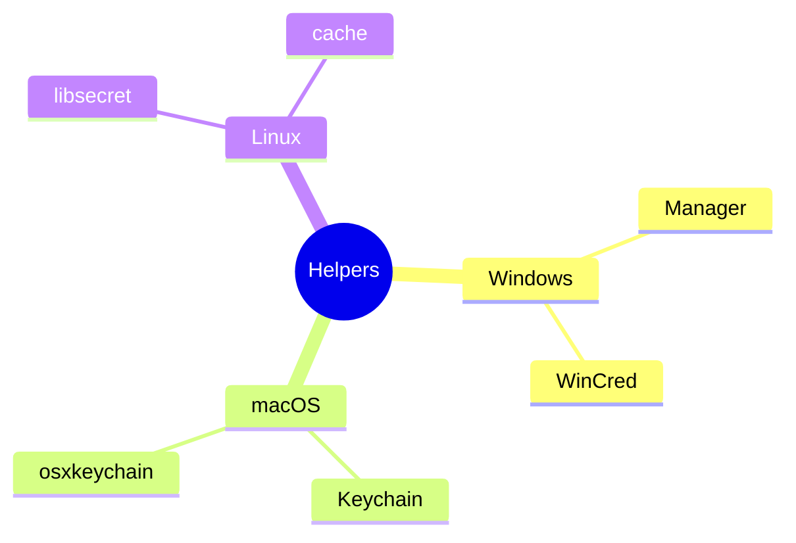
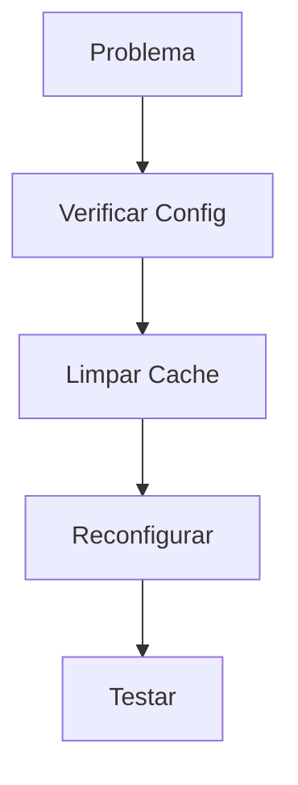

# Git Credential Helpers: Gerenciamento Seguro de Credenciais

```ascii
+------------------------+
| Credential Helpers    |
|                       |
| Secure Storage       |
| Authentication       |
| Platform Integration |
|                       |
| Security Best        |
+------------------------+
```

## Helpers Disponíveis

### Por Plataforma


## Configuração

### Setup Básico
```bash
# Windows
git config --global credential.helper manager

# macOS
git config --global credential.helper osxkeychain

# Linux
git config --global credential.helper cache
```

### Cache Options
```bash
# Definir timeout
git config --global credential.helper 'cache --timeout=3600'

# Limpar cache
git credential-cache exit
```

## Segurança

### Boas Práticas
```ascii
+------------------------+
|    SEGURANÇA          |
|                       |
| • Timeout curto      |
| • HTTPS preferido    |
| • 2FA ativado       |
| • Tokens únicos     |
| • Revisão regular   |
+------------------------+
```

### Troubleshooting


## Próximos Passos

### Tópicos Relacionados
- [Git Security](git-security.md)
- [Git Authentication](git-authentication.md)
- [Git Tools](git-tools.md)

> **Dica Pro**: Use diferentes credenciais para diferentes repositórios quando necessário por segurança.