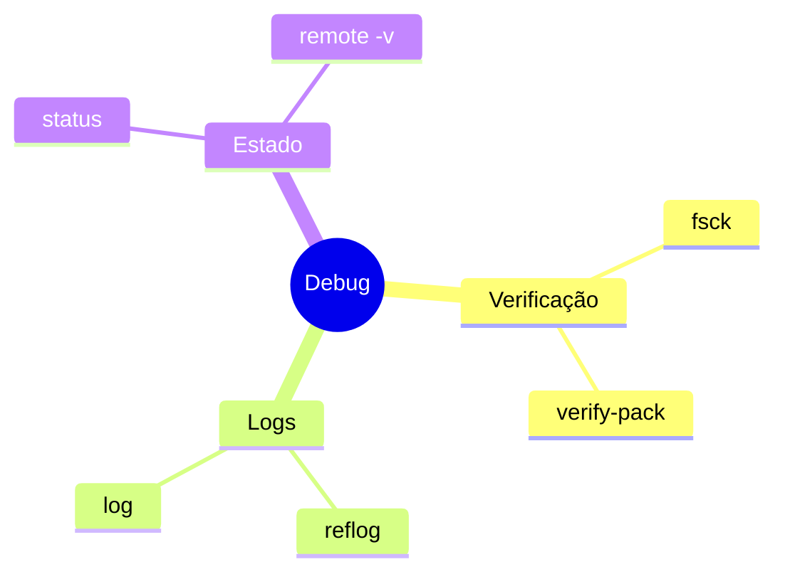
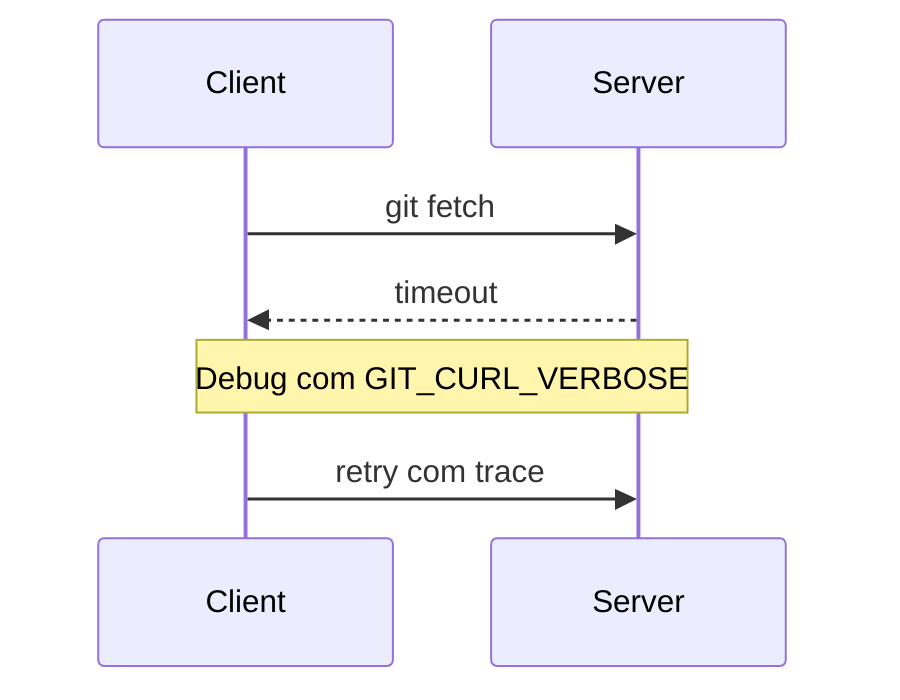
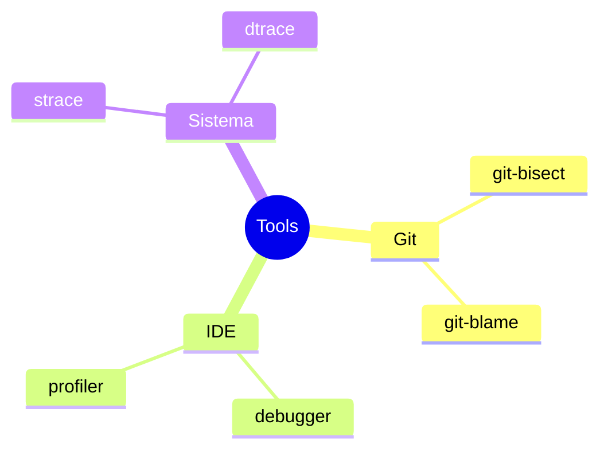
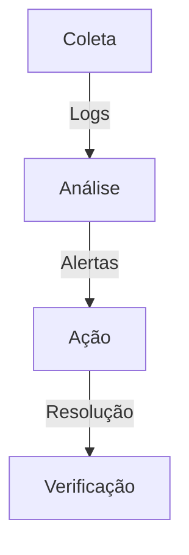

# Git Debug

```ascii
+------------------------+
|      Git Debug        |
|                       |
| Diagnóstico           |
| Troubleshooting       |
| Resolução             |
|                       |
| Debugging Avançado    |
+------------------------+
```

## Ferramentas de Debug

### Variáveis de Ambiente
```bash
# Debug geral
GIT_TRACE=1

# Debug específico
GIT_TRACE_PACKET=1     # Protocolo
GIT_TRACE_PACK_ACCESS=1 # Acesso packfile
GIT_TRACE_PERFORMANCE=1 # Performance
GIT_TRACE_SETUP=1      # Setup
GIT_CURL_VERBOSE=1     # HTTP
```

### Comandos Essenciais


## Técnicas de Diagnóstico

### Verificação de Integridade
```bash
# Verificar repositório
git fsck --full

# Verificar objetos
git verify-pack -v .git/objects/pack/*.idx

# Verificar refs
git for-each-ref --verify
```

### Análise de Logs
```ascii
+------------------------+
|    NÍVEIS DE LOG      |
|                       |
| • Trace              |
| • Debug              |
| • Info               |
| • Warning            |
| • Error              |
+------------------------+
```

## Problemas Comuns

### Network Issues


### Resolução
```bash
# Problemas de rede
GIT_CURL_VERBOSE=1 git clone <url>

# Problemas de autenticação
ssh -vT git@github.com

# Problemas de objeto
git prune && git gc
```

## Debug Avançado

### Análise de Performance
```bash
# Trace detalhado
GIT_TRACE_PERFORMANCE=1 git status

# Estatísticas de objetos
git count-objects -v

# Profiling
git maintenance run --task=gc --verbose
```

### Ferramentas Externas


## Boas Práticas

### Prevenção
```ascii
+------------------------+
|    CHECKLIST          |
|                       |
| • Backup regular     |
| • Verificações       |
| • Manutenção        |
| • Monitoramento     |
| • Documentação      |
+------------------------+
```

### Workflow de Debug
1. Identificar sintomas
2. Coletar informações
3. Reproduzir problema
4. Analisar logs
5. Aplicar solução
6. Verificar resolução

## Automação

### Scripts Úteis
```bash
#!/bin/bash
# Debug completo
debug_git() {
    export GIT_TRACE=1
    export GIT_TRACE_PERFORMANCE=1
    export GIT_TRACE_PACKET=1
    git "$@"
    unset GIT_TRACE GIT_TRACE_PERFORMANCE GIT_TRACE_PACKET
}
```

### Monitoramento


## Recuperação

### Dados Perdidos
```bash
# Recuperar commits deletados
git reflog

# Recuperar arquivos deletados
git fsck --lost-found

# Restaurar estado anterior
git reset --hard HEAD@{1}
```

### Corrupção
```bash
# Verificar e reparar
git fsck --full
git prune
git gc --aggressive

# Clonar novamente se necessário
git clone --mirror <url>
```

## Próximos Passos

### Tópicos Relacionados
- [Git Bisect](git-bisect.md)
- [Git Performance](git-performance.md)
- [Git Maintenance](git-maintenance.md)

> **Dica Pro**: Mantenha um registro de problemas encontrados e suas soluções para referência futura.