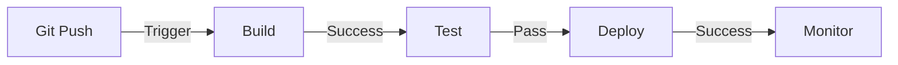
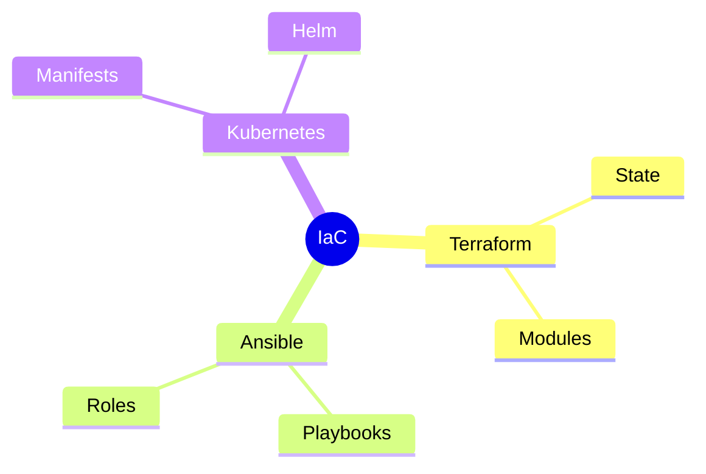
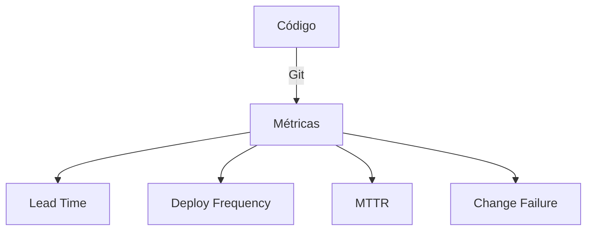
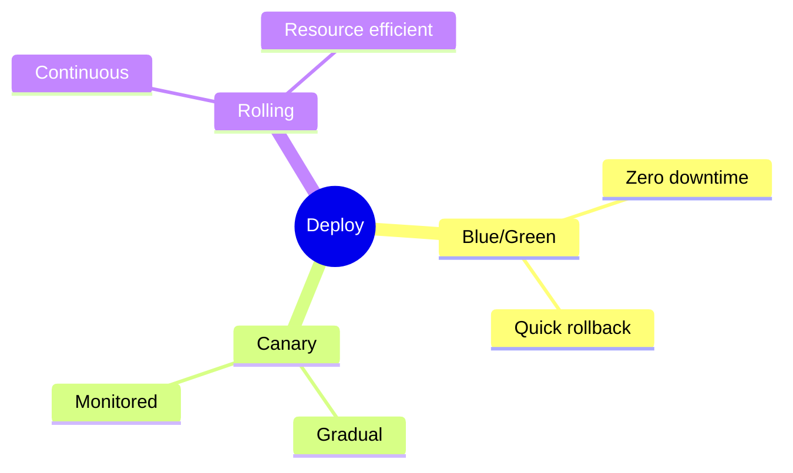
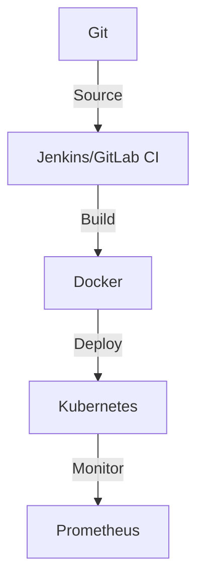
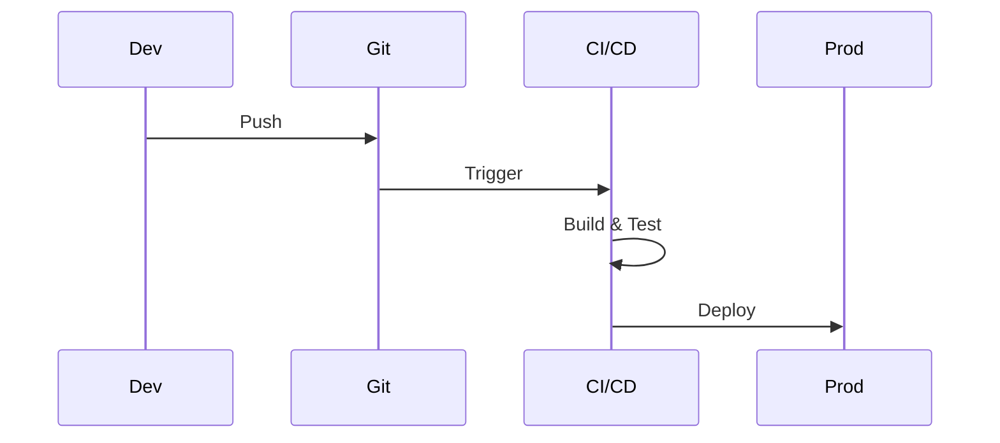
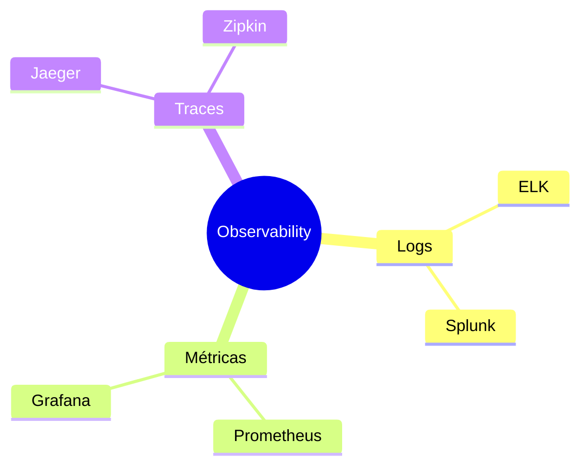
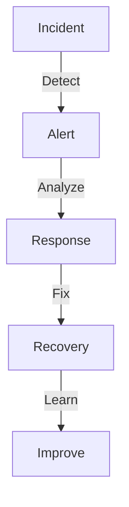

# Git e DevOps

## Integração Contínua

### Pipeline Básico


## Automação

### GitHub Actions
```yaml
name: CI/CD
on:
  push:
    branches: [ main ]
  pull_request:
    branches: [ main ]

jobs:
  build:
    runs-on: ubuntu-latest
    steps:
      - uses: actions/checkout@v2
      - name: Build
        run: make build
      - name: Test
        run: make test
      - name: Deploy
        if: github.ref == 'refs/heads/main'
        run: make deploy
```

## Infrastructure as Code

### Git + IaC


## Monitoramento

### Métricas DevOps


## Segurança

### DevSecOps
```ascii
+------------------------+
|     SEGURANÇA         |
|                       |
| • SAST              |
| • DAST              |
| • SCA               |
| • IAST              |
| • Secrets Scan      |
+------------------------+
```

## Deployment

### Estratégias


## Ferramentas

### Stack DevOps


## Boas Práticas

### Guidelines
1. Trunk-based development
2. Feature flags
3. Automated testing
4. Continuous feedback
5. Infrastructure as Code

### Workflow


## Observabilidade

### Componentes


## Recuperação

### Disaster Recovery


## Próximos Passos

### Tópicos Relacionados
- [CI/CD Integration](ci-cd-integration.md)
- [Git Security](git-security.md)
- [Workflow Automation](workflow-automation.md)

> **Dica Pro**: Use feature flags para separar deploy de release e permitir rollback rápido em caso de problemas.