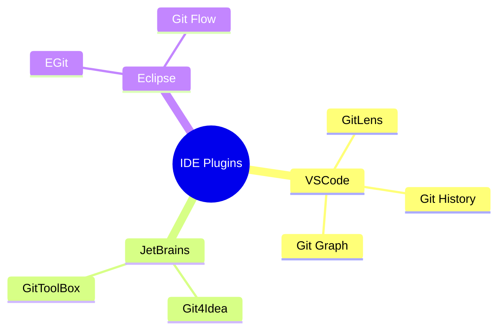
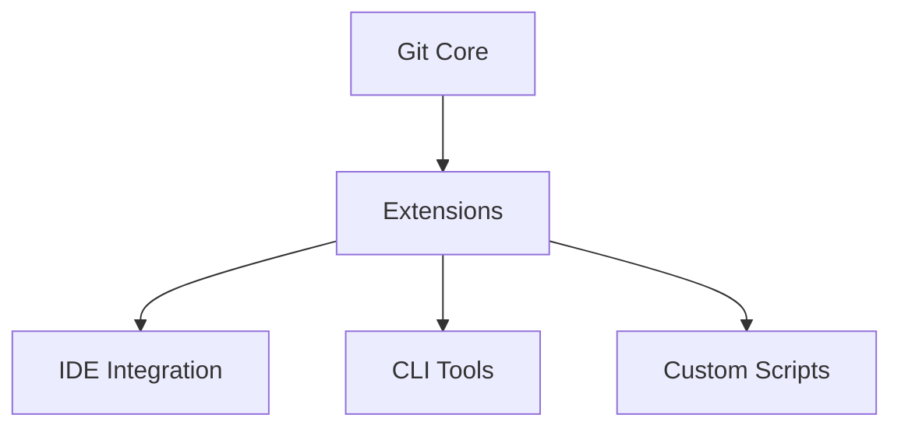

# Extensões Git

```ascii
+------------------------+
|    Git Extensions     |
|                       |
| IDE Plugins          |
| CLI Extensions       |
| Custom Scripts       |
|                       |
| Productivity Tools   |
+------------------------+
```

## Extensões Populares

### IDE Plugins


### CLI Extensions
```bash
# Git Flow
git flow init
git flow feature start

# Git Open
git open

# Git Recent
git recent

# Git Interactive Rebase Tool
git rebase -i HEAD~3
```

## Instalação e Configuração

### Package Managers
```bash
# VSCode
code --install-extension eamodio.gitlens

# npm global
npm install -g git-open

# Homebrew
brew install git-flow
```

### Configuração Manual
```bash
# Adicionar ao PATH
export PATH=$PATH:/caminho/para/extensao

# Configurar alias
git config --global alias.custom-cmd '!path/to/script.sh'
```

## Extensões Recomendadas

### Produtividade
```ascii
+------------------------+
|    RECOMENDADAS       |
|                       |
| • GitLens            |
| • Git Flow           |
| • Git Open           |
| • Git Recent         |
| • Git Interactive    |
+------------------------+
```

### Integração


## Próximos Passos

### Tópicos Relacionados
- [Git Tools](git-tools.md)
- [Git Workflow](git-workflow.md)
- [IDE Integration](ide-integration.md)

> **Dica Pro**: Comece com extensões básicas e adicione mais conforme sua necessidade específica.