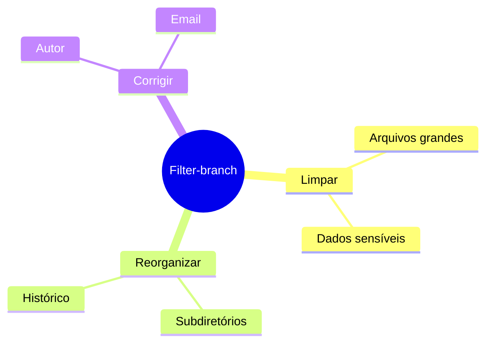
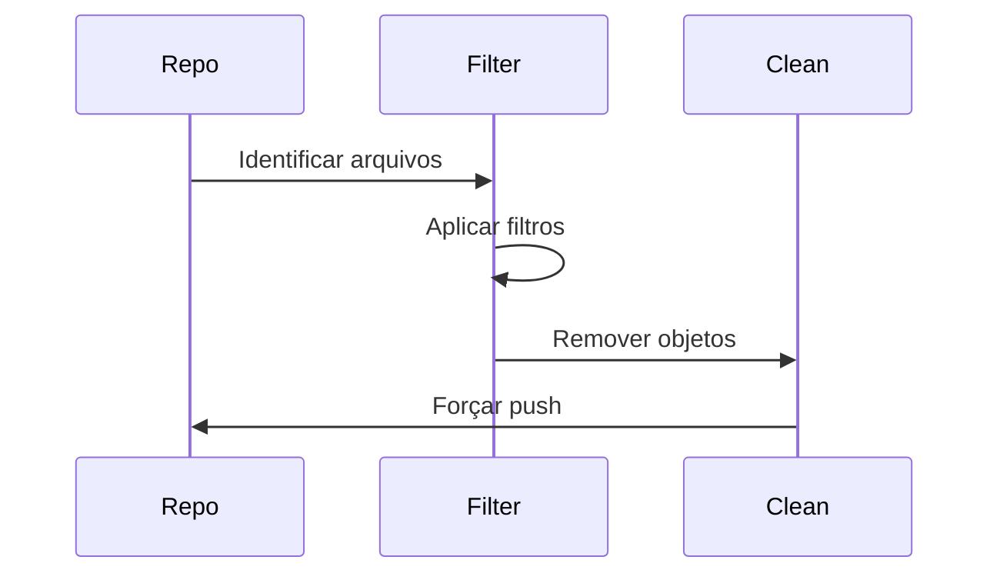
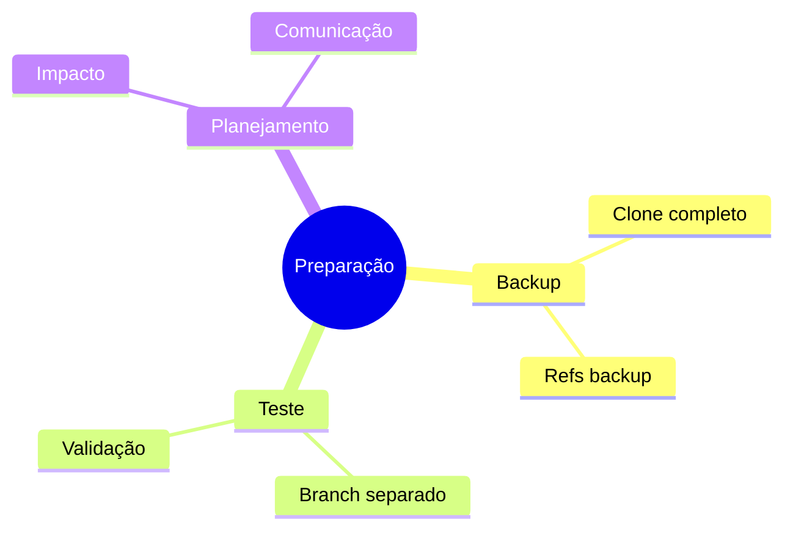
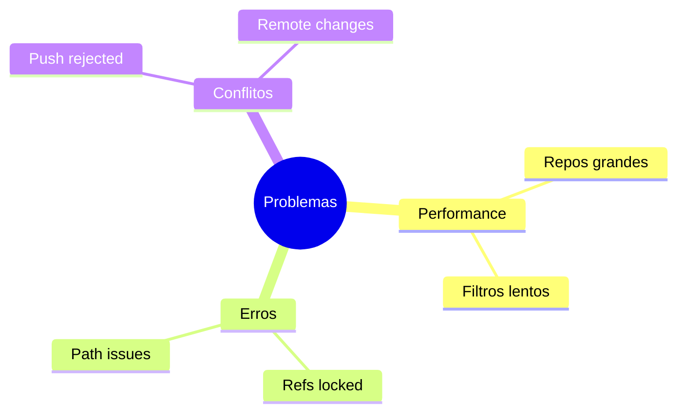
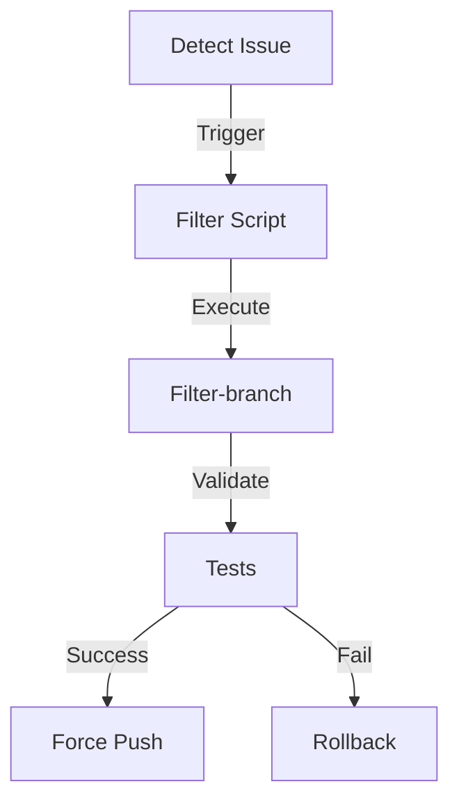

# Git Filter-branch: Reescrevendo Histórico

```ascii
+------------------------+
|    Filter-branch      |
|                       |
| History Rewriting     |
| Repository Cleaning   |
| Data Migration       |
|                       |
| Powerful but Complex  |
+------------------------+
```

## Conceitos Básicos

### O que é Filter-branch?


### Quando Usar
```ascii
+------------------------+
|    CASOS DE USO       |
|                       |
| • Remover senhas     |
| • Limpar arquivos    |
| • Corrigir autoria   |
| • Mover diretórios   |
| • Dividir repos      |
+------------------------+
```

## Comandos Essenciais

### Operações Básicas
```bash
# Remover arquivo do histórico
git filter-branch --tree-filter 'rm -f senha.txt' HEAD

# Alterar email
git filter-branch --commit-filter '
    if [ "$GIT_AUTHOR_EMAIL" = "old@email.com" ];
    then
        GIT_AUTHOR_EMAIL="new@email.com";
        git commit-tree "$@";
    else
        git commit-tree "$@";
    fi' HEAD
```

### Filtros Comuns
```bash
# Tree filter (manipula arquivos)
git filter-branch --tree-filter 'rm -rf node_modules' HEAD

# Index filter (mais rápido)
git filter-branch --index-filter 'git rm --cached --ignore-unmatch *.log' HEAD

# Env filter (modifica variáveis)
git filter-branch --env-filter '
    export GIT_AUTHOR_DATE="2023-01-01 12:00:00"
' HEAD
```

## Casos de Uso Avançados

### Limpeza de Repositório


### Reorganização
```bash
# Mover diretório para raiz
git filter-branch --subdirectory-filter pasta HEAD

# Prefixar diretório
git filter-branch --tree-filter '
    mkdir -p novo/caminho
    mv * novo/caminho/ 2>/dev/null || true
' HEAD
```

## Boas Práticas

### Antes de Começar


### Segurança
```bash
# Backup de refs
git branch backup-master master
git tag backup-tags

# Forçar reescrita
git filter-branch -f --index-filter 'git rm --cached --ignore-unmatch *.key' HEAD
```

## Troubleshooting

### Problemas Comuns


### Soluções
```bash
# Limpar backup
rm -rf .git/refs/original/

# Forçar garbage collection
git gc --aggressive --prune=now

# Forçar push
git push origin master --force
```

## Alternativas Modernas

### BFG Repo-Cleaner
```bash
# Remover arquivos grandes
bfg --strip-blobs-bigger-than 100M

# Substituir senhas
bfg --replace-text passwords.txt
```

### Comparação
```ascii
+------------------------+
|    COMPARAÇÃO         |
|                       |
| Filter-branch        |
| • Mais flexível      |
| • Mais complexo      |
| • Mais lento         |
|                       |
| BFG                  |
| • Mais rápido        |
| • Mais simples       |
| • Menos flexível     |
+------------------------+
```

## Workflows Avançados

### Automação
```bash
#!/bin/bash
# Script de limpeza completa
git filter-branch --force --index-filter \
    'git rm --cached --ignore-unmatch *.log' \
    --prune-empty --tag-name-filter cat -- --all

git for-each-ref --format="%(refname)" refs/original/ | \
    xargs -n 1 git update-ref -d

git reflog expire --expire=now --all
git gc --prune=now --aggressive
```

### Integração CI/CD


## Dicas Avançadas

### Performance
```bash
# Usar index-filter em vez de tree-filter
git filter-branch --index-filter 'git rm --cached --ignore-unmatch arquivo.grande' HEAD

# Limitar escopo
git filter-branch --tree-filter 'comando' HEAD~10..HEAD
```

### Manutenção
```ascii
+------------------------+
|    MANUTENÇÃO         |
|                       |
| • Monitor tamanho    |
| • Backup regular     |
| • Teste em clone     |
| • Documentar mudanças|
| • Comunicar equipe   |
+------------------------+
```

## Próximos Passos

### Tópicos Relacionados
- [Git History](git-history.md)
- [Git Performance](git-performance.md)
- [Git Security](git-security.md)

> **Dica Pro**: Sempre teste filter-branch em um clone do repositório antes de aplicar no repositório principal. Mudanças são permanentes e podem ser difíceis de reverter.