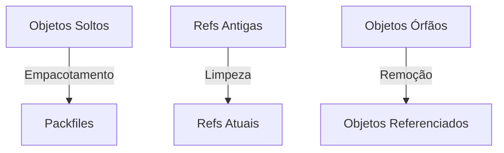
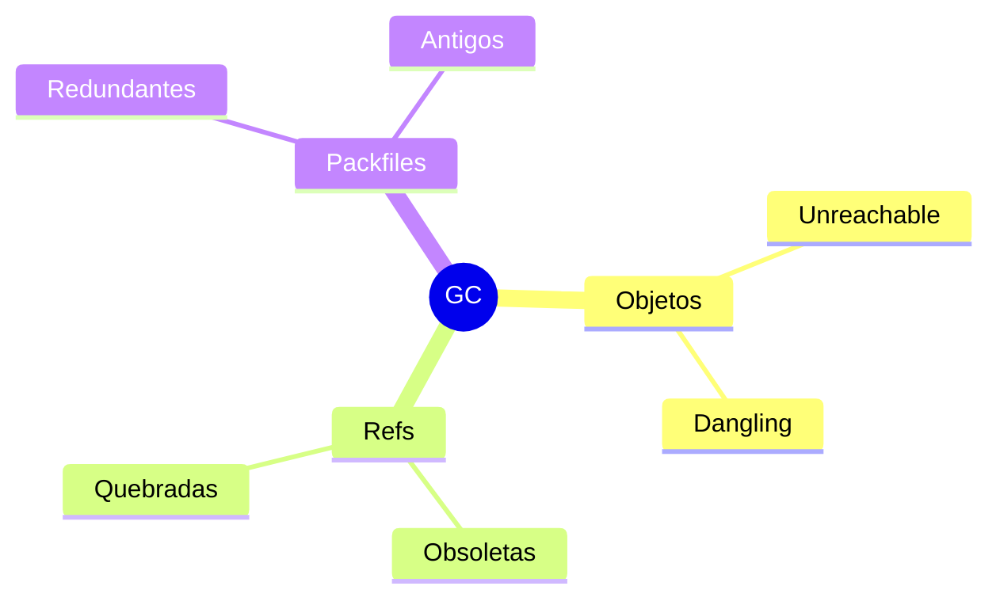
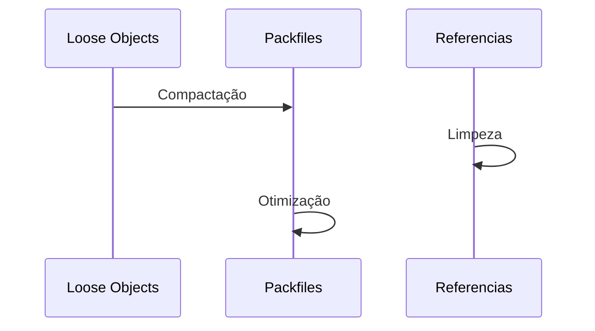
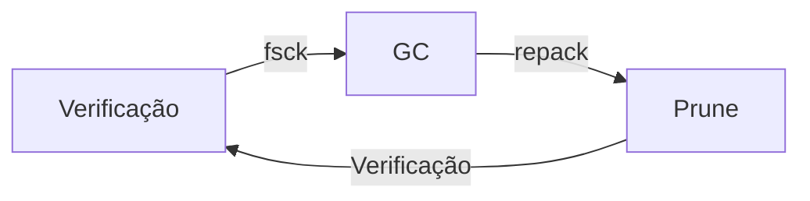
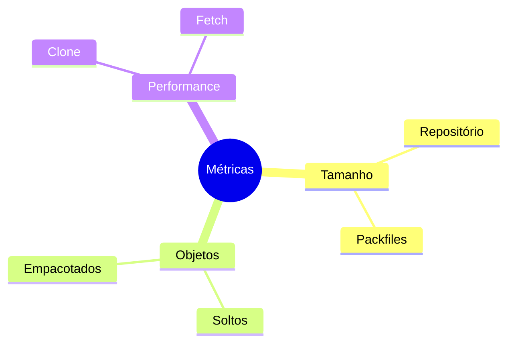

# Git Garbage Collection: Mantendo o Repositório Otimizado

```ascii
+------------------------+
|   Garbage Collection   |
|                        |
| Cleanup + Optimization |
| Pack + Compress        |
| Maintain Performance   |
|                        |
| git gc                 |
+------------------------+
```

## Como Funciona

### Processo Básico


### Gatilhos Automáticos
```ascii
+------------------+
|    TRIGGERS     |
+------------------+
| • Push          |
| • Fetch         |
| • Merge         |
| • Threshold     |
+------------------+
```

## O que é Coletado

### Tipos de Objetos


### Processo de Coleta


## Comandos Principais

### Comandos Básicos
```bash
# GC básico
git gc

# GC agressivo
git gc --aggressive

# GC automático
git gc --auto

# Prune
git prune
```

### Configurações
```bash
# Ajustar threshold
git config gc.auto 256

# Frequência de auto-gc
git config gc.autoPackLimit 50

# Expiração de objetos
git config gc.pruneExpire "2.weeks.ago"
```

## Otimização de Performance

### Estratégias
```ascii
+----------------------+
|    OTIMIZAÇÕES      |
|                     |
| • Delta compression |
| • Repack            |
| • Prune             |
| • Reflog expire     |
+----------------------+
```

### Comandos Avançados
```bash
# Repack otimizado
git repack -ad

# Expirar reflog
git reflog expire --expire=now --all

# Verificar objetos
git fsck --full

# Estatísticas
git count-objects -v
```

## Manutenção Programada

### Rotina de Manutenção


### Agendamento
```bash
# Iniciar manutenção
git maintenance start

# Configurar agenda
git maintenance register

# Executar agora
git maintenance run --task=gc
```

## Troubleshooting

### Problemas Comuns
```ascii
+----------------------+
|      PROBLEMAS      |
|                     |
| • GC muito lento    |
| • Espaço em disco   |
| • Objetos perdidos  |
| • Performance       |
+----------------------+
```

### Diagnóstico
```bash
# Verificar objetos
git fsck --unreachable

# Analisar packfiles
git verify-pack -v .git/objects/pack/*.idx

# Encontrar objetos grandes
git rev-list --objects --all | git cat-file --batch-check
```

## Boas Práticas

### Recomendações
1. GC regular
2. Backup antes de GC agressivo
3. Monitorar tamanho
4. Verificar integridade

### Configurações Recomendadas
```bash
# Para repos grandes
git config gc.auto 1024
git config gc.autoPackLimit 100
git config gc.pruneExpire "1.month.ago"
```

## Monitoramento

### Métricas Importantes


### Comandos de Monitoramento
```bash
# Estatísticas detalhadas
git count-objects --verbose

# Tamanho dos packfiles
du -sh .git/objects/pack/

# Objetos grandes
git verify-pack -v .git/objects/pack/*.idx | sort -k 3 -n | tail -10
```

## Próximos Passos

### Tópicos Relacionados
- [Git Objects](git-objects.md)
- [Git Packfiles](git-packfiles.md)
- [Git Internals](git-internals.md)

> **Dica Pro**: Configure `git maintenance` para automatizar a manutenção do repositório e manter a performance consistente.