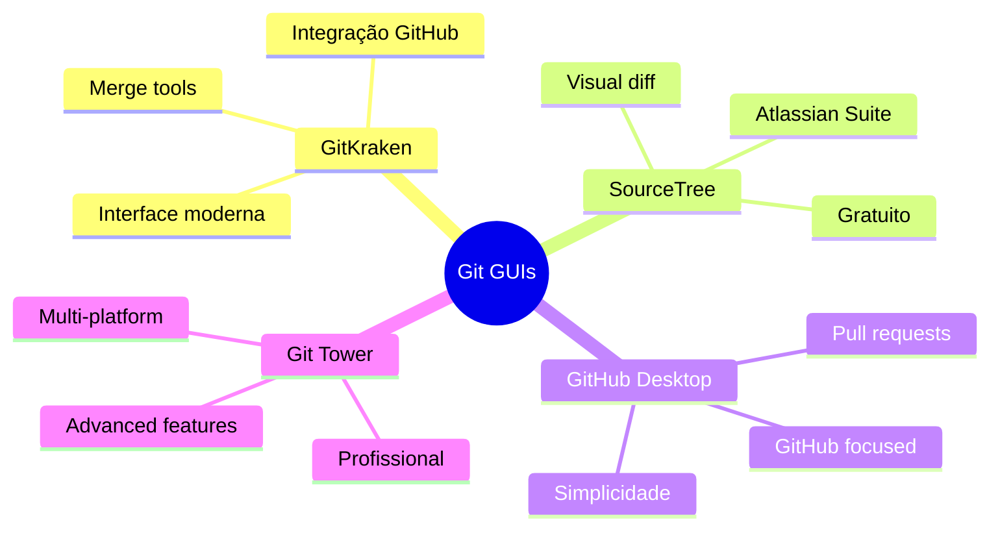
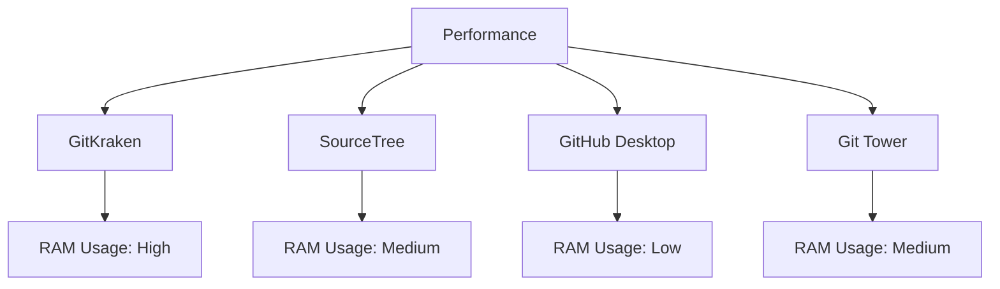
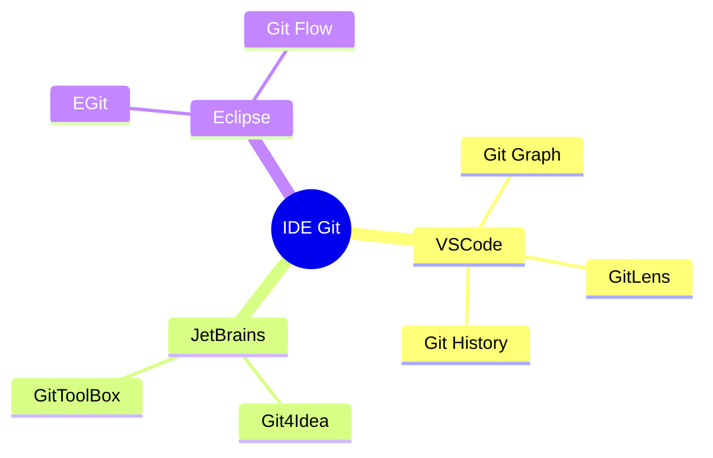
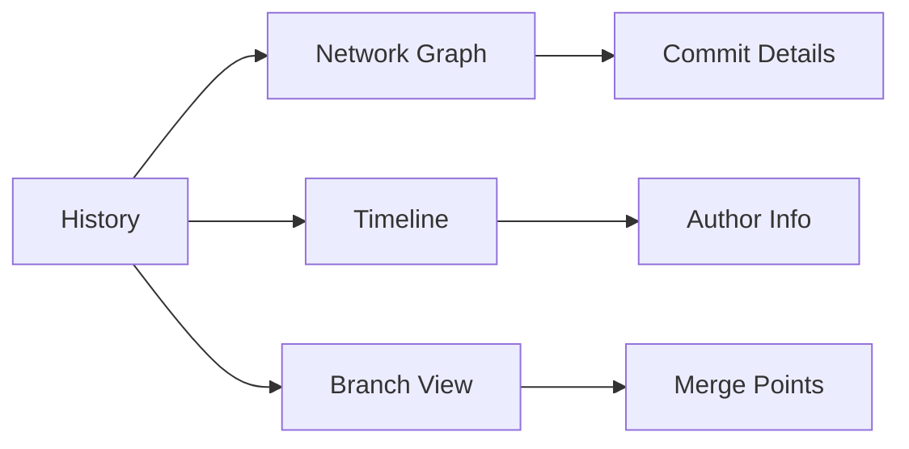
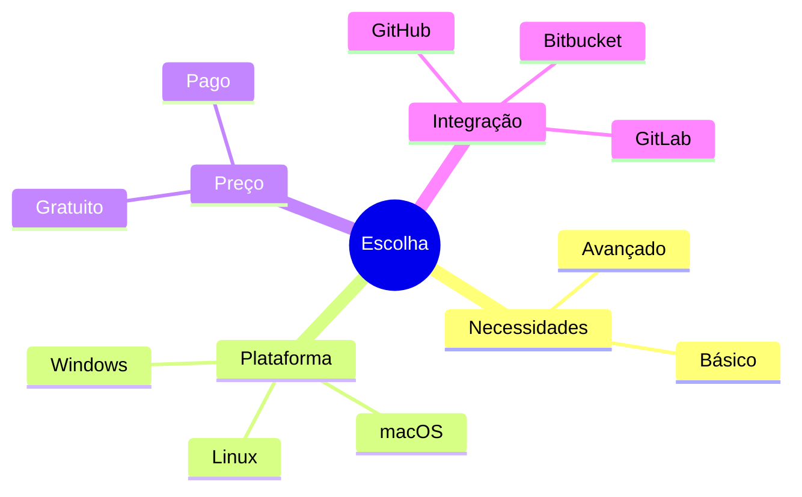
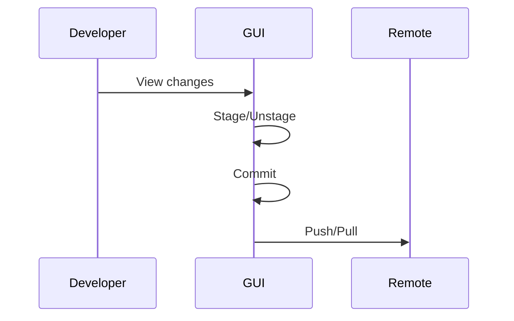

# Interfaces Gráficas Git: Simplificando o Workflow

```ascii
+------------------------+
|      Git GUIs         |
|                       |
| Visual Clients       |
| IDE Integration      |
| Repository View      |
|                       |
| User Experience     |
+------------------------+
```

## Clientes Populares

### Principais Opções


## Comparativo

### Recursos
```ascii
+------------------------+
|      RECURSOS         |
|                       |
| • Visual Diff        |
| • Merge Tools        |
| • Branch View        |
| • History Graph      |
| • Stash UI          |
| • Rebase Interface  |
+------------------------+
```

### Performance


## IDE Integration

### Plugins Populares


## Funcionalidades Essenciais

### Visual Diff & Merge
```ascii
+------------------------+
|    DIFF & MERGE       |
|                       |
| • Side-by-side       |
| • Syntax highlight   |
| • Conflict resolver  |
| • Chunk selection    |
| • Interactive rebase |
+------------------------+
```

### History Visualization


## Escolhendo uma GUI

### Fatores de Decisão


### Recomendações
```ascii
+------------------------+
|    POR PERFIL        |
|                       |
| Iniciante            |
| • GitHub Desktop     |
|                       |
| Intermediário        |
| • SourceTree        |
|                       |
| Avançado            |
| • GitKraken         |
| • Git Tower         |
+------------------------+
```

## Dicas de Uso

### Produtividade
```bash
# Atalhos comuns
Ctrl/Cmd + S    # Stage changes
Ctrl/Cmd + K    # Commit
Ctrl/Cmd + P    # Push
Ctrl/Cmd + L    # Pull
```

### Workflow Integration


## Próximos Passos

### Tópicos Relacionados
- [Git Tools](git-tools.md)
- [Git Workflow](git-workflow.md)
- [IDE Integration](ide-integration.md)

> **Dica Pro**: Combine GUI com linha de comando para maior produtividade - use cada ferramenta onde ela é mais eficiente.